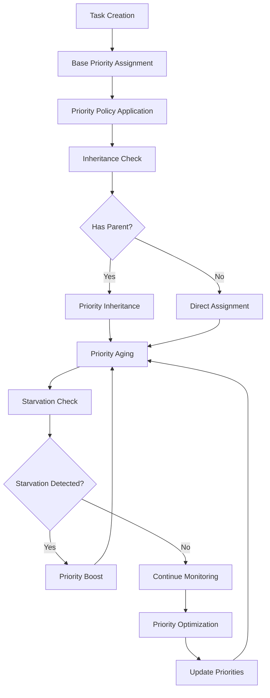

# **Priority Manager**

## **Overview**

The Priority Manager module provides sophisticated priority management capabilities, including dynamic priority assignment, priority aging, priority inheritance, and intelligent priority optimization. It ensures fair resource allocation, prevents priority inversion, and optimizes system performance through intelligent priority management.

## **Core Principles**
- **Dynamic Priority Assignment**: Assign and adjust priorities dynamically based on context.
- **Priority Aging**: Implement priority aging to prevent starvation.
- **Priority Inheritance**: Handle priority inheritance to prevent priority inversion.
- **Fair Resource Allocation**: Ensure fair resource allocation across priority levels.

## **Function Specifications**

### **Core Functions**
- **Priority Assignment**: Assign priorities to tasks and resources dynamically.
- **Priority Aging**: Implement priority aging to prevent resource starvation.
- **Priority Inheritance**: Handle priority inheritance for dependent tasks.
- **Priority Optimization**: Optimize priority distribution for system performance.
- **Starvation Prevention**: Prevent resource starvation through priority management.
- **Priority Monitoring**: Monitor priority distribution and effectiveness.

### **TypeScript Interfaces**
```typescript
interface PriorityManagerConfig {
  priorityLevels: number;
  agingPolicy: AgingPolicy;
  inheritancePolicy: InheritancePolicy;
  optimizationPolicy: OptimizationPolicy;
}

interface Priority {
  level: number;
  basePriority: number;
  currentPriority: number;
  age: number;
  inheritedFrom?: string;
  lastUpdate: Date;
}

interface PriorityPolicy {
  name: string;
  rules: PriorityRule[];
  agingFactor: number;
  inheritanceEnabled: boolean;
  optimizationEnabled: boolean;
}

interface PriorityRule {
  condition: PriorityCondition;
  action: PriorityAction;
  weight: number;
}

function assignPriority(taskId: string, basePriority: number): Promise<Priority>
function agePriority(taskId: string): Promise<Priority>
function inheritPriority(taskId: string, parentTaskId: string): Promise<Priority>
function optimizePriorities(): Promise<OptimizationResult>
function preventStarvation(): Promise<StarvationResult>
function monitorPriorities(): Promise<PriorityMetrics>
```

## **Integration Patterns**

### **Priority Management Flow**


## **Capabilities**
- **Dynamic Priority Assignment**: Assign priorities based on context and policies.
- **Priority Aging**: Implement configurable priority aging policies.
- **Priority Inheritance**: Handle complex priority inheritance scenarios.
- **Starvation Prevention**: Prevent resource starvation through priority management.
- **Priority Optimization**: Optimize priority distribution for system performance.
- **Multi-Level Priorities**: Support multiple priority levels and hierarchies.

## **Configuration Examples**
```yaml
priority_manager:
  priority_levels: 10
  aging_policy:
    enabled: true
    aging_factor: 0.1
    aging_interval: "1m"
    max_age: 100
  inheritance_policy:
    enabled: true
    inheritance_depth: 3
    inheritance_factor: 0.8
    max_inherited_priority: 8
  optimization_policy:
    enabled: true
    optimization_interval: "5m"
    optimization_criteria:
      - "fairness"
      - "throughput"
      - "latency"
    optimization_algorithm: "genetic"
  starvation_prevention:
    enabled: true
    starvation_threshold: "5m"
    boost_factor: 2.0
    boost_duration: "1m"
  priority_policies:
    - name: "user_interaction"
      base_priority: 8
      aging_factor: 0.05
      inheritance_enabled: true
    - name: "background_processing"
      base_priority: 3
      aging_factor: 0.2
      inheritance_enabled: false
    - name: "system_maintenance"
      base_priority: 5
      aging_factor: 0.1
      inheritance_enabled: true
```

## **Performance Considerations**
- **Priority Assignment**: < 10ms for priority assignment operations
- **Aging Processing**: < 50ms for priority aging calculations
- **Inheritance Resolution**: < 100ms for inheritance resolution
- **Optimization Overhead**: < 1% performance impact
- **Monitoring Latency**: < 5ms for priority monitoring

## **Security Considerations**
- **Priority Manipulation**: Prevent unauthorized priority manipulation
- **Access Control**: Control access to priority management functions
- **Policy Validation**: Validate priority policies for safety
- **Audit Logging**: Log all priority changes and policy applications

## **Monitoring & Observability**
- **Priority Metrics**: Track priority distribution and changes
- **Aging Metrics**: Monitor priority aging and effectiveness
- **Inheritance Metrics**: Track priority inheritance and resolution
- **Starvation Metrics**: Monitor starvation prevention and effectiveness
- **Optimization Metrics**: Track priority optimization and performance impact

---

**Version**: 1.0  
**Module**: Priority Manager  
**Status**: ✅ **COMPLETE** - Comprehensive module specification ready for implementation  
**Focus**: Dynamic priority management with aging, inheritance, and starvation prevention. 