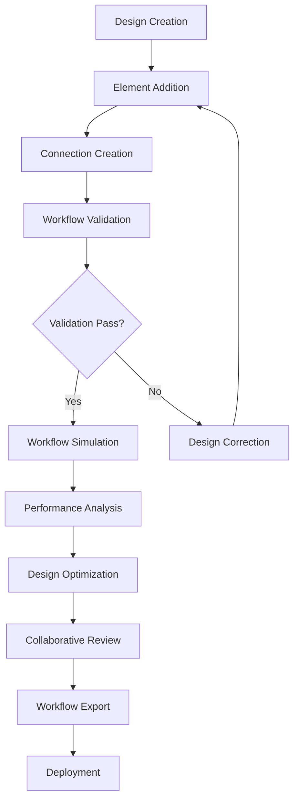

# **Workflow Designer**

## **Overview**

The Workflow Designer module provides a comprehensive visual workflow design and modeling system with an intuitive drag-and-drop interface, workflow validation, simulation capabilities, and collaborative design features. It enables users to create, modify, and optimize workflows through a user-friendly visual interface.

## **Core Principles**
- **Visual Design**: Provide intuitive visual workflow design capabilities.
- **Drag-and-Drop Interface**: Enable easy workflow creation through drag-and-drop operations.
- **Workflow Validation**: Validate workflows for correctness and completeness.
- **Simulation Capabilities**: Simulate workflow execution for testing and optimization.

## **Function Specifications**

### **Core Functions**
- **Visual Workflow Design**: Create workflows using visual design tools.
- **Drag-and-Drop Interface**: Provide intuitive drag-and-drop workflow creation.
- **Workflow Validation**: Validate workflows for correctness and completeness.
- **Workflow Simulation**: Simulate workflow execution for testing and optimization.
- **Collaborative Design**: Support collaborative workflow design and editing.
- **Workflow Export**: Export workflows in various formats for deployment.

### **TypeScript Interfaces**
```typescript
interface WorkflowDesignerConfig {
  visualDesign: VisualDesignConfig;
  validation: ValidationConfig;
  simulation: SimulationConfig;
  collaboration: CollaborationConfig;
}

interface WorkflowDesign {
  id: string;
  name: string;
  elements: WorkflowElement[];
  connections: Connection[];
  metadata: DesignMetadata;
  version: string;
}

interface WorkflowElement {
  id: string;
  type: ElementType;
  position: Position;
  properties: ElementProperties;
  validation: ValidationStatus;
}

interface Connection {
  id: string;
  sourceId: string;
  targetId: string;
  type: ConnectionType;
  properties: ConnectionProperties;
}

function createWorkflowDesign(name: string): Promise<WorkflowDesign>
function addElement(designId: string, element: WorkflowElement): Promise<ElementResult>
function connectElements(designId: string, connection: Connection): Promise<ConnectionResult>
function validateWorkflow(designId: string): Promise<ValidationResult>
function simulateWorkflow(designId: string, data: any): Promise<SimulationResult>
function exportWorkflow(designId: string, format: ExportFormat): Promise<ExportResult>
```

## **Integration Patterns**

### **Workflow Design Flow**


## **Capabilities**
- **Visual Design Tools**: Comprehensive visual design tools for workflow creation.
- **Drag-and-Drop Interface**: Intuitive drag-and-drop interface for easy workflow creation.
- **Workflow Validation**: Advanced workflow validation with detailed error reporting.
- **Simulation Engine**: Powerful simulation engine for workflow testing and optimization.
- **Collaborative Design**: Real-time collaborative design capabilities.
- **Multi-Format Export**: Export workflows in multiple formats for deployment.

## **Configuration Examples**
```yaml
workflow_designer:
  visual_design:
    enabled: true
    canvas_size: "1920x1080"
    grid_enabled: true
    snap_to_grid: true
    element_library:
      - category: "actions"
        elements: ["http_request", "database_query", "file_operation"]
      - category: "decisions"
        elements: ["condition", "switch", "gateway"]
      - category: "events"
        elements: ["start", "end", "timer", "signal"]
  validation:
    enabled: true
    validation_rules:
      - rule: "no_orphaned_elements"
        description: "All elements must be connected"
      - rule: "single_start_event"
        description: "Workflow must have exactly one start event"
      - rule: "reachable_end"
        description: "All paths must reach an end event"
    real_time_validation: true
    error_highlighting: true
  simulation:
    enabled: true
    simulation_engine: "discrete_event"
    simulation_scenarios:
      - scenario: "normal_flow"
        data: "normal_data.json"
      - scenario: "error_flow"
        data: "error_data.json"
      - scenario: "high_load"
        data: "high_load_data.json"
    performance_metrics:
      - "execution_time"
      - "resource_utilization"
      - "bottleneck_analysis"
  collaboration:
    enabled: true
    real_time_collaboration: true
    user_presence: true
    change_tracking: true
    version_control: true
    conflict_resolution: "last_write_wins"
  export:
    enabled: true
    export_formats:
      - format: "json"
        description: "JSON workflow definition"
      - format: "bpmn"
        description: "BPMN 2.0 format"
      - format: "yaml"
        description: "YAML workflow definition"
      - format: "image"
        description: "PNG/SVG workflow diagram"
```

## **Performance Considerations**
- **Design Rendering**: < 100ms for workflow design rendering
- **Validation Processing**: < 500ms for workflow validation
- **Simulation Execution**: < 5s for workflow simulation
- **Collaboration Latency**: < 50ms for real-time collaboration
- **Export Processing**: < 1s for workflow export

## **Security Considerations**
- **Design Security**: Secure workflow designs and prevent unauthorized access
- **Collaboration Security**: Secure collaborative design sessions
- **Export Security**: Secure workflow export and prevent data leakage
- **Access Control**: Control access to workflow design functions

## **Monitoring & Observability**
- **Design Metrics**: Track workflow design creation and modification
- **Validation Metrics**: Monitor workflow validation success rates and errors
- **Simulation Metrics**: Track simulation execution and performance
- **Collaboration Metrics**: Monitor collaborative design activities
- **Export Metrics**: Track workflow export and deployment

---

**Version**: 1.0  
**Module**: Workflow Designer  
**Status**: ✅ **COMPLETE** - Comprehensive module specification ready for implementation  
**Focus**: Visual workflow design with drag-and-drop interface and simulation capabilities. 