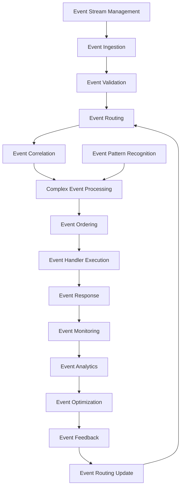

# **Event Orchestrator**

## **Overview**

The Event Orchestrator module provides advanced event orchestration capabilities, enabling management of event-driven workflows, event routing, event correlation, and complex event processing. It handles high-volume event streams, ensures event ordering, and provides sophisticated event processing patterns for distributed systems.

## **Core Principles**
- **Event-Driven Architecture**: Support event-driven workflows and processing patterns.
- **Event Routing**: Provide intelligent event routing and distribution.
- **Event Correlation**: Correlate related events across distributed systems.
- **Complex Event Processing**: Enable complex event processing and pattern recognition.

## **Function Specifications**

### **Core Functions**
- **Event Management**: Manage event streams and event processing.
- **Event Routing**: Route events to appropriate handlers and consumers.
- **Event Correlation**: Correlate related events across distributed systems.
- **Complex Event Processing**: Process complex event patterns and sequences.
- **Event Ordering**: Ensure proper event ordering and consistency.
- **Event Monitoring**: Monitor event processing and performance.

### **TypeScript Interfaces**
```typescript
interface EventOrchestratorConfig {
  eventManagement: EventManagementConfig;
  eventRouting: RoutingConfig;
  eventCorrelation: CorrelationConfig;
  complexEventProcessing: CEPConfig;
}

interface Event {
  id: string;
  type: string;
  source: string;
  timestamp: Date;
  data: any;
  correlationId?: string;
  priority: number;
}

interface EventWorkflow {
  id: string;
  name: string;
  events: Event[];
  handlers: EventHandler[];
  routing: RoutingRule[];
  correlation: CorrelationRule[];
}

interface EventHandler {
  id: string;
  name: string;
  eventType: string;
  handler: EventHandlerFunction;
  priority: number;
  retryPolicy: RetryPolicy;
}

function manageEvents(events: Event[]): Promise<EventResult>
function routeEvents(events: Event[]): Promise<RoutingResult>
function correlateEvents(correlationId: string): Promise<CorrelationResult>
function processComplexEvents(patterns: EventPattern[]): Promise<CEPResult>
function orderEvents(events: Event[]): Promise<OrderingResult>
function monitorEvents(workflowId: string): Promise<EventMetrics>
```

## **Integration Patterns**

### **Event Orchestration Flow**


## **Capabilities**
- **Event Management**: Comprehensive management of high-volume event streams.
- **Event Routing**: Intelligent event routing and distribution to appropriate handlers.
- **Event Correlation**: Advanced event correlation across distributed systems.
- **Complex Event Processing**: Sophisticated complex event processing and pattern recognition.
- **Event Ordering**: Ensure proper event ordering and consistency in distributed environments.
- **Real-Time Processing**: Real-time event processing and response generation.

## **Configuration Examples**
```yaml
event_orchestrator:
  event_management:
    enabled: true
    event_streams:
      - stream: "user_events"
        source: "user_service"
        format: "json"
        schema: "user_event_schema.json"
      - stream: "system_events"
        source: "system_monitor"
        format: "avro"
        schema: "system_event_schema.avsc"
      - stream: "business_events"
        source: "business_logic"
        format: "protobuf"
        schema: "business_event.proto"
    event_storage:
      - storage: "kafka"
        retention: "7d"
        partitions: 10
        replication_factor: 3
      - storage: "redis"
        retention: "1h"
        max_memory: "1GB"
    event_processing:
      - processing: "real_time"
        latency: "100ms"
        throughput: "10000/s"
      - processing: "batch"
        batch_size: 1000
        batch_timeout: "5s"
  event_routing:
    enabled: true
    routing_strategy: "content_based"
    routing_rules:
      - rule: "user_registration"
        condition: "event_type == 'user_registered'"
        handlers: ["email_service", "analytics_service"]
        priority: 1
      - rule: "order_processing"
        condition: "event_type == 'order_placed'"
        handlers: ["inventory_service", "payment_service", "notification_service"]
        priority: 2
      - rule: "system_alert"
        condition: "event_type == 'system_alert'"
        handlers: ["alert_service", "monitoring_service"]
        priority: 3
    routing_optimization:
      - optimization: "load_balancing"
        algorithm: "round_robin"
      - optimization: "priority_based"
        priority_levels: 5
      - optimization: "geographic_routing"
        regions: ["us-east", "us-west", "eu-west"]
  event_correlation:
    enabled: true
    correlation_engine: "temporal"
    correlation_rules:
      - rule: "user_journey"
        correlation_key: "user_id"
        time_window: "24h"
        events: ["user_registered", "user_login", "user_purchase"]
      - rule: "order_workflow"
        correlation_key: "order_id"
        time_window: "1h"
        events: ["order_placed", "payment_processed", "order_shipped"]
      - rule: "system_incident"
        correlation_key: "incident_id"
        time_window: "30m"
        events: ["alert_triggered", "alert_acknowledged", "alert_resolved"]
    correlation_analytics:
      - analytics: "pattern_recognition"
        algorithm: "sequence_mining"
      - analytics: "anomaly_detection"
        algorithm: "isolation_forest"
      - analytics: "trend_analysis"
        algorithm: "time_series"
  complex_event_processing:
    enabled: true
    cep_engine: "esper"
    event_patterns:
      - pattern: "fraud_detection"
        description: "Detect fraudulent transactions"
        events:
          - event: "login_attempt"
            condition: "location != last_known_location"
          - event: "large_transaction"
            condition: "amount > 1000"
          - event: "multiple_transactions"
            condition: "count > 5 within 1h"
        action: "trigger_fraud_alert"
      - pattern: "customer_churn"
        description: "Detect potential customer churn"
        events:
          - event: "login_failure"
            condition: "count > 3 within 1d"
          - event: "support_ticket"
            condition: "severity == 'high'"
          - event: "subscription_cancellation"
            condition: "within 7d"
        action: "trigger_retention_campaign"
    pattern_matching:
      - matching: "exact_match"
        enabled: true
      - matching: "fuzzy_match"
        similarity_threshold: 0.8
      - matching: "regex_match"
        enabled: true
  event_ordering:
    enabled: true
    ordering_strategy: "timestamp_based"
    ordering_guarantees:
      - guarantee: "causal_ordering"
        enabled: true
      - guarantee: "total_ordering"
        enabled: false
      - guarantee: "partial_ordering"
        enabled: true
    ordering_optimization:
      - optimization: "parallel_processing"
        max_parallel_events: 100
      - optimization: "batch_processing"
        batch_size: 1000
      - optimization: "stream_processing"
        window_size: "1m"
  event_monitoring:
    enabled: true
    monitoring_metrics:
      - "event_throughput"
      - "event_latency"
      - "event_loss_rate"
      - "correlation_accuracy"
      - "pattern_detection_rate"
    alert_thresholds:
      - metric: "event_latency"
        threshold: "500ms"
        severity: "warning"
      - metric: "event_loss_rate"
        threshold: "1%"
        severity: "critical"
      - metric: "correlation_accuracy"
        threshold: "95%"
        severity: "warning"
```

## **Performance Considerations**
- **Event Processing**: < 100ms for event processing and routing
- **Event Correlation**: < 500ms for event correlation across distributed systems
- **Complex Event Processing**: < 1s for complex event pattern recognition
- **Event Ordering**: < 50ms for event ordering and consistency
- **Event Throughput**: 100,000+ events per second

## **Security Considerations**
- **Event Security**: Secure event processing and prevent event tampering
- **Routing Security**: Secure event routing and prevent unauthorized access
- **Correlation Security**: Secure event correlation and prevent data leakage
- **Processing Security**: Secure complex event processing and prevent manipulation

## **Monitoring & Observability**
- **Event Metrics**: Track event processing and routing performance
- **Correlation Metrics**: Monitor event correlation accuracy and effectiveness
- **Processing Metrics**: Track complex event processing and pattern recognition
- **Ordering Metrics**: Monitor event ordering and consistency
- **Throughput Metrics**: Track event throughput and system performance

---

**Version**: 1.0  
**Module**: Event Orchestrator  
**Status**: ✅ **COMPLETE** - Comprehensive module specification ready for implementation  
**Focus**: Advanced event orchestration with correlation and complex event processing. 