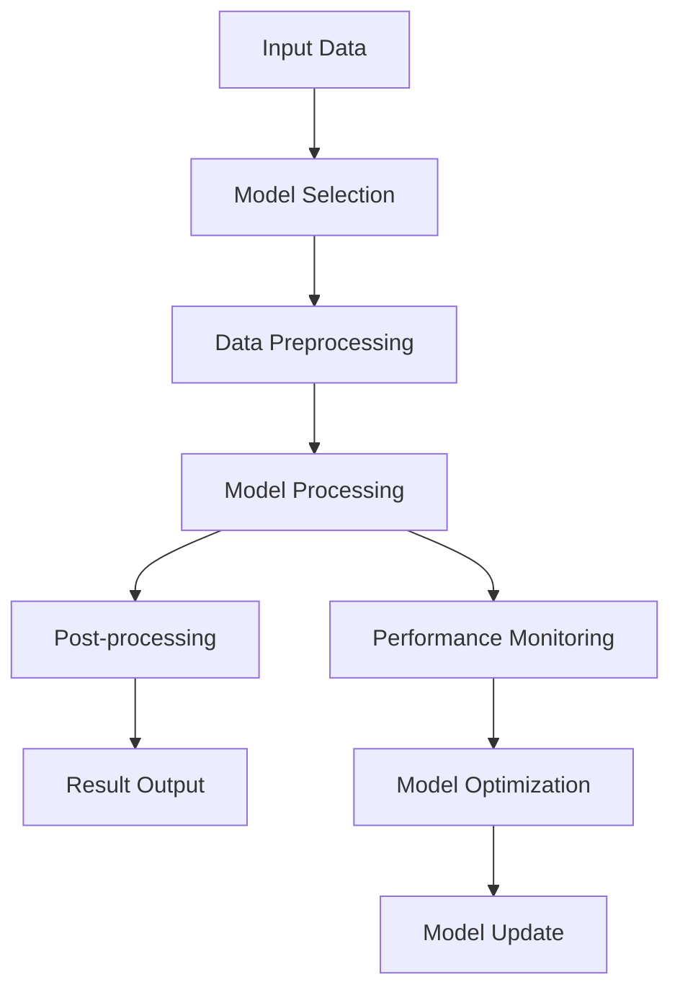
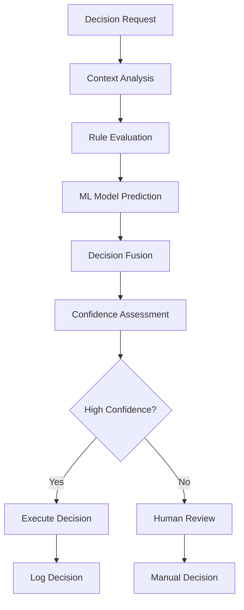
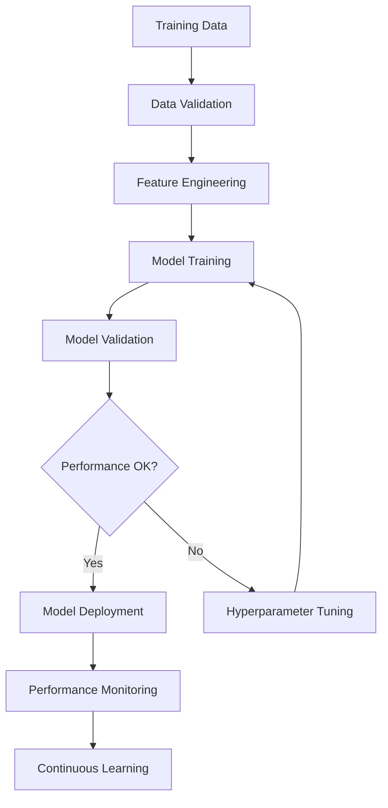

# Intelligence & AI

## Overview
Handles all artificial intelligence and machine learning functionalities including model processing, decision making, learning, prediction, and AI-driven automation across all platforms and contexts.

## Core Principles
- **Intelligence First**: All functions prioritize intelligent decision making
- **Continuous Learning**: Systems improve over time through learning
- **Adaptive Behavior**: Functions adapt to changing conditions and requirements
- **Explainable AI**: Provide clear explanations for AI decisions
- **Ethical AI**: Ensure AI decisions are fair, unbiased, and ethical
- **Performance Optimization**: Optimize AI performance and efficiency

## Function Specifications

### Base Functions (4 Functions)
1. [Base Model Processor](01_Base_Model_Processor.md) - Core AI model interface and common functionality
2. [Base Decision Engine](02_Base_Decision_Engine.md) - Core decision-making interface and common functionality
3. [Base Learning Engine](03_Base_Learning_Engine.md) - Core learning interface and common functionality
4. [Base Predictor](04_Base_Predictor.md) - Core prediction interface and common functionality

### Model Processing (3 Functions)
5. [LLM Processor](05_LLM_Processor.md) - Large Language Model processing and management
6. [Vision Model Processor](06_Vision_Model_Processor.md) - Computer vision model processing
7. [Audio Model Processor](07_Audio_Model_Processor.md) - Audio and speech model processing

### Decision Making (2 Functions)
8. [Rule-Based Decision Engine](08_Rule_Based_Decision_Engine.md) - Rule-based decision making
9. [ML Decision Engine](09_ML_Decision_Engine.md) - Machine learning-based decision making

### Learning Systems (2 Functions)
10. [Supervised Learning Engine](10_Supervised_Learning_Engine.md) - Supervised learning algorithms
11. [Unsupervised Learning Engine](11_Unsupervised_Learning_Engine.md) - Unsupervised learning algorithms

### Prediction Systems (3 Functions)
12. [Time Series Predictor](12_Time_Series_Predictor.md) - Time series forecasting
13. [Classification Predictor](13_Classification_Predictor.md) - Classification predictions
14. [Regression Predictor](14_Regression_Predictor.md) - Regression predictions

### Specialized AI (6 Functions)
15. [Recommendation Engine](15_Recommendation_Engine.md) - Recommendation systems
16. [Sentiment Analyzer](16_Sentiment_Analyzer.md) - Sentiment analysis
17. [Entity Extractor](17_Entity_Extractor.md) - Named entity recognition
18. [Text Summarizer](18_Text_Summarizer.md) - Text summarization
19. [Language Translator](19_Language_Translator.md) - Language translation
20. [Speech Recognizer](20_Speech_Recognizer.md) - Speech recognition

## Integration Patterns

### AI Model Processing Flow


### Decision Making Flow


### Learning Flow


## AI Capabilities

### Model Processing Capabilities
- **Model Loading**: Load and initialize AI models
- **Model Optimization**: Optimize model performance
- **Model Versioning**: Manage model versions and updates
- **Model Monitoring**: Monitor model performance and health
- **Model Scaling**: Scale models for high throughput

### Decision Making Capabilities
- **Rule Evaluation**: Evaluate business rules and policies
- **ML Prediction**: Use ML models for predictions
- **Decision Fusion**: Combine multiple decision sources
- **Confidence Scoring**: Assess decision confidence
- **Explainability**: Provide decision explanations

### Learning Capabilities
- **Data Processing**: Process training and validation data
- **Feature Engineering**: Create and select features
- **Model Training**: Train ML models
- **Hyperparameter Tuning**: Optimize model parameters
- **Model Evaluation**: Evaluate model performance

### Prediction Capabilities
- **Time Series Forecasting**: Predict future values
- **Classification**: Classify data into categories
- **Regression**: Predict continuous values
- **Anomaly Detection**: Detect unusual patterns
- **Trend Analysis**: Analyze data trends

## Configuration Examples

### AI Model Configuration
```yaml
ai_models:
  llm:
    model_name: "gpt-4"
    max_tokens: 2048
    temperature: 0.7
    top_p: 0.9
  vision:
    model_name: "resnet-50"
    input_size: [224, 224]
    batch_size: 32
  audio:
    model_name: "whisper-large"
    language: "en"
    task: "transcribe"
```

### Decision Engine Configuration
```yaml
decision_engine:
  rules:
    enabled: true
    rule_file: "business_rules.yaml"
  ml_models:
    enabled: true
    models:
      - name: "fraud_detection"
        threshold: 0.8
      - name: "risk_assessment"
        threshold: 0.7
  fusion:
    method: "weighted_average"
    weights:
      rules: 0.3
      ml: 0.7
```

### Learning Configuration
```yaml
learning:
  supervised:
    algorithms:
      - random_forest
      - gradient_boosting
      - neural_network
    validation_split: 0.2
    cross_validation: 5
  unsupervised:
    algorithms:
      - kmeans
      - dbscan
      - pca
    auto_tuning: true
  continuous:
    enabled: true
    update_frequency: "daily"
    performance_threshold: 0.9
```

## Error Handling

### Model Processing Errors
- **Model Loading Failures**: Handle model loading errors
- **Input Validation Errors**: Handle invalid input data
- **Processing Timeouts**: Handle processing timeouts
- **Memory Errors**: Handle memory constraints
- **GPU Errors**: Handle GPU-related errors

### Decision Making Errors
- **Rule Evaluation Errors**: Handle rule evaluation failures
- **ML Model Errors**: Handle ML model failures
- **Decision Fusion Errors**: Handle decision fusion failures
- **Confidence Errors**: Handle confidence calculation errors
- **Explainability Errors**: Handle explanation generation errors

### Learning Errors
- **Data Quality Errors**: Handle poor quality training data
- **Training Failures**: Handle model training failures
- **Validation Errors**: Handle validation failures
- **Deployment Errors**: Handle model deployment failures
- **Performance Degradation**: Handle performance issues

## Performance Considerations

### Model Processing Performance
- **Inference Speed**: Optimize model inference speed
- **Memory Usage**: Optimize memory usage
- **GPU Utilization**: Optimize GPU utilization
- **Batch Processing**: Implement efficient batch processing
- **Caching**: Implement model and result caching

### Decision Making Performance
- **Decision Speed**: Optimize decision-making speed
- **Rule Evaluation**: Optimize rule evaluation
- **ML Inference**: Optimize ML model inference
- **Decision Fusion**: Optimize decision fusion
- **Confidence Calculation**: Optimize confidence calculation

### Learning Performance
- **Training Speed**: Optimize training speed
- **Data Processing**: Optimize data processing
- **Feature Engineering**: Optimize feature engineering
- **Model Validation**: Optimize model validation
- **Hyperparameter Tuning**: Optimize hyperparameter search

## Monitoring & Observability

### Model Performance Metrics
- **Inference Latency**: Track model inference time
- **Throughput**: Track requests per second
- **Accuracy**: Track model accuracy
- **Memory Usage**: Track memory consumption
- **GPU Utilization**: Track GPU usage

### Decision Quality Metrics
- **Decision Accuracy**: Track decision accuracy
- **Confidence Distribution**: Track confidence levels
- **Rule Coverage**: Track rule usage
- **ML Model Usage**: Track ML model usage
- **Decision Latency**: Track decision time

### Learning Progress Metrics
- **Training Progress**: Track training progress
- **Validation Performance**: Track validation metrics
- **Model Convergence**: Track model convergence
- **Feature Importance**: Track feature importance
- **Learning Rate**: Track learning rate

### AI Alerts
- **Model Performance Degradation**: Alert on performance issues
- **High Error Rates**: Alert on high error rates
- **Memory Usage**: Alert on high memory usage
- **Training Failures**: Alert on training failures
- **Decision Confidence**: Alert on low confidence decisions

## Ethical Considerations

### Bias Detection
- **Data Bias**: Detect bias in training data
- **Model Bias**: Detect bias in model predictions
- **Feature Bias**: Detect bias in features
- **Output Bias**: Detect bias in outputs
- **Bias Mitigation**: Implement bias mitigation strategies

### Fairness
- **Fairness Metrics**: Track fairness metrics
- **Disparate Impact**: Monitor disparate impact
- **Equal Opportunity**: Ensure equal opportunity
- **Demographic Parity**: Ensure demographic parity
- **Fairness Testing**: Implement fairness testing

### Transparency
- **Model Explainability**: Provide model explanations
- **Decision Transparency**: Make decisions transparent
- **Feature Importance**: Show feature importance
- **Confidence Intervals**: Provide confidence intervals
- **Uncertainty Quantification**: Quantify uncertainty

### Privacy
- **Data Privacy**: Protect training data privacy
- **Model Privacy**: Protect model privacy
- **Inference Privacy**: Protect inference privacy
- **Differential Privacy**: Implement differential privacy
- **Federated Learning**: Support federated learning

## Future Enhancements

### Advanced AI Capabilities
- **Multi-Modal AI**: Support multi-modal inputs
- **Federated Learning**: Distributed learning across nodes
- **AutoML**: Automated machine learning
- **Neural Architecture Search**: Automated architecture search
- **Meta-Learning**: Learning to learn

### Enhanced Decision Making
- **Causal Inference**: Understand cause and effect
- **Counterfactual Analysis**: Analyze what-if scenarios
- **Multi-Agent Systems**: Multi-agent decision making
- **Game Theory**: Game theoretic decision making
- **Reinforcement Learning**: Learning from interactions

### Improved Learning
- **Active Learning**: Intelligent data selection
- **Transfer Learning**: Transfer knowledge between domains
- **Few-Shot Learning**: Learning from few examples
- **Continual Learning**: Continuous learning without forgetting
- **Self-Supervised Learning**: Learning without labels

---

**Version**: 1.0  
**Category**: Intelligence & AI  
**Total Functions**: 20 