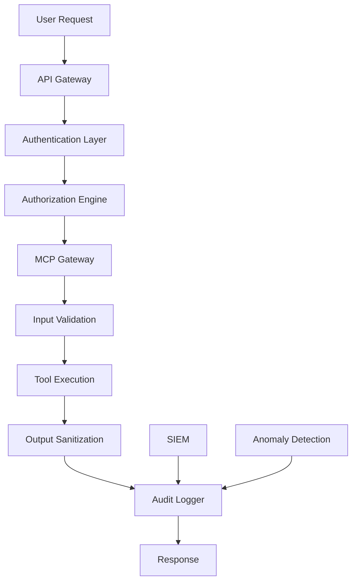

# Model Context Protocol (MCP) Architecture

## Overview

The Model Context Protocol (MCP) serves as the standardized interface layer between AI agents and external tools, data sources, and services within the AI-Q ecosystem. This architecture emphasizes security-first design, self-hosted core services, and scalable integration patterns.

## Architecture Components

### Core MCP Gateway

The central MCP Gateway (IBM ContextForge-based) provides:

- **Protocol Translation**: JSON-RPC ↔ HTTP/WebSocket bridging
- **Security Enforcement**: OAuth 2.1, RBAC, input validation
- **Service Federation**: Multi-cluster MCP server coordination
- **Admin Interface**: Real-time management and monitoring

```yaml
mcp_gateway:
  deployment: "kubernetes_cluster"
  replicas: 3
  load_balancer: "nginx_ingress"
  security:
    tls: "mutual_tls_required"
    auth: "oauth_2_1_with_pkce"
    rbac: "attribute_based_access_control"
```

### Self-Hosted Tier 1 Services

#### Context7 Documentation Server
```yaml
context7:
  purpose: "AI coding assistance with up-to-date documentation"
  repository: "https://github.com/upstash/context7"
  deployment:
    method: "self_hosted_docker"
    resource_limits:
      memory: "2Gi"
      cpu: "1000m"
    security:
      network: "isolated_subnet"
      filesystem: "read_only_root"
```

#### Browserbase Automation Server  
```yaml
browserbase:
  purpose: "Secure web automation and data extraction"
  repository: "https://github.com/browserbase/mcp-server-browserbase"
  deployment:
    method: "containerized_with_stagehand"
    sandbox: "gvisor_runtime"
    security:
      browser_isolation: "separate_containers"
      network_policies: "egress_restricted"
```

### Service Tier Classification

#### Tier 1: Self-Hosted Core (Zero External Dependencies)
- Context7 (Documentation)
- Browserbase (Web Automation)
- Local PostgreSQL MCP
- Local Filesystem MCP
- Self-hosted Supabase Instance (via PostgreSQL MCP)

#### Tier 2: Trusted External (Verified Providers)
- GitHub Official MCP
- GitLab Official MCP  
- Supabase Official MCP (20+ tools, database + project management)
- AWS Official MCP Servers
- Google Cloud MCP Servers

#### Tier 3: Community Verified (Audited Third-Party)
- Slack MCP (Community)
- Notion MCP (Community)
- Docker MCP (Community)

#### Tier 4: Sandboxed Experimental (Strict Isolation)
- New community servers
- Custom integrations
- Development/testing tools

## Security Architecture

### Defense-in-Depth Layers



### Authentication & Authorization

```yaml
security_framework:
  authentication:
    primary: "oauth_2_1_with_pkce"
    token_lifetime: "1_hour_max"
    refresh_policy: "automatic_rotation"
    
  authorization:
    model: "attribute_based_access_control"
    scopes:
      - "mcp:tool:read"
      - "mcp:tool:execute" 
      - "mcp:admin:manage"
    
  network_security:
    internal: "mutual_tls_required"
    external: "tls_1_3_minimum"
    isolation: "kubernetes_network_policies"
```

### Input/Output Validation

```yaml
validation_framework:
  input_validation:
    schema_enforcement: "strict_json_schema"
    parameter_sanitization: "allowlist_based"
    size_limits: "configurable_per_tool"
    
  output_sanitization:
    content_filtering: "remove_potential_injections"
    metadata_stripping: "security_sensitive_headers"
    encoding: "safe_character_encoding"
```

## Deployment Architecture

### Production Deployment

```yaml
production_deployment:
  infrastructure:
    platform: "kubernetes_1.28+"
    nodes: 3
    resource_allocation:
      mcp_gateway: "4Gi_memory_2_cpu"
      context7: "2Gi_memory_1_cpu"
      browserbase: "8Gi_memory_4_cpu"
      
  networking:
    service_mesh: "istio"
    ingress: "nginx_with_waf"
    egress: "restricted_allowlist"
    
  storage:
    configuration: "kubernetes_secrets"
    logs: "persistent_volumes"
    cache: "redis_cluster"
```

### Development Environment

```yaml
development_deployment:
  infrastructure:
    platform: "docker_compose"
    profiles: ["dev", "test", "staging"]
    
  security:
    level: "relaxed_for_development"
    mocking: "external_services_stubbed"
    
  tools:
    hot_reload: "enabled"
    debug_ports: "exposed_locally"
```

## Monitoring & Observability

### Metrics Collection

```yaml
observability:
  metrics:
    - "mcp_requests_total"
    - "mcp_request_duration_seconds"
    - "mcp_errors_total"
    - "mcp_active_connections"
    
  logging:
    level: "info"
    format: "structured_json"
    retention: "90_days"
    
  alerting:
    channels: ["slack", "pagerduty"]
    rules:
      - "mcp_error_rate > 5%"
      - "mcp_response_time > 10s"
      - "mcp_unauthorized_access_attempts"
```

### Security Monitoring

```yaml
security_monitoring:
  threat_detection:
    prompt_injection: "ml_based_detection"
    anomaly_patterns: "behavioral_analysis"
    credential_theft: "token_usage_analysis"
    
  incident_response:
    automated_containment: "true"
    escalation_matrix: "defined"
    recovery_procedures: "documented"
```

## Integration Patterns

### AI Agent Integration

```typescript
interface MCPClient {
  // Tool execution with security context
  executeTool(
    toolName: string,
    parameters: Record<string, any>,
    securityContext: SecurityContext
  ): Promise<ToolResult>;
  
  // Resource access with permissions
  getResource(
    resourceUri: string,
    permissions: Permission[]
  ): Promise<Resource>;
  
  // Prompt template management
  renderPrompt(
    templateId: string,
    context: PromptContext
  ): Promise<RenderedPrompt>;
}
```

### Service Registration

```yaml
service_registration:
  discovery:
    method: "kubernetes_service_discovery"
    health_checks: "http_probe_based"
    
  configuration:
    source: "kubernetes_configmaps"
    hot_reload: "true"
    validation: "schema_based"
```

## Compliance & Governance

### Data Protection

```yaml
data_protection:
  classification:
    levels: ["public", "internal", "confidential", "restricted"]
    handling: "automatic_based_on_classification"
    
  retention:
    logs: "90_days"
    audit_trails: "7_years"
    temporary_data: "24_hours"
    
  encryption:
    at_rest: "aes_256_gcm"
    in_transit: "tls_1_3"
    key_management: "vault_based"
```

### Audit Requirements

```yaml
audit_framework:
  logging:
    events: ["authentication", "authorization", "tool_execution", "data_access"]
    format: "structured_json_with_correlation_ids"
    
  reporting:
    frequency: "monthly_compliance_reports"
    stakeholders: ["security_team", "compliance_officer"]
    
  retention:
    operational_logs: "90_days"
    security_logs: "1_year"
    compliance_logs: "7_years"
```

## Implementation Roadmap

### Phase 1: Foundation (Weeks 1-2)
- Deploy MCP Gateway infrastructure
- Implement Context7 self-hosted instance
- Set up basic security controls
- Create monitoring pipeline

### Phase 2: Core Services (Weeks 3-4)
- Deploy Browserbase self-hosted instance
- Add PostgreSQL and Filesystem MCP servers
- Implement comprehensive validation
- Set up anomaly detection

### Phase 3: Integration (Weeks 5-6)
- Connect to AI-Q frontend systems
- Implement Tier 2 external services
- Advanced security features
- Performance optimization

### Phase 4: Production (Weeks 7-8)
- Production deployment
- Security hardening
- Load testing
- Documentation completion

## Future Considerations

### Scalability Enhancements
- Multi-region MCP gateway federation
- Edge deployment for latency optimization
- Auto-scaling based on demand patterns

### Security Evolution
- Zero-trust architecture integration
- Advanced threat detection ML models
- Quantum-resistant cryptography preparation

### Integration Expansion
- Additional self-hosted service tiers
- Custom MCP server development framework
- Cross-protocol bridge capabilities

## References

- [MCP Official Specification](https://modelcontextprotocol.io/)
- [IBM ContextForge Gateway](https://github.com/IBM/mcp-context-forge)
- [MCP Security Best Practices](https://modelcontextprotocol.io/specification/draft/basic/security_best_practices)
- [AI-Q Service Architecture](./01_Service_Architecture.md) 