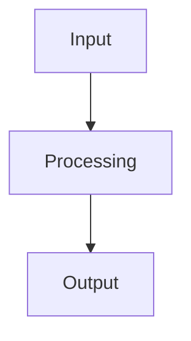

# **Module Documentation Style Guide**

## **Purpose**

This document establishes the definitive style and format standards for all module documentation in the kOS ecosystem. All agents must follow these standards precisely to ensure consistency, quality, and maintainability.

## **Core Principles**

### **1. Scenario-Driven Design**
- **No Rigid Limits**: Categories and subcategories are created based on actual needs, not arbitrary numbers
- **Flexible Granularity**: Modules are as granular as needed for specific scenarios
- **Real-World Focus**: Every module addresses a concrete, implementable capability
- **Future-Proof**: Design for extensibility and evolution

### **2. Single Source of Truth**
- **Comprehensive Coverage**: Every possible scenario and capability must be documented
- **Agent-Ready**: Documentation must be sufficient for any agent to implement
- **No Assumptions**: Every detail must be explicitly stated
- **Complete Context**: Include all necessary information for implementation

## **File Structure Standards**

### **Directory Naming Convention**
```
[##]_Category_Name/
├── 00_Category_Name_Index.md
├── [##]_Subcategory_Name/
│   ├── 00_Subcategory_Name_Index.md
│   ├── [##]_Module_Name.md
│   ├── [##]_Module_Name.md
│   └── [##]_Module_Name.md
└── [##]_Subcategory_Name/
    ├── 00_Subcategory_Name_Index.md
    └── [##]_Module_Name.md
```

### **File Naming Convention**
- **Category Index**: `00_Category_Name_Index.md`
- **Subcategory Index**: `00_Subcategory_Name_Index.md`
- **Module Specification**: `[##]_Module_Name.md`

### **Numbering Convention**
- **Categories**: `01_`, `02_`, `03_`, etc.
- **Subcategories**: `01_`, `02_`, `03_`, etc. (within each category)
- **Modules**: `01_`, `02_`, `03_`, etc. (within each subcategory)

## **YAML Frontmatter Requirements**

### **Required Fields**
```yaml
---
title: "Exact File Name Without Extension"
version: "1.0"
---
```

### **Optional Fields**
```yaml
---
title: "Module Name"
version: "1.0"
category: "Category Name"
subcategory: "Subcategory Name"
dependencies: ["Module1", "Module2"]
tags: ["tag1", "tag2"]
priority: "high|medium|low"
---
```

## **Documentation Structure Standards**

### **Category Index Structure**
```markdown
---
title: "Category Name Index"
version: "1.0"
---

# Category Name

## Overview
Brief description of the category's purpose and scope.

## Subcategories

### 1. [Subcategory Name](01_Subcategory_Name/00_Subcategory_Name_Index.md)
**Purpose**: Specific purpose of this subcategory.

**Modules**:
1. [Module Name](01_Subcategory_Name/01_Module_Name.md)
2. [Module Name](01_Subcategory_Name/02_Module_Name.md)
...

### 2. [Subcategory Name](02_Subcategory_Name/00_Subcategory_Name_Index.md)
...

## Total Modules: [Number]

## Core Capabilities
- **Capability 1**: Description
- **Capability 2**: Description
...

## Integration Points
- **Related Category**: Description of integration
...

## Configuration
- **Setting 1**: Description
- **Setting 2**: Description
...

## Dependencies
- **External Dependency**: Description
- **Internal Dependency**: Description
...

## Performance Requirements
- **Metric 1**: Target value
- **Metric 2**: Target value
...

## Security Considerations
- **Security Aspect 1**: Description
- **Security Aspect 2**: Description
...

## Error Handling
- **Error Type 1**: Handling approach
- **Error Type 2**: Handling approach
...

## Testing Strategy
- **Test Type 1**: Description
- **Test Type 2**: Description
...

## Deployment
- **Deployment Aspect 1**: Description
- **Deployment Aspect 2**: Description
...

## Usage Examples
- **Example 1**: Description
- **Example 2**: Description
...

## Future Enhancements
- **Enhancement 1**: Description
- **Enhancement 2**: Description
...
```

### **Subcategory Index Structure**
```markdown
---
title: "Subcategory Name Index"
version: "1.0"
---

# Subcategory Name

## Overview
Brief description of the subcategory's purpose and scope.

## Modules

### 1. [Module Name](01_Module_Name.md)
**Purpose**: Specific purpose of this module.
**Capabilities**: Key capabilities provided.
**Dependencies**: Required dependencies.

### 2. [Module Name](02_Module_Name.md)
...

## Total Modules: [Number]

## Core Capabilities
- **Capability 1**: Description
- **Capability 2**: Description
...

## Integration Points
- **Related Subcategory**: Description of integration
...

## Configuration
- **Setting 1**: Description
- **Setting 2**: Description
...

## Dependencies
- **External Dependency**: Description
- **Internal Dependency**: Description
...

## Performance Requirements
- **Metric 1**: Target value
- **Metric 2**: Target value
...

## Security Considerations
- **Security Aspect 1**: Description
- **Security Aspect 2**: Description
...

## Error Handling
- **Error Type 1**: Handling approach
- **Error Type 2**: Handling approach
...

## Testing Strategy
- **Test Type 1**: Description
- **Test Type 2**: Description
...

## Deployment
- **Deployment Aspect 1**: Description
- **Deployment Aspect 2**: Description
...

## Usage Examples
- **Example 1**: Description
- **Example 2**: Description
...

## Future Enhancements
- **Enhancement 1**: Description
- **Enhancement 2**: Description
...
```

### **Module Specification Structure**
```markdown
---
title: "Module Name"
version: "1.0"
---

# Module Name

## Purpose
Clear, concise description of what this module does and why it exists.

## Capabilities
Detailed list of specific capabilities provided by this module.

## Integration Points
- **Input**: What this module receives
- **Output**: What this module produces
- **Dependencies**: What this module requires

## Configuration
```yaml
module_name:
  setting1: value1
  setting2: value2
```

## Example Workflow


## Core Capabilities

### **1. Capability Name**
- **Description**: What this capability does
- **Input**: What it requires
- **Output**: What it produces
- **Dependencies**: What it needs

### **2. Capability Name**
...

## Module Interface

### **Input Interface**
```typescript
interface ModuleInput {
  // TypeScript interface definition
}
```

### **Output Interface**
```typescript
interface ModuleOutput {
  // TypeScript interface definition
}
```

### **Configuration Interface**
```typescript
interface ModuleConfig {
  // TypeScript interface definition
}
```

## Module Dependencies

### **Required Dependencies**
- **Dependency Name**: Description and version requirements

### **Optional Dependencies**
- **Dependency Name**: Description and when it's used

## Module Implementation

### **Core Components**

#### **1. Component Name**
```typescript
class ComponentName {
  // Implementation details
}
```

#### **2. Component Name**
...

### **Integration Points**

#### **1. Integration Point Name**
- **Description**: What this integration provides
- **Protocol**: How integration works
- **Authentication**: Security requirements
- **Rate Limiting**: Performance considerations

#### **2. Integration Point Name**
...

## Performance Characteristics

### **Throughput**
- **Metric Name**: Target value and measurement method

### **Reliability**
- **Metric Name**: Target value and measurement method

### **Scalability**
- **Metric Name**: Target value and measurement method

## Security Considerations

### **Security Aspect Name**
- **Description**: What this security measure provides
- **Implementation**: How it's implemented
- **Configuration**: Required settings

### **Security Aspect Name**
...

## Error Handling

### **Error Types**
- **Error Type Name**: Description and causes

### **Error Recovery**
- **Recovery Method Name**: Description and implementation

## Testing Strategy

### **Unit Testing**
- **Test Type Name**: Description and approach

### **Integration Testing**
- **Test Type Name**: Description and approach

### **Load Testing**
- **Test Type Name**: Description and approach

## Deployment Considerations

### **Resource Requirements**
- **Resource Type**: Minimum and recommended specifications

### **Configuration**
- **Configuration Aspect**: Description and requirements

### **Monitoring**
- **Monitoring Aspect**: Description and implementation

## Usage Examples

### **Basic Usage**
```typescript
// Code example showing basic usage
```

### **Advanced Usage**
```typescript
// Code example showing advanced usage
```

## Future Enhancements

### **Planned Features**
- **Feature Name**: Description and timeline

### **Performance Improvements**
- **Improvement Name**: Description and expected impact

---

**Version**: 1.0  
**Focus**: [Brief description of module focus]
```

## **Content Standards**

### **Writing Style**
- **Professional Tone**: Clear, concise, technical documentation
- **Active Voice**: Use active voice when possible
- **Present Tense**: Use present tense for current capabilities
- **Future Tense**: Use future tense for planned features
- **Consistent Terminology**: Use established terms consistently

### **Technical Detail**
- **Complete Specifications**: Include all necessary technical details
- **Implementation Ready**: Documentation must be sufficient for implementation
- **No Ambiguity**: Every detail must be clear and unambiguous
- **Comprehensive Coverage**: Cover all aspects of the module

### **Code Examples**
- **TypeScript Preferred**: Use TypeScript for all code examples
- **Complete Examples**: Provide complete, runnable examples
- **Best Practices**: Follow established coding standards
- **Error Handling**: Include error handling in examples

### **Diagrams and Visuals**
- **Mermaid Diagrams**: Use Mermaid for workflow diagrams
- **Clear Labels**: All diagrams must have clear, descriptive labels
- **Consistent Style**: Use consistent visual style across all diagrams
- **Purpose-Driven**: Every diagram must serve a clear purpose

## **Quality Assurance**

### **Review Checklist**
- [ ] YAML frontmatter is complete and correct
- [ ] All required sections are present
- [ ] Content is comprehensive and accurate
- [ ] Code examples are complete and correct
- [ ] Diagrams are clear and accurate
- [ ] Links are valid and working
- [ ] Formatting is consistent
- [ ] No typos or grammatical errors

### **Validation Requirements**
- **Technical Accuracy**: All technical details must be correct
- **Completeness**: All required information must be present
- **Consistency**: Format and style must be consistent
- **Usability**: Documentation must be useful for implementation

## **Maintenance Standards**

### **Version Control**
- **Semantic Versioning**: Use semantic versioning for all changes
- **Change Documentation**: Document all changes in version history
- **Backward Compatibility**: Maintain backward compatibility when possible
- **Migration Guides**: Provide migration guides for breaking changes

### **Update Process**
- **Regular Reviews**: Review documentation regularly for accuracy
- **User Feedback**: Incorporate user feedback and suggestions
- **Technology Updates**: Update documentation when technology changes
- **Continuous Improvement**: Continuously improve documentation quality

---

**Version**: 1.0  
**Focus**: Definitive style guide for all module documentation 