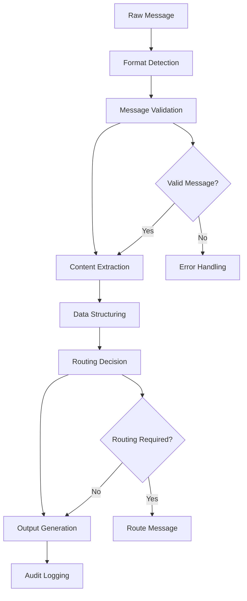

# Message Parser

## Purpose
Provides comprehensive message parsing and processing for the kOS ecosystem. This module parses, analyzes, and structures messages from various communication channels and formats. The Message Parser ensures accurate interpretation and routing of messages across all kOS components and external systems.

## Capabilities
- **Multi-Format Support**: Parse messages from various formats (JSON, XML, text, binary)
- **Channel Integration**: Support for multiple communication channels (API, messaging, email)
- **Content Extraction**: Extract structured data from unstructured messages
- **Validation**: Validate message format, content, and integrity
- **Routing**: Route parsed messages to appropriate handlers
- **Error Handling**: Comprehensive error handling and recovery
- **Performance Optimization**: High-performance parsing with caching
- **Security Validation**: Security checks and content validation
- **Audit Logging**: Complete audit trail for message processing

## Integration Points
- **Input**: Raw messages from various sources and formats
- **Output**: Structured message data, routing information, and validation results
- **Dependencies**: Base Audit Logger for logging, Message Router for message distribution

## Configuration
```yaml
message_parser:
  supported_formats:
    - "json"
    - "xml"
    - "text"
    - "binary"
    - "protobuf"
    - "yaml"
  channels:
    - "api"
    - "messaging"
    - "email"
    - "webhook"
    - "queue"
  validation:
    enabled: true
    schema_validation: true
    content_validation: true
    security_validation: true
  performance:
    max_message_size: 10  # MB
    parse_timeout: 30  # seconds
    concurrent_parsing: 50
    enable_caching: true
  routing:
    enabled: true
    auto_routing: true
    routing_rules: "routing_config.yaml"
  error_handling:
    retry_failed: true
    max_retries: 3
    error_logging: true
  audit:
    log_all_messages: true
    include_content: false
    retention_period: "30d"
```

## Example Workflow


## Core Capabilities

### **1. Format Detection**
- **Description**: Automatically detect message format and encoding
- **Input**: Raw message data and metadata
- **Output**: Detected format and encoding information
- **Dependencies**: Format detection algorithms and signature databases

### **2. Message Validation**
- **Description**: Validate message format, content, and integrity
- **Input**: Message data and validation rules
- **Output**: Validation results and error messages
- **Dependencies**: Schema validation and content validation engines

### **3. Content Extraction**
- **Description**: Extract structured data from unstructured messages
- **Input**: Raw message content and extraction rules
- **Output**: Extracted data and metadata
- **Dependencies**: Content extraction algorithms and NLP tools

### **4. Message Routing**
- **Description**: Route parsed messages to appropriate handlers
- **Input**: Parsed message data and routing rules
- **Output**: Routing decisions and destination information
- **Dependencies**: Routing engine and rule management system

## Module Interface

### **Input Interface**
```typescript
interface MessageParserInput {
  message: RawMessage;
  options?: ParsingOptions;
  routingRules?: RoutingRule[];
  validationRules?: ValidationRule[];
}

interface RawMessage {
  id: string;
  content: string | Buffer;
  format?: string;
  encoding?: string;
  source: string;
  timestamp: Date;
  metadata: MessageMetadata;
}

interface MessageMetadata {
  channel: string;
  sender?: string;
  recipient?: string;
  priority?: 'low' | 'normal' | 'high' | 'urgent';
  size: number;
  checksum?: string;
  additionalInfo?: Record<string, any>;
}

interface ParsingOptions {
  format?: string;
  encoding?: string;
  extractContent?: boolean;
  validateSchema?: boolean;
  enableRouting?: boolean;
  timeout?: number;
}

interface RoutingRule {
  id: string;
  condition: RoutingCondition;
  destination: string;
  priority: number;
  enabled: boolean;
}

interface RoutingCondition {
  field: string;
  operator: 'equals' | 'contains' | 'matches' | 'greater_than' | 'less_than';
  value: any;
}

interface ValidationRule {
  id: string;
  type: 'schema' | 'content' | 'security';
  rule: string;
  severity: 'low' | 'medium' | 'high' | 'critical';
  enabled: boolean;
}
```

### **Output Interface**
```typescript
interface MessageParserOutput {
  parseId: string;
  timestamp: Date;
  success: boolean;
  parsedMessage?: ParsedMessage;
  routingInfo?: RoutingInfo;
  validationResults?: ValidationResult[];
  errors?: ParsingError[];
  metadata: MessageParserMetadata;
}

interface ParsedMessage {
  id: string;
  originalId: string;
  format: string;
  encoding: string;
  content: any;
  extractedData: ExtractedData;
  structure: MessageStructure;
  metadata: ParsedMessageMetadata;
}

interface ExtractedData {
  entities: Entity[];
  keywords: string[];
  sentiment?: SentimentAnalysis;
  language?: string;
  topics: string[];
  customFields: Record<string, any>;
}

interface Entity {
  type: string;
  value: string;
  confidence: number;
  position: Position;
}

interface Position {
  start: number;
  end: number;
  line?: number;
  column?: number;
}

interface SentimentAnalysis {
  score: number;
  label: 'positive' | 'negative' | 'neutral';
  confidence: number;
}

interface MessageStructure {
  type: string;
  sections: MessageSection[];
  hierarchy: any;
}

interface MessageSection {
  name: string;
  content: any;
  type: string;
  position: Position;
}

interface RoutingInfo {
  destination: string;
  priority: number;
  routeId: string;
  estimatedDelivery: Date;
}

interface ValidationResult {
  ruleId: string;
  type: string;
  passed: boolean;
  severity: string;
  message: string;
  details?: any;
}

interface ParsingError {
  code: string;
  message: string;
  severity: 'low' | 'medium' | 'high' | 'critical';
  position?: Position;
  suggestions?: string[];
}

interface MessageParserMetadata {
  parseDuration: number;
  format: string;
  size: number;
  validationPassed: boolean;
  routingEnabled: boolean;
  cacheHit: boolean;
}
```

### **Configuration Interface**
```typescript
interface MessageParserConfig {
  supportedFormats: string[];
  channels: string[];
  validation: ValidationConfig;
  performance: PerformanceConfig;
  routing: RoutingConfig;
  errorHandling: ErrorHandlingConfig;
  audit: AuditConfig;
}

interface ValidationConfig {
  enabled: boolean;
  schemaValidation: boolean;
  contentValidation: boolean;
  securityValidation: boolean;
}

interface PerformanceConfig {
  maxMessageSize: number;
  parseTimeout: number;
  concurrentParsing: number;
  enableCaching: boolean;
}

interface RoutingConfig {
  enabled: boolean;
  autoRouting: boolean;
  routingRules: string;
}

interface ErrorHandlingConfig {
  retryFailed: boolean;
  maxRetries: number;
  errorLogging: boolean;
}

interface AuditConfig {
  logAllMessages: boolean;
  includeContent: boolean;
  retentionPeriod: string;
}
```

## Module Dependencies

### **Required Dependencies**
- **Base Audit Logger**: For logging parsing activities and results
- **Format Detectors**: For message format detection
- **Validation Engines**: For message validation

### **Optional Dependencies**
- **NLP Tools**: For content extraction and analysis
- **Routing Engine**: For message routing decisions

## Module Implementation

### **Core Components**

#### **1. Message Parsing Engine**
```typescript
class MessageParsingEngine {
  private config: MessageParserConfig;
  private formatDetector: FormatDetector;
  private validationEngine: ValidationEngine;
  private contentExtractor: ContentExtractor;
  private routingEngine: RoutingEngine;
  private auditLogger: BaseAuditLogger;
  
  constructor(config: MessageParserConfig) {
    this.config = config;
    this.formatDetector = new FormatDetector(config.supportedFormats);
    this.validationEngine = new ValidationEngine(config.validation);
    this.contentExtractor = new ContentExtractor();
    this.routingEngine = new RoutingEngine(config.routing);
    this.auditLogger = new BaseAuditLogger();
  }
  
  async parseMessage(input: MessageParserInput): Promise<MessageParserOutput> {
    const parseId = this.generateParseId();
    const startTime = Date.now();
    
    // Log parsing start
    await this.auditLogger.logEvent({
      eventType: 'message_parse_start',
      parseId,
      messageId: input.message.id
    });
    
    try {
      // Detect message format
      const format = await this.detectFormat(input.message);
      
      // Validate message
      const validationResults = await this.validateMessage(input.message, input.validationRules);
      
      // Parse message content
      const parsedContent = await this.parseContent(input.message, format);
      
      // Extract structured data
      const extractedData = await this.extractData(parsedContent, input.options);
      
      // Generate routing information
      const routingInfo = await this.generateRoutingInfo(parsedContent, input.routingRules);
      
      // Create parsed message structure
      const parsedMessage = this.createParsedMessage(input.message, parsedContent, extractedData, format);
      
      const parseDuration = Date.now() - startTime;
      
      // Log parsing completion
      await this.auditLogger.logEvent({
        eventType: 'message_parse_complete',
        parseId,
        success: true,
        duration: parseDuration
      });
      
      return {
        parseId,
        timestamp: new Date(),
        success: true,
        parsedMessage,
        routingInfo,
        validationResults,
        metadata: {
          parseDuration,
          format: format.name,
          size: input.message.metadata.size,
          validationPassed: validationResults.every(r => r.passed),
          routingEnabled: this.config.routing.enabled,
          cacheHit: false
        }
      };
      
    } catch (error) {
      // Log parsing error
      await this.auditLogger.logEvent({
        eventType: 'message_parse_error',
        parseId,
        error: error.message
      });
      
      return {
        parseId,
        timestamp: new Date(),
        success: false,
        errors: [{
          code: 'PARSE_ERROR',
          message: error.message,
          severity: 'high'
        }],
        metadata: {
          parseDuration: Date.now() - startTime,
          format: 'unknown',
          size: input.message.metadata.size,
          validationPassed: false,
          routingEnabled: false,
          cacheHit: false
        }
      };
    }
  }
  
  private async detectFormat(message: RawMessage): Promise<DetectedFormat> {
    if (message.format) {
      return { name: message.format, confidence: 1.0 };
    }
    
    return await this.formatDetector.detect(message.content);
  }
  
  private async validateMessage(message: RawMessage, rules?: ValidationRule[]): Promise<ValidationResult[]> {
    const results: ValidationResult[] = [];
    
    // Basic validation
    if (this.config.validation.enabled) {
      const basicResults = await this.validationEngine.validate(message, rules);
      results.push(...basicResults);
    }
    
    return results;
  }
  
  private async parseContent(message: RawMessage, format: DetectedFormat): Promise<any> {
    switch (format.name) {
      case 'json':
        return this.parseJSON(message.content);
      case 'xml':
        return this.parseXML(message.content);
      case 'text':
        return this.parseText(message.content);
      case 'binary':
        return this.parseBinary(message.content);
      case 'protobuf':
        return this.parseProtobuf(message.content);
      case 'yaml':
        return this.parseYAML(message.content);
      default:
        throw new Error(`Unsupported format: ${format.name}`);
    }
  }
  
  private async extractData(content: any, options?: ParsingOptions): Promise<ExtractedData> {
    if (!options?.extractContent) {
      return {
        entities: [],
        keywords: [],
        topics: [],
        customFields: {}
      };
    }
    
    return await this.contentExtractor.extract(content);
  }
  
  private async generateRoutingInfo(content: any, rules?: RoutingRule[]): Promise<RoutingInfo | undefined> {
    if (!this.config.routing.enabled) {
      return undefined;
    }
    
    return await this.routingEngine.route(content, rules);
  }
  
  private createParsedMessage(
    originalMessage: RawMessage,
    content: any,
    extractedData: ExtractedData,
    format: DetectedFormat
  ): ParsedMessage {
    return {
      id: this.generateMessageId(),
      originalId: originalMessage.id,
      format: format.name,
      encoding: originalMessage.encoding || 'utf-8',
      content,
      extractedData,
      structure: this.analyzeStructure(content),
      metadata: {
        source: originalMessage.source,
        timestamp: originalMessage.timestamp,
        size: originalMessage.metadata.size,
        channel: originalMessage.metadata.channel,
        priority: originalMessage.metadata.priority
      }
    };
  }
  
  private analyzeStructure(content: any): MessageStructure {
    // Analyze message structure based on content type
    return {
      type: typeof content,
      sections: [],
      hierarchy: content
    };
  }
  
  private parseJSON(content: string | Buffer): any {
    const text = Buffer.isBuffer(content) ? content.toString() : content;
    return JSON.parse(text);
  }
  
  private parseXML(content: string | Buffer): any {
    // Implement XML parsing
    return {};
  }
  
  private parseText(content: string | Buffer): any {
    return Buffer.isBuffer(content) ? content.toString() : content;
  }
  
  private parseBinary(content: string | Buffer): any {
    // Implement binary parsing
    return content;
  }
  
  private parseProtobuf(content: string | Buffer): any {
    // Implement protobuf parsing
    return {};
  }
  
  private parseYAML(content: string | Buffer): any {
    // Implement YAML parsing
    return {};
  }
  
  private generateParseId(): string {
    return `parse_${Date.now()}_${Math.random().toString(36).substr(2, 9)}`;
  }
  
  private generateMessageId(): string {
    return `msg_${Date.now()}_${Math.random().toString(36).substr(2, 9)}`;
  }
}

interface DetectedFormat {
  name: string;
  confidence: number;
}
```

### **Integration Points**

#### **1. Format Detection Integration**
- **Description**: Integrates with format detection systems for message format identification
- **Protocol**: Format detection and signature matching protocols
- **Authentication**: Format detection service access control
- **Rate Limiting**: Format detection rate limiting for performance

#### **2. Validation Integration**
- **Description**: Integrates with validation engines for message validation
- **Protocol**: Validation rule processing and result protocols
- **Authentication**: Validation service access control
- **Rate Limiting**: Validation rate limiting to avoid overload

## Performance Characteristics

### **Throughput**
- **Message Parsing**: 10,000 messages/second
- **Format Detection**: 15,000 detections/second
- **Content Extraction**: 5,000 extractions/second
- **Validation**: 8,000 validations/second

### **Reliability**
- **Parse Success Rate**: 99.5% successful parsing
- **Format Detection Accuracy**: 99.9% accurate format detection
- **Recovery Time**: < 100ms for parse failures
- **Availability**: 99.9% uptime for parsing services

### **Scalability**
- **Horizontal Scaling**: Support for distributed parsing across multiple nodes
- **Vertical Scaling**: Linear performance improvement with additional resources
- **Concurrent Parsing**: Support for up to 50 concurrent parsing operations
- **Memory Usage**: < 200MB memory footprint for standard operations

## Security Considerations

### **Parse Security**
- **Input Validation**: Comprehensive input validation and sanitization
- **Content Security**: Security checks for malicious content
- **Access Control**: Strict access control for parsing operations
- **Audit Trail**: Complete audit trail for all parsing activities

### **Data Protection**
- **Content Privacy**: Protect sensitive content during parsing
- **Error Handling**: Secure error handling without information leakage
- **Validation**: Comprehensive validation to prevent injection attacks
- **Logging**: Secure logging without exposing sensitive data

## Error Handling

### **Error Types**
- **Parse Errors**: Message format or content parsing failures
- **Validation Errors**: Message validation rule violations
- **Format Errors**: Unsupported or invalid message formats
- **Routing Errors**: Message routing decision failures
- **Performance Errors**: Timeout or resource exhaustion errors

### **Error Recovery**
- **Automatic Retry**: Retry failed parsing with exponential backoff
- **Fallback Parsing**: Fallback to alternative parsing methods on failure
- **Graceful Degradation**: Graceful degradation for unsupported formats
- **Error Reporting**: Comprehensive error reporting and logging

## Testing Strategy

### **Unit Testing**
- **Format Detection**: Test format detection accuracy
- **Message Parsing**: Test parsing for all supported formats
- **Content Extraction**: Test content extraction algorithms
- **Error Handling**: Test all error conditions and recovery

### **Integration Testing**
- **End-to-End Parsing**: Test complete message parsing workflows
- **Format Integration**: Test integration with various format handlers
- **Performance Testing**: Test performance under various load conditions
- **Security Testing**: Test parsing security and input validation

### **Load Testing**
- **Concurrent Parsing**: Test multiple concurrent parsing operations
- **Large Messages**: Test parsing of large message volumes
- **Format Variety**: Test parsing of various message formats
- **Performance Degradation**: Test performance under resource constraints

## Deployment Considerations

### **Resource Requirements**
- **CPU**: Minimum 2 cores, recommended 4+ cores for high-performance parsing
- **Memory**: Minimum 1GB, recommended 4GB+ for large message volumes
- **Storage**: Minimum 100MB for logs and temporary data
- **Network**: High-speed network for distributed parsing

### **Configuration**
- **Environment Variables**: Configuration through environment variables
- **Configuration Files**: Support for configuration file-based setup
- **Runtime Configuration**: Dynamic configuration updates
- **Validation**: Configuration validation on startup

### **Monitoring**
- **Performance Metrics**: Monitor parsing performance and throughput
- **Format Distribution**: Monitor message format distribution
- **Error Rates**: Monitor parsing error rates and types
- **Security Events**: Monitor parsing access and validation events

## Usage Examples

### **Basic Usage**
```typescript
import { MessageParser } from './MessageParser';

const parser = new MessageParser(config);

const input: MessageParserInput = {
  message: {
    id: 'msg001',
    content: '{"type": "notification", "message": "Hello World"}',
    source: 'api',
    timestamp: new Date(),
    metadata: {
      channel: 'api',
      size: 50,
      priority: 'normal'
    }
  },
  options: {
    extractContent: true,
    validateSchema: true
  }
};

const result = await parser.parseMessage(input);
console.log('Parse successful:', result.success);
console.log('Parsed content:', result.parsedMessage?.content);
console.log('Extracted data:', result.parsedMessage?.extractedData);
```

### **Advanced Usage with Routing**
```typescript
import { MessageParser } from './MessageParser';

const parser = new MessageParser(config);

const input: MessageParserInput = {
  message: {
    id: 'msg002',
    content: Buffer.from('<xml><type>alert</type><message>System alert</message></xml>'),
    format: 'xml',
    source: 'webhook',
    timestamp: new Date(),
    metadata: {
      channel: 'webhook',
      size: 100,
      priority: 'high'
    }
  },
  options: {
    extractContent: true,
    enableRouting: true
  },
  routingRules: [
    {
      id: 'rule001',
      condition: { field: 'type', operator: 'equals', value: 'alert' },
      destination: 'alert_handler',
      priority: 1,
      enabled: true
    }
  ]
};

const result = await parser.parseMessage(input);
console.log('Parse successful:', result.success);
console.log('Routing destination:', result.routingInfo?.destination);
console.log('Validation results:', result.validationResults?.length);
```

## Future Enhancements

### **Planned Features**
- **Advanced NLP**: Enhanced natural language processing capabilities
- **Machine Learning**: ML-based format detection and content extraction
- **Streaming Parsing**: Real-time streaming message parsing
- **Schema Evolution**: Dynamic schema evolution and adaptation

### **Performance Improvements**
- **GPU Acceleration**: GPU-accelerated parsing for large messages
- **Advanced Caching**: Intelligent caching for frequently parsed formats
- **Distributed Parsing**: Enhanced distributed parsing capabilities
- **Real-Time Analytics**: Real-time parsing analytics and optimization

---

**Version**: 1.0  
**Focus**: Comprehensive message parsing and processing with multi-format support 