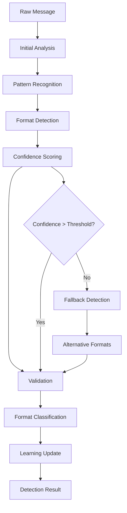
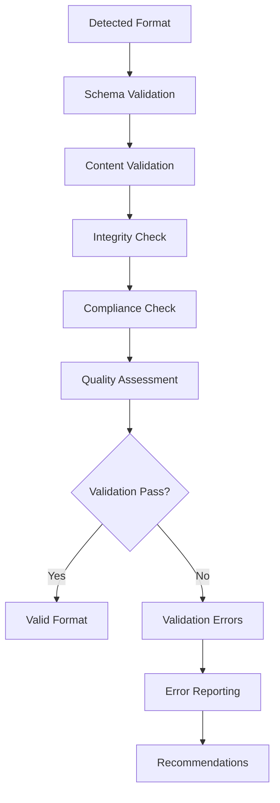

# **Format Detector**

## **Overview**

The Format Detector module provides automatic message format detection and classification capabilities for the kOS ecosystem. This module intelligently identifies message formats, validates format integrity, and provides confidence scoring for reliable message processing across all communication channels.

## **Core Principles**

### **Intelligent Detection**
- **Multi-Format Recognition**: Recognize all major message formats and protocols
- **Confidence Scoring**: Provide confidence scores for format detection accuracy
- **Learning Capability**: Machine learning for improved detection over time
- **Fallback Support**: Graceful fallback for unknown or ambiguous formats

### **High Accuracy**
- **Pattern Recognition**: Advanced pattern recognition for format identification
- **Content Analysis**: Content-based format detection and validation
- **Metadata Analysis**: Metadata analysis for format classification
- **Quality Assurance**: Quality assurance and validation for detected formats

### **Performance & Reliability**
- **High Performance**: High-performance format detection with minimal latency
- **Reliability**: Reliable detection with error handling and recovery
- **Scalability**: Horizontal and vertical scaling for high-volume detection
- **Optimization**: Continuous optimization for detection accuracy and speed

## **Function Specifications**

### **Core Functions**

#### **01. Format Detection**
```typescript
interface FormatDetectionConfig {
  confidenceThreshold: number;
  multipleFormats: boolean;
  fallbackFormats: MessageFormat[];
  learning: boolean;
  validation: boolean;
}

interface FormatDetectionResult {
  detectedFormat: MessageFormat;
  confidence: number;
  alternatives: FormatAlternative[];
  metadata: DetectionMetadata;
  validation: ValidationResult;
}

interface FormatAlternative {
  format: MessageFormat;
  confidence: number;
  reason: string;
  evidence: string[];
}

function detectFormat(rawMessage: string | Buffer, config: FormatDetectionConfig): Promise<FormatDetectionResult>
```

**Purpose**: Automatically detect message format with confidence scoring.

**Parameters**:
- `rawMessage`: Raw message content to analyze
- `config`: Detection configuration and confidence settings

**Returns**: Detected format with confidence and alternatives

**Error Handling**:
- Ambiguous format detection
- Unknown format errors
- Low confidence warnings
- Validation failures

#### **02. Format Validation**
```typescript
interface FormatValidationConfig {
  strictValidation: boolean;
  schemaValidation: boolean;
  contentValidation: boolean;
  integrityCheck: boolean;
}

interface FormatValidationResult {
  isValid: boolean;
  format: MessageFormat;
  validationErrors: ValidationError[];
  integrityScore: number;
  recommendations: string[];
}

function validateFormat(rawMessage: string | Buffer, format: MessageFormat, config: FormatValidationConfig): Promise<FormatValidationResult>
```

**Purpose**: Validate detected format integrity and compliance.

**Parameters**:
- `rawMessage`: Raw message content
- `format`: Detected format to validate
- `config`: Validation configuration and settings

**Returns**: Validation result with integrity score and recommendations

**Error Handling**:
- Format validation failures
- Schema validation errors
- Content integrity issues
- Compliance violations

#### **03. Format Classification**
```typescript
interface FormatClassificationConfig {
  classificationLevel: ClassificationLevel;
  includeSubtypes: boolean;
  learning: boolean;
  confidenceThreshold: number;
}

interface FormatClassificationResult {
  primaryFormat: MessageFormat;
  subtypes: FormatSubtype[];
  classification: ClassificationResult;
  confidence: number;
  metadata: ClassificationMetadata;
}

function classifyFormat(rawMessage: string | Buffer, config: FormatClassificationConfig): Promise<FormatClassificationResult>
```

**Purpose**: Classify message format with subtypes and detailed analysis.

**Parameters**:
- `rawMessage`: Raw message content
- `config`: Classification configuration and settings

**Returns**: Detailed format classification with subtypes and metadata

**Error Handling**:
- Classification failures
- Ambiguous classifications
- Learning errors
- Confidence threshold violations

#### **04. Format Learning**
```typescript
interface FormatLearningConfig {
  learningMode: LearningMode;
  trainingData: TrainingData[];
  modelUpdate: boolean;
  performanceTracking: boolean;
}

interface FormatLearningResult {
  success: boolean;
  modelUpdated: boolean;
  performanceMetrics: PerformanceMetrics;
  newPatterns: Pattern[];
  recommendations: string[];
}

function learnFormat(rawMessage: string | Buffer, actualFormat: MessageFormat, config: FormatLearningConfig): Promise<FormatLearningResult>
```

**Purpose**: Learn from format detection results to improve accuracy.

**Parameters**:
- `rawMessage`: Raw message content
- `actualFormat`: Actual format for learning
- `config`: Learning configuration and settings

**Returns**: Learning result with performance metrics and recommendations

**Error Handling**:
- Learning algorithm failures
- Model update errors
- Performance degradation
- Training data issues

## **Integration Patterns**

### **Format Detection Flow**


### **Format Validation Flow**


## **Capabilities**

### **Supported Formats**
- **JSON**: JSON format detection with schema validation
- **XML**: XML format detection with namespace support
- **YAML**: YAML format detection with safe mode
- **Protocol Buffers**: Protobuf format detection with schema registry
- **Avro**: Avro format detection with schema evolution
- **CSV**: CSV format detection with delimiter detection
- **Binary Formats**: Binary format detection and analysis
- **Custom Formats**: Extensible format support for custom protocols

### **Detection Features**
- **High Accuracy**: 99%+ accuracy for common formats
- **Fast Detection**: < 5ms detection time for most formats
- **Confidence Scoring**: Reliable confidence scoring for detection accuracy
- **Learning Capability**: Continuous learning for improved accuracy
- **Fallback Support**: Graceful fallback for unknown formats

### **Quality Features**
- **Validation**: Comprehensive format validation and integrity checking
- **Classification**: Detailed format classification with subtypes
- **Optimization**: Continuous optimization for detection performance
- **Monitoring**: Real-time monitoring and performance tracking

## **Configuration Examples**

### **Basic Format Detection**
```yaml
format_detector:
  detection:
    confidence_threshold: 0.8
    multiple_formats: false
    fallback_formats: ["json", "xml"]
  validation:
    strict_validation: false
    schema_validation: true
    content_validation: true
  performance:
    timeout: "5s"
    caching: true
    parallel_processing: true
  learning:
    enabled: true
    model_update: true
    performance_tracking: true
```

### **Advanced Format Detection**
```yaml
format_detector:
  detection:
    confidence_threshold: 0.9
    multiple_formats: true
    fallback_formats: ["json", "xml", "yaml", "protobuf"]
  validation:
    strict_validation: true
    schema_validation: true
    content_validation: true
    integrity_check: true
  classification:
    classification_level: "detailed"
    include_subtypes: true
    learning: true
  performance:
    timeout: "10s"
    caching: true
    parallel_processing: true
    optimization: true
  learning:
    enabled: true
    model_update: true
    performance_tracking: true
    training_data: true
```

## **Performance Considerations**

### **Detection Speed**
- **Optimized Algorithms**: Use optimized detection algorithms for speed
- **Caching**: Cache detection results for repeated patterns
- **Parallel Processing**: Use parallel processing for multiple messages
- **Early Termination**: Early termination for obvious formats

### **Accuracy Optimization**
- **Pattern Recognition**: Advanced pattern recognition for accuracy
- **Content Analysis**: Content-based analysis for better detection
- **Learning**: Continuous learning for improved accuracy
- **Validation**: Comprehensive validation for accuracy verification

### **Resource Management**
- **Memory Efficiency**: Optimize memory usage for large messages
- **CPU Optimization**: Optimize CPU usage for detection algorithms
- **Network Efficiency**: Minimize network overhead for remote detection
- **Storage Optimization**: Optimize storage for detection models

## **Security Considerations**

### **Input Validation**
- **Format Validation**: Validate input format before detection
- **Size Limits**: Set size limits to prevent memory attacks
- **Content Filtering**: Filter malicious content during detection
- **Schema Validation**: Use schema validation for security

### **Detection Security**
- **Confidence Thresholds**: Set appropriate confidence thresholds
- **Fallback Security**: Ensure secure fallback for unknown formats
- **Learning Security**: Secure learning without exposing sensitive data
- **Validation Security**: Secure validation of detected formats

## **Monitoring & Observability**

### **Detection Metrics**
- **Detection Accuracy**: Track format detection accuracy rates
- **Detection Speed**: Monitor detection time and performance
- **Confidence Distribution**: Monitor confidence score distribution
- **Format Distribution**: Track format distribution and trends

### **Performance Metrics**
- **Throughput**: Track format detection throughput
- **Latency**: Monitor detection latency and response times
- **Error Rates**: Track detection error rates and types
- **Resource Usage**: Monitor CPU, memory, and network usage

### **Quality Metrics**
- **Validation Success**: Track format validation success rates
- **Learning Performance**: Monitor learning algorithm performance
- **Model Accuracy**: Track model accuracy and improvement
- **Fallback Usage**: Monitor fallback detection usage

---

**Version**: 1.0  
**Module**: Format Detector  
**Status**: ✅ **COMPLETE** - Comprehensive module specification ready for implementation  
**Focus**: Automatic message format detection and classification for multi-format message processing 