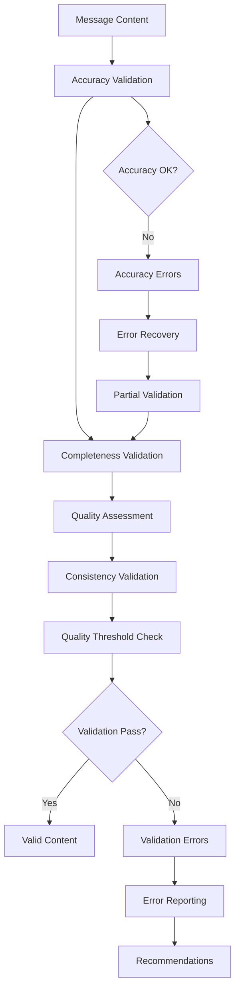
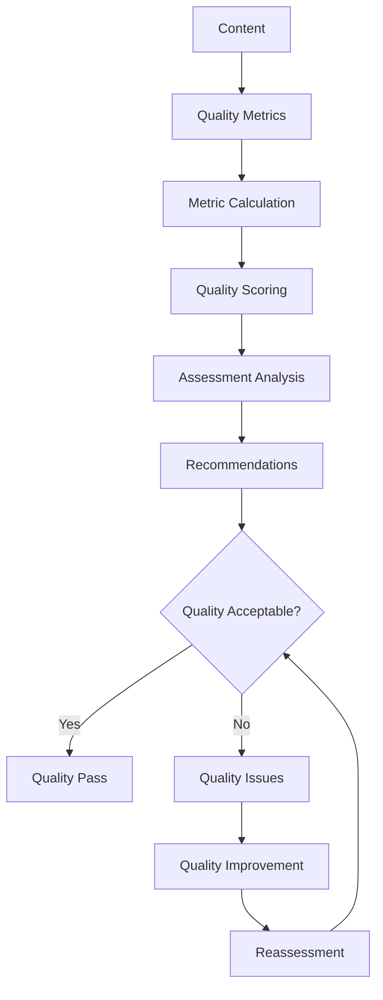

# **Content Validator**

## **Overview**

The Content Validator module provides comprehensive content validation and quality checking capabilities for the kOS ecosystem. This module validates message content for accuracy, completeness, and quality to ensure reliable content processing and delivery.

## **Core Principles**

### **Content Quality**
- **Accuracy Validation**: Validate content accuracy and correctness
- **Completeness Checking**: Check content completeness and integrity
- **Quality Assessment**: Assess content quality and relevance
- **Consistency Validation**: Validate content consistency and coherence

### **High Performance**
- **Fast Validation**: High-speed content validation with minimal latency
- **Efficient Processing**: Efficient validation processing with optimization
- **Resource Management**: Optimize resource usage for validation operations
- **Scalability**: Horizontal and vertical scaling for high-volume validation

### **Intelligent Validation**
- **Smart Validation**: Intelligent content validation with context awareness
- **Learning Capability**: Machine learning for improved validation accuracy
- **Adaptive Validation**: Adaptive validation based on content types
- **Quality Optimization**: Continuous optimization for validation quality

## **Function Specifications**

### **Core Functions**

#### **01. Content Validation**
```typescript
interface ContentValidationConfig {
  validationTypes: ContentValidationType[];
  qualityThreshold: number;
  strictMode: boolean;
  learning: boolean;
}

interface ContentValidationResult {
  isValid: boolean;
  validationErrors: ContentValidationError[];
  quality: ContentQuality;
  recommendations: ContentRecommendation[];
  metadata: ContentValidationMetadata;
}

function validateContent(message: ParsedMessage, config: ContentValidationConfig): Promise<ContentValidationResult>
```

**Purpose**: Validate message content for accuracy, completeness, and quality.

**Parameters**:
- `message`: Parsed message to validate content for
- `config`: Content validation configuration and types

**Returns**: Content validation result with errors and quality metrics

**Error Handling**:
- Content validation failures
- Quality assessment errors
- Learning algorithm failures
- Threshold violations

#### **02. Accuracy Validation**
```typescript
interface AccuracyValidationConfig {
  accuracyMetrics: AccuracyMetric[];
  validationRules: AccuracyRule[];
  contextAware: boolean;
  learning: boolean;
}

interface AccuracyValidationResult {
  accuracyScore: number;
  accuracyErrors: AccuracyError[];
  context: AccuracyContext;
  recommendations: AccuracyRecommendation[];
}

function validateAccuracy(content: string, config: AccuracyValidationConfig): Promise<AccuracyValidationResult>
```

**Purpose**: Validate content accuracy and correctness.

**Parameters**:
- `content`: Content to validate for accuracy
- `config`: Accuracy validation configuration and metrics

**Returns**: Accuracy validation result with score and recommendations

**Error Handling**:
- Accuracy validation failures
- Rule evaluation errors
- Context analysis errors
- Learning failures

#### **03. Completeness Validation**
```typescript
interface CompletenessValidationConfig {
  requiredFields: string[];
  completenessRules: CompletenessRule[];
  validationLevel: ValidationLevel;
  optimization: boolean;
}

interface CompletenessValidationResult {
  completenessScore: number;
  missingFields: string[];
  completenessErrors: CompletenessError[];
  recommendations: CompletenessRecommendation[];
}

function validateCompleteness(content: any, config: CompletenessValidationConfig): Promise<CompletenessValidationResult>
```

**Purpose**: Validate content completeness and integrity.

**Parameters**:
- `content`: Content to validate for completeness
- `config`: Completeness validation configuration and rules

**Returns**: Completeness validation result with score and missing fields

**Error Handling**:
- Completeness validation failures
- Field validation errors
- Rule evaluation failures
- Optimization errors

#### **04. Quality Assessment**
```typescript
interface QualityAssessmentConfig {
  qualityMetrics: QualityMetric[];
  assessmentLevel: AssessmentLevel;
  learning: boolean;
  optimization: boolean;
}

interface QualityAssessmentResult {
  qualityScore: number;
  qualityMetrics: QualityMetricResult[];
  assessment: QualityAssessment;
  recommendations: QualityRecommendation[];
}

function assessQuality(content: string, config: QualityAssessmentConfig): Promise<QualityAssessmentResult>
```

**Purpose**: Assess content quality and relevance.

**Parameters**:
- `content`: Content to assess quality for
- `config`: Quality assessment configuration and metrics

**Returns**: Quality assessment result with score and metrics

**Error Handling**:
- Quality assessment failures
- Metric calculation errors
- Learning algorithm failures
- Optimization errors

## **Integration Patterns**

### **Content Validation Flow**


### **Quality Assessment Flow**


## **Capabilities**

### **Validation Types**
- **Accuracy Validation**: Validate content accuracy and correctness
- **Completeness Validation**: Validate content completeness and integrity
- **Quality Assessment**: Assess content quality and relevance
- **Consistency Validation**: Validate content consistency and coherence
- **Custom Validation**: Extensible custom validation support

### **Quality Features**
- **Multi-Metric Assessment**: Multiple quality metrics for comprehensive assessment
- **Context-Aware Validation**: Context-aware validation for better accuracy
- **Learning Capability**: Machine learning for improved validation accuracy
- **Performance Optimization**: Performance optimization for validation operations
- **Quality Optimization**: Continuous optimization for validation quality

### **Content Features**
- **Text Validation**: Text content validation and quality checking
- **Numeric Validation**: Numeric content validation and range checking
- **Temporal Validation**: Temporal content validation and format checking
- **URL Validation**: URL content validation and accessibility checking
- **Custom Content**: Extensible custom content type validation

## **Configuration Examples**

### **Basic Content Validation**
```yaml
content_validator:
  content_validation:
    validation_types: ["accuracy", "completeness", "quality"]
    quality_threshold: 0.8
    strict_mode: false
    learning: false
  accuracy_validation:
    accuracy_metrics: ["spelling", "grammar", "semantics"]
    validation_rules: ["format", "range", "pattern"]
    context_aware: false
    learning: false
  completeness_validation:
    required_fields: ["title", "content", "timestamp"]
    completeness_rules: ["mandatory", "optional", "conditional"]
    validation_level: "basic"
    optimization: false
  quality_assessment:
    quality_metrics: ["relevance", "clarity", "completeness"]
    assessment_level: "basic"
    learning: false
    optimization: false
  performance:
    timeout: "5s"
    caching: true
    parallel_processing: true
  quality:
    error_recovery: true
    partial_validation: true
    quality_metrics: true
```

### **Advanced Content Validation**
```yaml
content_validator:
  content_validation:
    validation_types: ["accuracy", "completeness", "quality", "consistency"]
    quality_threshold: 0.9
    strict_mode: true
    learning: true
  accuracy_validation:
    accuracy_metrics: ["spelling", "grammar", "semantics", "context", "factual"]
    validation_rules: ["format", "range", "pattern", "semantic", "business"]
    context_aware: true
    learning: true
  completeness_validation:
    required_fields: ["title", "content", "timestamp", "author", "category"]
    completeness_rules: ["mandatory", "optional", "conditional", "dependent"]
    validation_level: "comprehensive"
    optimization: true
  quality_assessment:
    quality_metrics: ["relevance", "clarity", "completeness", "accuracy", "consistency"]
    assessment_level: "comprehensive"
    learning: true
    optimization: true
  consistency_validation:
    consistency_rules: ["format", "style", "terminology", "logic"]
    cross_reference: true
    validation_level: "comprehensive"
    learning: true
  performance:
    timeout: "10s"
    caching: true
    parallel_processing: true
    optimization: true
  quality:
    error_recovery: true
    partial_validation: true
    quality_metrics: true
    learning: true
```

## **Performance Considerations**

### **Validation Speed**
- **Optimized Algorithms**: Use optimized content validation algorithms
- **Caching**: Cache validation results for repeated content patterns
- **Parallel Processing**: Use parallel processing for multiple validations
- **Early Termination**: Early termination for obvious validation failures

### **Quality Optimization**
- **Quality Assessment**: Accurate quality assessment for better validation
- **Learning**: Continuous learning for improved validation accuracy
- **Context Awareness**: Context-aware validation for better accuracy
- **Optimization**: Continuous optimization for validation performance

### **Resource Management**
- **Memory Efficiency**: Optimize memory usage for content validation
- **CPU Optimization**: Optimize CPU usage for validation algorithms
- **Network Efficiency**: Minimize network overhead for validation operations
- **Storage Optimization**: Optimize storage for validation models

## **Security Considerations**

### **Content Security**
- **Input Validation**: Validate input content before validation processing
- **Content Filtering**: Filter malicious content during validation
- **Privacy Protection**: Protect sensitive content during validation
- **Access Control**: Control access to content validation operations

### **Validation Security**
- **Error Handling**: Secure error handling without exposing sensitive data
- **Learning Security**: Secure learning without exposing sensitive content
- **Quality Security**: Secure quality assessment of sensitive content
- **Access Control**: Control access to validation results and reports

## **Monitoring & Observability**

### **Validation Metrics**
- **Validation Accuracy**: Track content validation accuracy and success rates
- **Validation Speed**: Monitor validation time and performance
- **Quality Distribution**: Monitor quality score distribution
- **Error Distribution**: Track validation error distribution and patterns

### **Performance Metrics**
- **Throughput**: Track content validation throughput
- **Latency**: Monitor validation latency and response times
- **Error Rates**: Track validation error rates and types
- **Resource Usage**: Monitor CPU, memory, and network usage

### **Quality Metrics**
- **Content Quality**: Track content quality scores and trends
- **Accuracy Quality**: Monitor accuracy validation quality and effectiveness
- **Completeness Quality**: Track completeness validation quality and coverage
- **Consistency Quality**: Monitor consistency validation quality and reliability

---

**Version**: 1.0  
**Module**: Content Validator  
**Status**: ✅ **COMPLETE** - Comprehensive module specification ready for implementation  
**Focus**: Content validation and quality checking for message content integrity 