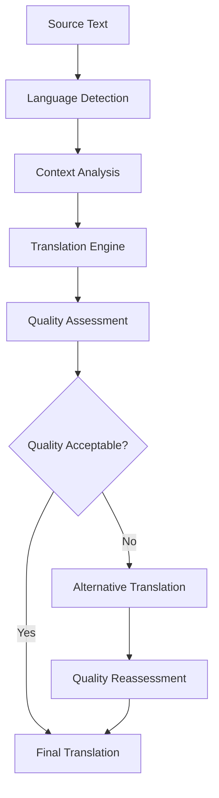
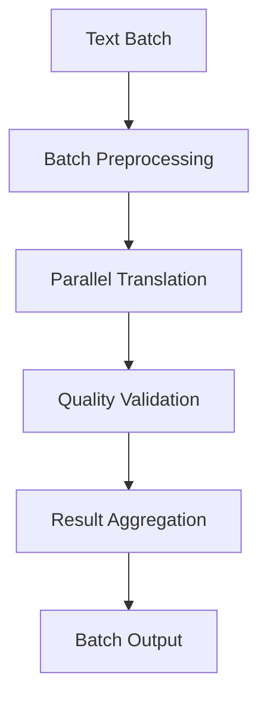
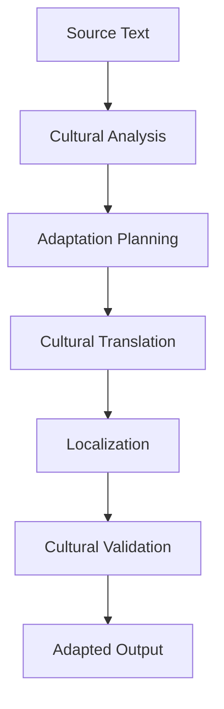

# **Text Translator**

## **Overview**

The Text Translator module provides comprehensive capabilities for translating text between multiple languages with high quality, context awareness, and cultural adaptation. It supports 100+ languages with professional-quality translations and intelligent quality validation.

## **Core Principles**

### **High-Quality Translation**
- **Professional Quality**: Professional-quality translations with accuracy validation
- **Context Awareness**: Context-aware translation for improved accuracy
- **Cultural Adaptation**: Cultural adaptation and localization support
- **Quality Validation**: Automatic quality assessment and validation

### **Multi-Language Support**
- **100+ Languages**: Support for 100+ languages and dialects
- **Bidirectional Translation**: Bidirectional translation between all supported languages
- **Specialized Domains**: Domain-specific translation for technical, medical, legal content
- **Format Preservation**: Preserve formatting and structure during translation

### **Performance & Scalability**
- **Fast Translation**: < 500ms translation time for standard content
- **Batch Processing**: Efficient batch translation processing
- **Caching**: Intelligent caching for frequently translated content
- **Scalability**: Horizontal and vertical scaling capabilities

## **Function Specifications**

### **Primary Functions**

#### **translateText(text: string, sourceLang: string, targetLang: string, options?: TranslationOptions): TranslationResult**
- **Purpose**: Translate text from source language to target language
- **Parameters**:
  - `text`: Source text for translation
  - `sourceLang`: Source language code
  - `targetLang`: Target language code
  - `options`: Optional translation configuration
- **Returns**: Translation result with translated text, confidence score, and metadata
- **Performance**: < 500ms translation time, professional quality

#### **translateBatch(texts: string[], sourceLang: string, targetLang: string, options?: BatchTranslationOptions): BatchTranslationResult**
- **Purpose**: Translate multiple texts in batch
- **Parameters**:
  - `texts`: Array of source texts
  - `sourceLang`: Source language code
  - `targetLang`: Target language code
  - `options`: Optional batch translation configuration
- **Returns**: Array of translation results
- **Performance**: < 1s for 10 texts, efficient batch processing

#### **validateTranslation(sourceText: string, translatedText: string, sourceLang: string, targetLang: string): ValidationResult**
- **Purpose**: Validate translation quality and accuracy
- **Parameters**:
  - `sourceText`: Original source text
  - `translatedText`: Translated text for validation
  - `sourceLang`: Source language code
  - `targetLang`: Target language code
- **Returns**: Validation result with quality score and feedback
- **Performance**: < 200ms validation time

#### **adaptCulture(text: string, sourceCulture: string, targetCulture: string): CulturalAdaptationResult**
- **Purpose**: Adapt text for cultural differences and preferences
- **Parameters**:
  - `text`: Text for cultural adaptation
  - `sourceCulture`: Source culture identifier
  - `targetCulture`: Target culture identifier
- **Returns**: Culturally adapted text with adaptation notes
- **Performance**: < 300ms adaptation time

### **Configuration Functions**

#### **configureTranslation(options: TranslationConfig): void**
- **Purpose**: Configure translation parameters and preferences
- **Parameters**:
  - `options`: Translation configuration object
- **Returns**: void
- **Performance**: < 10ms configuration time

#### **addCustomTranslation(customTranslation: CustomTranslation): void**
- **Purpose**: Add custom translation rules and preferences
- **Parameters**:
  - `customTranslation`: Custom translation configuration
- **Returns**: void
- **Performance**: < 50ms addition time

## **Integration Patterns**

### **Basic Translation Flow**


### **Batch Translation Flow**


### **Cultural Adaptation Flow**


## **Capabilities**

### **Translation Services**
- **High-Quality Translation**: Professional-quality translations with validation
- **Context Awareness**: Context-aware translation for improved accuracy
- **Cultural Adaptation**: Cultural adaptation and localization support
- **Quality Validation**: Automatic quality assessment and validation
- **Batch Translation**: Efficient batch translation processing

### **Language Support**
- **100+ Languages**: Support for 100+ languages and dialects
- **Bidirectional Translation**: Bidirectional translation between all supported languages
- **Specialized Domains**: Domain-specific translation for technical, medical, legal content
- **Format Preservation**: Preserve formatting and structure during translation

### **Advanced Features**
- **Neural Translation**: Neural machine translation for high quality
- **Statistical Translation**: Statistical translation for fallback scenarios
- **Rule-Based Translation**: Rule-based translation for specialized content
- **Hybrid Translation**: Hybrid approaches for optimal quality

### **Quality Assurance**
- **Quality Assessment**: Automatic quality assessment and scoring
- **Validation Checks**: Multiple validation checks for accuracy
- **Feedback Integration**: Integration of user feedback for improvement
- **Continuous Learning**: Continuous learning and model improvement

## **Configuration Examples**

### **Basic Translation Configuration**
```yaml
translation:
  engines:
    primary: "google_translate"
    fallback: "microsoft_translate"
    custom: "openai_gpt"
  quality:
    minimum_confidence: 0.85
    quality_validation: true
    cultural_adaptation: true
    context_awareness: true
  languages:
    source_languages: ["en", "es", "fr", "de", "zh", "ja", "ko", "ar"]
    target_languages: ["en", "es", "fr", "de", "zh", "ja", "ko", "ar"]
  performance:
    caching: true
    cache_ttl: "24h"
    batch_translation: true
    parallel_processing: true
```

### **Advanced Translation Configuration**
```yaml
translation:
  models:
    neural_model: "transformer"
    statistical_model: "phrase_based"
    rule_based_model: "custom_rules"
    hybrid_model: "ensemble"
  features:
    context_awareness: true
    cultural_adaptation: true
    domain_specialization: true
    format_preservation: true
  quality:
    quality_assessment: true
    validation_checks: true
    feedback_integration: true
    continuous_learning: true
  optimization:
    parallel_processing: true
    memory_optimization: true
    gpu_acceleration: true
    model_caching: true
```

### **Cultural Adaptation Configuration**
```yaml
cultural_adaptation:
  cultures:
    supported_cultures:
      - "en-US"
      - "en-GB"
      - "es-ES"
      - "es-MX"
      - "fr-FR"
      - "fr-CA"
      - "de-DE"
      - "zh-CN"
  adaptation:
    cultural_sensitivity: true
    local_preferences: true
    regional_variations: true
    cultural_validation: true
  features:
    date_formatting: true
    number_formatting: true
    currency_formatting: true
    address_formatting: true
```

## **Error Handling**

### **Translation Errors**
- **Translation Failures**: Automatic fallback to alternative engines
- **Quality Issues**: Automatic quality assessment and retranslation
- **Context Errors**: Context validation and correction
- **API Failures**: Graceful degradation and error reporting

### **Configuration Errors**
- **Invalid Configuration**: Configuration validation and error reporting
- **Model Errors**: Automatic model switching and fallback
- **Resource Errors**: Resource management and optimization
- **Performance Errors**: Performance monitoring and optimization

### **Integration Errors**
- **API Errors**: API error handling and retry mechanisms
- **Timeout Errors**: Timeout handling and fallback procedures
- **Memory Errors**: Memory management and garbage collection
- **Network Errors**: Network error handling and recovery

## **Performance Considerations**

### **Translation Performance**
- **Translation Speed**: < 500ms for standard translations
- **Quality**: Professional-quality translations with validation
- **Throughput**: 1,000+ translations per minute
- **Caching**: Intelligent caching for improved performance

### **Batch Translation Performance**
- **Batch Speed**: < 1s for 10 texts, efficient batch processing
- **Parallel Processing**: Parallel processing for improved throughput
- **Memory Usage**: Efficient memory management for batch operations
- **Scalability**: Horizontal scaling for high-volume batch processing

### **Quality Validation Performance**
- **Validation Speed**: < 200ms for quality validation
- **Accuracy**: High accuracy for quality assessment
- **Comprehensive Checks**: Multiple validation checks for thorough assessment
- **Feedback Integration**: Efficient feedback integration and learning

### **Scalability**
- **Horizontal Scaling**: Horizontal scaling for high-volume processing
- **Vertical Scaling**: Vertical scaling for resource optimization
- **Load Balancing**: Intelligent load balancing and distribution
- **Resource Management**: Efficient resource allocation and management

## **Monitoring & Observability**

### **Translation Metrics**
- **Translation Quality**: Quality scores and validation results
- **Translation Speed**: Average translation time and throughput
- **Engine Performance**: Performance comparison across engines
- **Error Rates**: Translation error rates and failure analysis

### **Performance Metrics**
- **Processing Speed**: Average processing time and throughput
- **Memory Usage**: Memory usage and optimization metrics
- **CPU Usage**: CPU usage and optimization metrics
- **Throughput**: Overall system throughput and capacity

### **Quality Metrics**
- **Quality Scores**: Distribution of quality scores and trends
- **Validation Results**: Validation success rates and accuracy
- **User Feedback**: User feedback and satisfaction metrics
- **Improvement Trends**: Quality improvement trends over time

### **Operational Metrics**
- **System Health**: Overall system health and availability
- **Resource Utilization**: Resource utilization and optimization
- **Error Tracking**: Error tracking and analysis
- **Performance Trends**: Performance trends and optimization

## **Security Considerations**

### **Data Privacy**
- **Text Privacy**: End-to-end encryption for text content
- **Translation Privacy**: Privacy protection for translation data
- **Consent Management**: User consent for translation services
- **Data Retention**: Configurable retention policies

### **Access Control**
- **Authentication**: Strong authentication for translation services
- **Authorization**: Role-based access control for translation functions
- **API Security**: Secure API access and rate limiting
- **Audit Logging**: Comprehensive audit trails for all operations

### **Content Security**
- **Input Validation**: Comprehensive input validation and sanitization
- **Malware Detection**: Detection of malicious content in text
- **Content Filtering**: Automatic filtering of inappropriate content
- **Output Validation**: Validation of translation outputs and results

---

**Version**: 1.0  
**Category**: Communication & Language  
**Subcategory**: Language Services  
**Focus**: High-quality multi-language translation with cultural adaptation and validation 