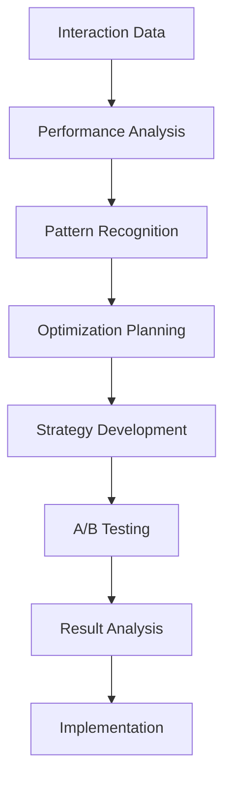
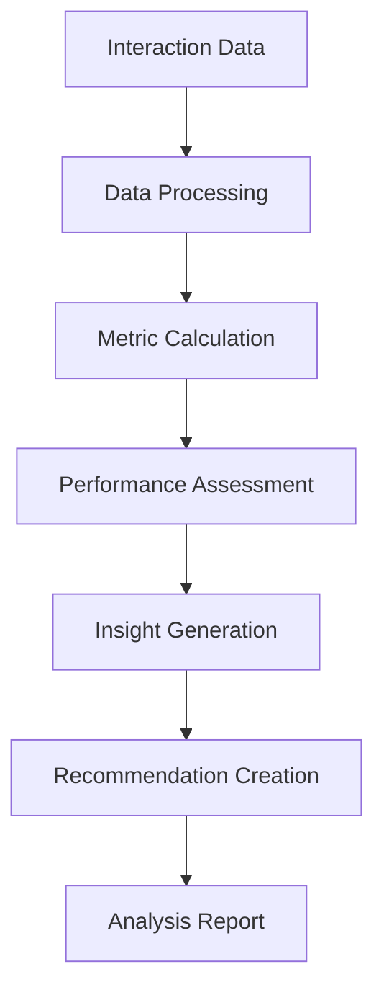
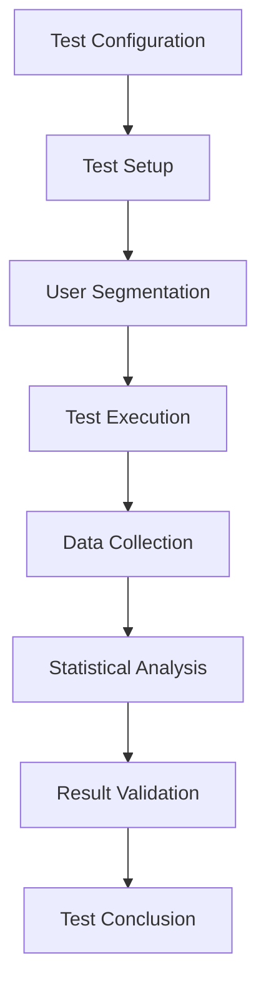

# **Interaction Optimizer**

## **Overview**

The Interaction Optimizer module provides comprehensive capabilities for analyzing interaction performance, optimizing interaction strategies, and continuously improving user experience. It enables data-driven interaction optimization with machine learning and A/B testing.

## **Core Principles**

### **Performance Optimization**
- **Performance Analysis**: Analyze interaction performance and effectiveness
- **Optimization Algorithms**: Apply optimization algorithms for better outcomes
- **A/B Testing**: A/B testing for interaction strategy optimization
- **Continuous Improvement**: Continuous improvement based on performance data

### **Data-Driven Decisions**
- **Analytics Integration**: Integration of interaction analytics and metrics
- **Pattern Recognition**: Recognition of patterns in user interactions
- **Predictive Analytics**: Predictive analytics for interaction optimization
- **Machine Learning**: Machine learning-based optimization algorithms

### **User-Centric Design**
- **User Experience**: Focus on user experience and satisfaction
- **Personalization**: Personalized interaction strategies
- **User Feedback**: Integration of user feedback and preferences
- **Accessibility**: Accessibility and inclusive design optimization

## **Function Specifications**

### **Primary Functions**

#### **optimizeInteraction(interaction: Interaction, goal: OptimizationGoal): OptimizationResult**
- **Purpose**: Optimize interaction for better outcomes
- **Parameters**:
  - `interaction`: Current interaction data
  - `goal`: Optimization goal or objective
- **Returns**: Optimization result with recommendations and strategies
- **Performance**: < 200ms optimization decisions, continuous improvement

#### **analyzePerformance(interactionData: InteractionData): PerformanceAnalysis**
- **Purpose**: Analyze interaction performance and effectiveness
- **Parameters**:
  - `interactionData`: Interaction data for analysis
- **Returns**: Performance analysis with metrics and insights
- **Performance**: < 150ms analysis time, comprehensive insights

#### **runABTest(testConfig: ABTestConfig): ABTestResult**
- **Purpose**: Run A/B test for interaction optimization
- **Parameters**:
  - `testConfig`: A/B test configuration
- **Returns**: A/B test results with statistical significance
- **Performance**: Real-time test execution and monitoring

#### **generateRecommendations(userProfile: UserProfile, context: Context): RecommendationSet**
- **Purpose**: Generate personalized interaction recommendations
- **Parameters**:
  - `userProfile`: User profile and preferences
  - `context`: Current interaction context
- **Returns**: Set of personalized recommendations
- **Performance**: < 100ms recommendation generation

### **Configuration Functions**

#### **configureOptimization(options: OptimizationConfig): void**
- **Purpose**: Configure interaction optimization parameters
- **Parameters**:
  - `options`: Optimization configuration object
- **Returns**: void
- **Performance**: < 10ms configuration time

#### **addOptimizationRule(rule: OptimizationRule): void**
- **Purpose**: Add custom optimization rules
- **Parameters**:
  - `rule`: Custom optimization rule
- **Returns**: void
- **Performance**: < 50ms addition time

## **Integration Patterns**

### **Optimization Flow**


### **Performance Analysis Flow**


### **A/B Testing Flow**


## **Capabilities**

### **Performance Analysis**
- **Performance Tracking**: Track interaction performance and effectiveness
- **Metric Analysis**: Comprehensive metric analysis and reporting
- **Trend Analysis**: Analyze performance trends over time
- **Benchmarking**: Benchmarking against industry standards
- **Root Cause Analysis**: Root cause analysis for performance issues

### **Optimization Algorithms**
- **Machine Learning**: Machine learning-based optimization algorithms
- **Reinforcement Learning**: Reinforcement learning for continuous improvement
- **Predictive Analytics**: Predictive analytics for optimization planning
- **Multi-objective Optimization**: Multi-objective optimization algorithms
- **Adaptive Algorithms**: Adaptive algorithms for dynamic environments

### **A/B Testing**
- **Test Design**: Statistical test design and planning
- **User Segmentation**: Intelligent user segmentation for testing
- **Statistical Analysis**: Statistical analysis and significance testing
- **Result Validation**: Result validation and confidence assessment
- **Test Automation**: Automated test execution and monitoring

### **Personalization**
- **User Profiling**: Comprehensive user profiling and segmentation
- **Preference Learning**: Learning and adaptation to user preferences
- **Context Awareness**: Context-aware personalization
- **Dynamic Adaptation**: Dynamic adaptation to user behavior
- **Feedback Integration**: Integration of user feedback and preferences

## **Configuration Examples**

### **Basic Optimization Configuration**
```yaml
interaction_optimization:
  analysis:
    performance_tracking: true
    pattern_recognition: true
    user_behavior_analysis: true
    outcome_measurement: true
  optimization:
    algorithm_selection: "adaptive"
    personalization_level: "high"
    a_b_testing: true
    continuous_improvement: true
  learning:
    machine_learning: true
    reinforcement_learning: true
    user_feedback_integration: true
    adaptive_algorithms: true
  performance:
    optimization_speed: "< 200ms"
    learning_rate: "adaptive"
    accuracy_improvement: "continuous"
    scalability: "horizontal"
```

### **Advanced Optimization Configuration**
```yaml
interaction_optimization:
  algorithms:
    primary_algorithm: "reinforcement_learning"
    fallback_algorithm: "genetic_algorithm"
    ensemble_methods: ["boosting", "bagging"]
    multi_objective: true
  features:
    predictive_analytics: true
    real_time_optimization: true
    cross_platform_optimization: true
    accessibility_optimization: true
  testing:
    automated_testing: true
    statistical_validation: true
    confidence_assessment: true
    result_interpretation: true
  analytics:
    performance_analytics: true
    user_behavior_analytics: true
    optimization_insights: true
    predictive_insights: true
```

### **A/B Testing Configuration**
```yaml
a_b_testing:
  design:
    statistical_power: 0.95
    confidence_level: 0.95
    minimum_sample_size: 1000
    test_duration: "7d"
  segmentation:
    user_segmentation: true
    behavioral_segmentation: true
    demographic_segmentation: true
    contextual_segmentation: true
  analysis:
    statistical_analysis: true
    significance_testing: true
    effect_size_calculation: true
    confidence_intervals: true
  monitoring:
    real_time_monitoring: true
    alert_system: true
    performance_tracking: true
    result_validation: true
```

## **Error Handling**

### **Optimization Errors**
- **Optimization Failures**: Fallback to standard optimization methods
- **Algorithm Errors**: Algorithm validation and correction
- **Learning Errors**: Learning algorithm validation and correction
- **Performance Issues**: Performance monitoring and optimization

### **Analysis Errors**
- **Analysis Failures**: Graceful degradation with partial results
- **Data Quality Issues**: Data validation and quality checking
- **Statistical Errors**: Statistical validation and correction
- **Insight Errors**: Insight validation and verification

### **A/B Testing Errors**
- **Test Failures**: Test validation and error recovery
- **Statistical Errors**: Statistical validation and correction
- **Sample Size Issues**: Sample size validation and adjustment
- **Result Errors**: Result validation and verification

### **Configuration Errors**
- **Invalid Configuration**: Configuration validation and error reporting
- **Rule Errors**: Rule validation and correction
- **Resource Errors**: Resource management and optimization
- **Performance Errors**: Performance monitoring and optimization

## **Performance Considerations**

### **Optimization Performance**
- **Optimization Speed**: < 200ms for optimization decisions
- **Learning Rate**: Adaptive learning rate for continuous improvement
- **Accuracy Improvement**: Continuous accuracy improvement over time
- **Scalability**: Horizontal scaling for optimization algorithms

### **Analysis Performance**
- **Analysis Speed**: < 150ms for performance analysis
- **Data Processing**: Fast data processing and analysis
- **Insight Generation**: Fast insight generation and reporting
- **Recommendation Speed**: < 100ms for recommendation generation

### **A/B Testing Performance**
- **Test Execution**: Real-time test execution and monitoring
- **Statistical Analysis**: Fast statistical analysis and validation
- **Result Processing**: Fast result processing and interpretation
- **Monitoring**: Real-time monitoring and alerting

### **Scalability**
- **Horizontal Scaling**: Horizontal scaling for high-volume processing
- **Vertical Scaling**: Vertical scaling for resource optimization
- **Load Balancing**: Intelligent load balancing and distribution
- **Resource Management**: Efficient resource allocation and management

## **Monitoring & Observability**

### **Optimization Metrics**
- **Optimization Effectiveness**: Optimization algorithm effectiveness
- **Learning Performance**: Learning algorithm performance metrics
- **Improvement Rate**: Rate of improvement and optimization success
- **A/B Testing Performance**: A/B testing performance and reliability

### **Performance Metrics**
- **Processing Speed**: Average processing time and throughput
- **Memory Usage**: Memory usage and optimization metrics
- **CPU Usage**: CPU usage and optimization metrics
- **Throughput**: Overall system throughput and capacity

### **Quality Metrics**
- **Optimization Quality**: Optimization quality and effectiveness
- **User Satisfaction**: User satisfaction and engagement improvements
- **Performance Improvement**: Performance improvement trends
- **Accuracy Metrics**: Accuracy and precision of optimization

### **Operational Metrics**
- **System Health**: Overall system health and availability
- **Resource Utilization**: Resource utilization and optimization
- **Error Tracking**: Error tracking and analysis
- **Performance Trends**: Performance trends and optimization

## **Security Considerations**

### **Data Privacy**
- **Interaction Privacy**: End-to-end encryption for interaction data
- **User Privacy**: Privacy protection for user interaction data
- **Analytics Privacy**: Privacy protection for analytics data
- **Data Retention**: Configurable retention policies

### **Access Control**
- **Authentication**: Strong authentication for optimization services
- **Authorization**: Role-based access control for optimization functions
- **API Security**: Secure API access and rate limiting
- **Audit Logging**: Comprehensive audit trails for all operations

### **Content Security**
- **Input Validation**: Comprehensive input validation and sanitization
- **Data Validation**: Data validation and integrity checking
- **Result Validation**: Validation of optimization outputs and results
- **Test Security**: Security for A/B testing and experimentation

---

**Version**: 1.0  
**Category**: Communication & Language  
**Subcategory**: Interaction Management  
**Focus**: Data-driven interaction optimization with machine learning and A/B testing 