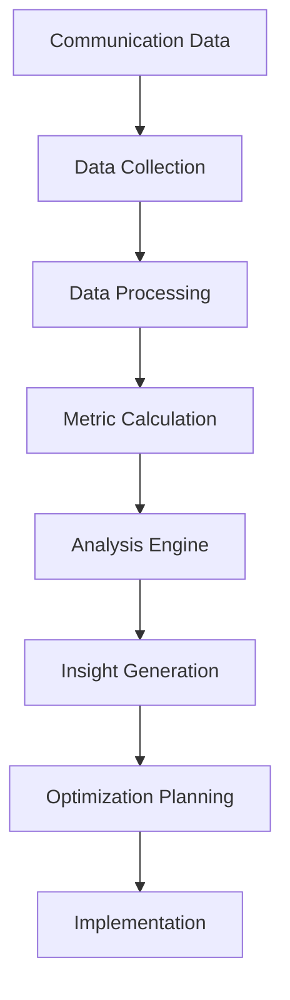
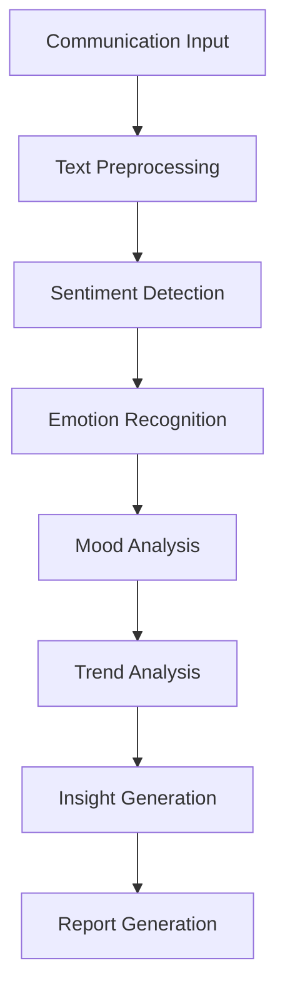
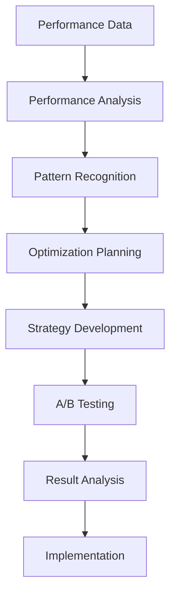
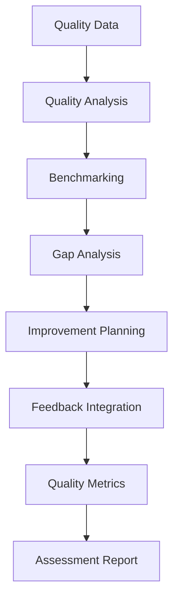

# **Communication Analytics**

## **Overview**

The Communication Analytics subcategory provides comprehensive capabilities for analyzing communication effectiveness, measuring performance, optimizing communication strategies, and assessing quality. These modules form the foundation for data-driven communication optimization and continuous improvement in the kOS ecosystem.

## **Core Principles**

### **Data-Driven Analysis**
- **Comprehensive Metrics**: Track comprehensive communication metrics and KPIs
- **Real-time Analytics**: Real-time analytics and performance monitoring
- **Trend Analysis**: Analyze communication trends and patterns over time
- **Predictive Analytics**: Predictive analytics for communication optimization

### **Performance Optimization**
- **Effectiveness Measurement**: Measure communication effectiveness and impact
- **Optimization Algorithms**: Apply optimization algorithms for better outcomes
- **A/B Testing**: A/B testing for communication strategy optimization
- **Continuous Improvement**: Continuous improvement based on analytics insights

### **Quality Assessment**
- **Quality Metrics**: Comprehensive quality metrics and assessment
- **Automated Analysis**: Automated quality analysis and assessment
- **Benchmarking**: Benchmarking against industry standards and best practices
- **Feedback Integration**: Integration of user feedback and satisfaction metrics

## **Function Specifications**

### **Sentiment Analysis**
- **Purpose**: Analyze sentiment and emotional intelligence in communications
- **Capabilities**: Sentiment detection, emotion recognition, mood tracking, trend analysis
- **Integration**: NLP engines, sentiment models, analytics platforms
- **Performance**: < 100ms analysis time, 95%+ accuracy

### **Communication Metrics**
- **Purpose**: Track and measure comprehensive communication metrics and KPIs
- **Capabilities**: Engagement metrics, effectiveness measurement, performance tracking
- **Integration**: Analytics engines, metrics databases, reporting platforms
- **Performance**: < 50ms metric calculation, real-time reporting

### **Performance Optimization**
- **Purpose**: Optimize communication performance and effectiveness
- **Capabilities**: Performance analysis, optimization algorithms, strategy improvement
- **Integration**: Optimization engines, machine learning models, analytics platforms
- **Performance**: < 200ms optimization decisions, continuous improvement

### **Quality Assessment**
- **Purpose**: Assess and improve communication quality and effectiveness
- **Capabilities**: Quality metrics, automated assessment, benchmarking, feedback integration
- **Integration**: Quality assessment engines, benchmarking databases, feedback systems
- **Performance**: < 150ms assessment time, comprehensive quality analysis

## **Integration Patterns**

### **Analytics Processing Flow**


### **Sentiment Analysis Flow**


### **Performance Optimization Flow**


### **Quality Assessment Flow**


## **Capabilities**

### **Sentiment Analysis**
- **Real-time Analysis**: Real-time sentiment analysis and emotional intelligence
- **Emotion Recognition**: Recognize and track emotional states and changes
- **Mood Tracking**: Track mood changes and emotional patterns over time
- **Trend Analysis**: Analyze sentiment trends and patterns
- **Predictive Sentiment**: Predictive sentiment analysis for future communications

### **Communication Metrics**
- **Engagement Metrics**: Track engagement rates, response times, and interaction patterns
- **Effectiveness Measurement**: Measure communication effectiveness and impact
- **Performance Tracking**: Track performance metrics and KPIs
- **ROI Analysis**: Analyze return on investment for communication strategies
- **Comparative Analysis**: Comparative analysis across different communication channels

### **Performance Optimization**
- **Performance Analysis**: Analyze communication performance and identify improvement areas
- **Optimization Algorithms**: Apply optimization algorithms for better outcomes
- **Strategy Development**: Develop and test communication strategies
- **A/B Testing**: A/B testing for communication strategy optimization
- **Continuous Improvement**: Continuous improvement based on performance data

### **Quality Assessment**
- **Quality Metrics**: Comprehensive quality metrics and assessment criteria
- **Automated Analysis**: Automated quality analysis and assessment
- **Benchmarking**: Benchmarking against industry standards and best practices
- **Feedback Integration**: Integration of user feedback and satisfaction metrics
- **Quality Improvement**: Quality improvement recommendations and implementation

## **Configuration Examples**

### **Sentiment Analysis Configuration**
```yaml
sentiment_analysis:
  models:
    sentiment_model: "bert-base"
    emotion_model: "roberta-base"
    mood_model: "distilbert"
    trend_model: "lstm"
  analysis:
    real_time_analysis: true
    emotion_recognition: true
    mood_tracking: true
    trend_analysis: true
    predictive_analysis: true
  performance:
    analysis_speed: "< 100ms"
    accuracy: "95%+"
    real_time: true
    batch_processing: true
  integration:
    nlp_engines: ["spacy", "nltk"]
    analytics_platforms: ["elasticsearch", "kibana"]
    reporting_tools: ["grafana", "tableau"]
```

### **Communication Metrics Configuration**
```yaml
communication_metrics:
  metrics:
    engagement_metrics: true
    effectiveness_measurement: true
    performance_tracking: true
    roi_analysis: true
    comparative_analysis: true
  tracking:
    real_time_tracking: true
    historical_analysis: true
    trend_analysis: true
    predictive_analytics: true
  reporting:
    automated_reports: true
    custom_dashboards: true
    alert_system: true
    export_capabilities: true
  performance:
    calculation_speed: "< 50ms"
    real_time_reporting: true
    data_accuracy: "99.9%"
    scalability: "horizontal"
```

### **Performance Optimization Configuration**
```yaml
performance_optimization:
  analysis:
    performance_analysis: true
    pattern_recognition: true
    gap_analysis: true
    opportunity_identification: true
  optimization:
    algorithm_selection: "adaptive"
    strategy_development: true
    a_b_testing: true
    continuous_improvement: true
  learning:
    machine_learning: true
    reinforcement_learning: true
    user_feedback_integration: true
    adaptive_algorithms: true
  performance:
    optimization_speed: "< 200ms"
    learning_rate: "adaptive"
    improvement_rate: "continuous"
    scalability: "horizontal"
```

### **Quality Assessment Configuration**
```yaml
quality_assessment:
  assessment:
    quality_metrics: true
    automated_analysis: true
    benchmarking: true
    gap_analysis: true
    feedback_integration: true
  criteria:
    accuracy_metrics: true
    relevance_metrics: true
    clarity_metrics: true
    effectiveness_metrics: true
    satisfaction_metrics: true
  benchmarking:
    industry_standards: true
    best_practices: true
    competitive_analysis: true
    historical_comparison: true
  performance:
    assessment_speed: "< 150ms"
    accuracy: "95%+"
    automation_level: "high"
    scalability: "horizontal"
```

## **Error Handling**

### **Sentiment Analysis Errors**
- **Analysis Failures**: Fallback to basic sentiment analysis methods
- **Model Errors**: Automatic model switching and fallback
- **Data Quality Issues**: Data validation and quality checking
- **Processing Errors**: Error isolation and recovery procedures

### **Metrics Calculation Errors**
- **Calculation Failures**: Automatic recalculation and validation
- **Data Corruption**: Data validation and repair procedures
- **Performance Issues**: Performance monitoring and optimization
- **Reporting Errors**: Error isolation and recovery mechanisms

### **Optimization Errors**
- **Optimization Failures**: Fallback to standard optimization methods
- **Algorithm Errors**: Algorithm validation and correction
- **Learning Errors**: Learning algorithm validation and correction
- **A/B Testing Errors**: Test validation and result verification

### **Quality Assessment Errors**
- **Assessment Failures**: Graceful degradation with partial results
- **Benchmarking Errors**: Benchmarking validation and correction
- **Feedback Errors**: Feedback validation and integration procedures
- **Quality Errors**: Quality validation and improvement mechanisms

## **Performance Considerations**

### **Sentiment Analysis Performance**
- **Analysis Speed**: < 100ms for real-time sentiment analysis
- **Accuracy**: 95%+ accuracy for sentiment and emotion recognition
- **Throughput**: 10,000+ analyses per hour
- **Real-time Processing**: Real-time processing for live communications

### **Metrics Calculation Performance**
- **Calculation Speed**: < 50ms for metric calculations
- **Real-time Reporting**: Real-time reporting and dashboard updates
- **Data Accuracy**: 99.9% data accuracy and reliability
- **Scalability**: Horizontal scaling for high-volume data processing

### **Optimization Performance**
- **Optimization Speed**: < 200ms for optimization decisions
- **Learning Rate**: Adaptive learning rate for continuous improvement
- **Improvement Rate**: Continuous improvement based on performance data
- **Scalability**: Horizontal scaling for optimization algorithms

### **Quality Assessment Performance**
- **Assessment Speed**: < 150ms for quality assessments
- **Accuracy**: 95%+ accuracy for quality analysis and assessment
- **Automation Level**: High level of automation for quality assessment
- **Scalability**: Horizontal scaling for quality assessment processes

## **Monitoring & Observability**

### **Sentiment Analysis Metrics**
- **Analysis Accuracy**: Sentiment and emotion analysis accuracy rates
- **Processing Speed**: Average processing time and throughput
- **Model Performance**: Performance metrics for different sentiment models
- **Error Rates**: Analysis error rates and failure analysis

### **Communication Metrics**
- **Metric Accuracy**: Accuracy of calculated metrics and KPIs
- **Calculation Speed**: Average calculation time and throughput
- **Data Quality**: Data quality and reliability metrics
- **Reporting Performance**: Reporting performance and reliability

### **Performance Optimization Metrics**
- **Optimization Effectiveness**: Optimization algorithm effectiveness
- **Learning Performance**: Learning algorithm performance metrics
- **Improvement Rate**: Rate of improvement and optimization success
- **A/B Testing Performance**: A/B testing performance and reliability

### **Quality Assessment Metrics**
- **Assessment Accuracy**: Quality assessment accuracy and reliability
- **Benchmarking Performance**: Benchmarking performance and accuracy
- **Feedback Integration**: Feedback integration effectiveness
- **Quality Improvement**: Quality improvement rate and effectiveness

## **Security Considerations**

### **Data Privacy**
- **Analytics Privacy**: End-to-end encryption for analytics data
- **User Anonymization**: Anonymization of sensitive analytics data
- **Consent Management**: User consent for analytics and optimization
- **Data Retention**: Configurable retention policies for analytics data

### **Access Control**
- **Authentication**: Strong authentication for analytics services
- **Authorization**: Role-based access control for different analytics functions
- **API Security**: Secure API access and rate limiting
- **Audit Logging**: Comprehensive audit trails for all analytics operations

### **Content Security**
- **Data Validation**: Comprehensive data validation and sanitization
- **Malware Detection**: Detection of malicious content in analytics data
- **Input Validation**: Comprehensive input validation and sanitization
- **Output Validation**: Validation of analytics outputs and reports

---

**Version**: 1.0  
**Category**: Communication & Language  
**Subcategory**: Communication Analytics  
**Focus**: Comprehensive communication analytics, performance optimization, and quality assessment 