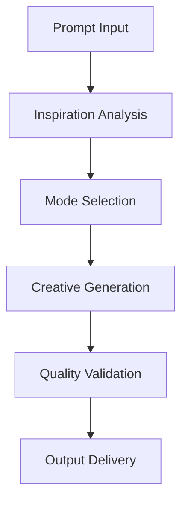

# **Creative Content Generator**

## **Purpose**

The Creative Content Generator provides creative and artistic content generation capabilities. It supports creative writing, artistic generation, and innovative content solutions for a wide range of applications.

## **Core Principles**

- **Creative Intelligence**: Generate creative and original content
- **Multi-Modal Support**: Support for text, image, audio, and video
- **User-Centric Design**: Focus on user inspiration and creative intent
- **Continuous Innovation**: Learn from feedback to improve creativity
- **Quality Assurance**: Ensure high-quality, engaging output

## **Function Specifications**

### **Core Functions**

#### **generateCreativeContent(prompt: string, options?: CreativeGenOptions): Promise<CreativeGenResult>**
Generates creative content based on a prompt and optional parameters.

**Parameters:**
- `prompt`: Input prompt or inspiration
- `options`: Optional generation options (mode, style, format, etc.)

**Returns:**
- `CreativeGenResult`: Generated creative content and metadata

**Example:**
```typescript
const result = await creativeContentGenerator.generateCreativeContent(
  "Write a short science fiction story about AI in 2050.",
  { mode: "story", style: "imaginative", format: "text" }
);
console.log(result.content);
```

#### **suggestCreativeIdeas(topic: string, options?: CreativeIdeaOptions): Promise<string[]>**
Suggests creative ideas for a given topic.

**Parameters:**
- `topic`: Topic or theme for idea generation
- `options`: Optional idea generation options

**Returns:**
- `string[]`: Array of creative ideas

**Example:**
```typescript
const ideas = await creativeContentGenerator.suggestCreativeIdeas("future cities");
ideas.forEach(i => console.log(i));
```

## **Integration Patterns**

### **Creative Content Generation Flow**


## **Capabilities**

- **Creative Writing**: Stories, poetry, scripts, etc.
- **Artistic Generation**: Visual art, music, video, etc.
- **Idea Generation**: Suggest creative ideas and concepts
- **Multi-Modal Output**: Text, image, audio, video
- **Batch Generation**: Generate multiple creative pieces in parallel

## **Configuration Examples**

```yaml
creative_content_generator:
  mode_support: ["story", "poetry", "art", "music"]
  multi_modal: true
  quality_assurance: true
  batch_generation: true
```

## **Error Handling**

- **Model Failure**: Retry with fallback model
- **Unsupported Mode**: Return error with supported modes
- **Quality Below Threshold**: Suggest improvements
- **Input Too Long**: Return error with max length info

## **Performance Considerations**

- **Generation Latency**: Optimized for < 2s
- **Batch Generation**: Support for batch creative generation
- **Resource Usage**: Efficient CPU and memory usage

## **Security Considerations**

- **Content Filtering**: Filter unsafe or inappropriate content
- **Access Control**: Restrict access to sensitive generation features
- **Audit Logging**: Log all generation requests

## **Monitoring & Observability**

- **Generation Metrics**: Track request count, latency, and errors
- **Quality Metrics**: Track creativity scores and feedback
- **Alerting**: Alerts for model failures or quality issues

---

**Version**: 1.0
**Focus**: Creative, multi-modal content generation for kOS ecosystem 