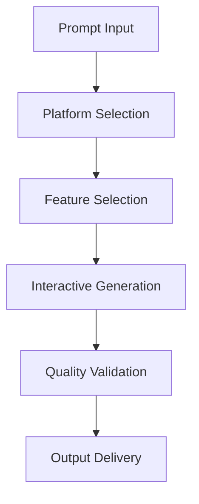

# **Interactive Content Generator**

## **Purpose**

The Interactive Content Generator provides interactive and dynamic content creation capabilities. It supports the generation of interactive elements, dynamic content, and user engagement features for web, mobile, and multimedia applications.

## **Core Principles**

- **User Engagement**: Maximize user interaction and engagement
- **Dynamic Content**: Generate content that adapts to user input
- **Multi-Platform Support**: Support for web, mobile, and multimedia
- **Accessibility**: Ensure content is accessible to all users
- **Continuous Improvement**: Learn from feedback to improve interactivity

## **Function Specifications**

### **Core Functions**

#### **generateInteractiveContent(prompt: string, options?: InteractiveGenOptions): Promise<InteractiveGenResult>**
Generates interactive content based on a prompt and optional parameters.

**Parameters:**
- `prompt`: Input prompt or description
- `options`: Optional generation options (platform, type, features, etc.)

**Returns:**
- `InteractiveGenResult`: Generated interactive content and metadata

**Example:**
```typescript
const result = await interactiveContentGenerator.generateInteractiveContent(
  "Create an interactive quiz about AI ethics.",
  { platform: "web", type: "quiz", features: ["scoring", "feedback"] }
);
console.log(result.contentUrl);
```

#### **customizeInteractivity(content: Buffer, features: string[]): Promise<InteractiveGenResult>**
Customizes interactive features for existing content.

**Parameters:**
- `content`: Input content buffer
- `features`: Features to add or customize

**Returns:**
- `InteractiveGenResult`: Updated interactive content and metadata

**Example:**
```typescript
const customized = await interactiveContentGenerator.customizeInteractivity(contentBuffer, ["timer", "leaderboard"]);
console.log(customized.contentUrl);
```

## **Integration Patterns**

### **Interactive Content Generation Flow**


## **Capabilities**

- **Interactive Elements**: Quizzes, polls, games, etc.
- **Dynamic Content**: Content that adapts to user input
- **Multi-Platform Output**: Web, mobile, multimedia
- **Accessibility Features**: Ensure content is accessible
- **Batch Generation**: Generate multiple interactive pieces in parallel

## **Configuration Examples**

```yaml
interactive_content_generator:
  platform_support: ["web", "mobile", "multimedia"]
  feature_support: ["quiz", "poll", "game", "feedback"]
  accessibility: true
  batch_generation: true
```

## **Error Handling**

- **Model Failure**: Retry with fallback model
- **Unsupported Platform**: Return error with supported platforms
- **Feature Not Supported**: Return error with available features
- **Input Too Long**: Return error with max length info

## **Performance Considerations**

- **Generation Latency**: Optimized for < 2s
- **Batch Generation**: Support for batch interactive generation
- **Resource Usage**: Efficient CPU and memory usage

## **Security Considerations**

- **Content Filtering**: Filter unsafe or inappropriate content
- **Access Control**: Restrict access to sensitive generation features
- **Audit Logging**: Log all generation requests

## **Monitoring & Observability**

- **Generation Metrics**: Track request count, latency, and errors
- **Quality Metrics**: Track interactivity scores and feedback
- **Alerting**: Alerts for model failures or quality issues

---

**Version**: 1.0
**Focus**: Interactive, dynamic content generation for kOS ecosystem 