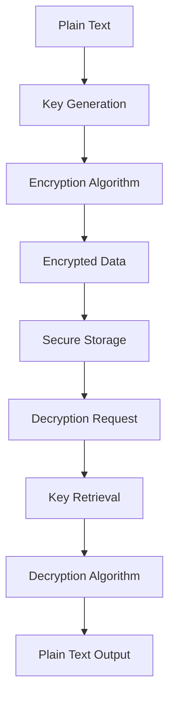
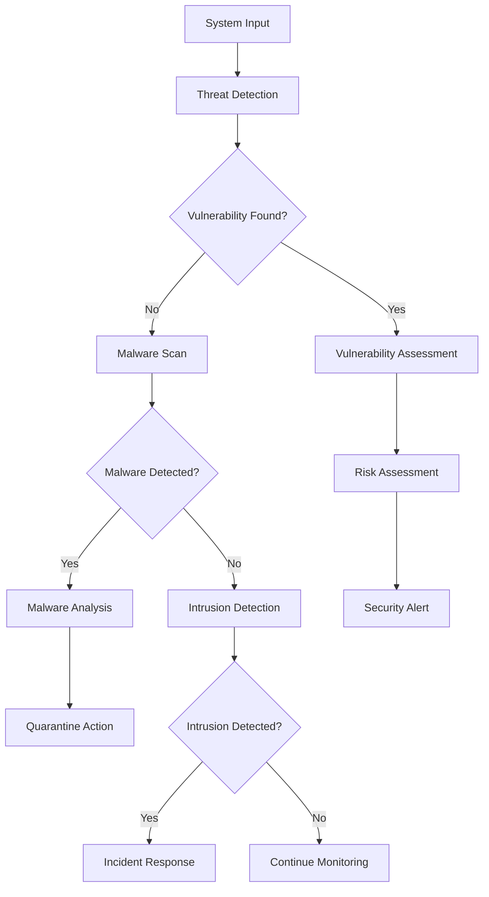
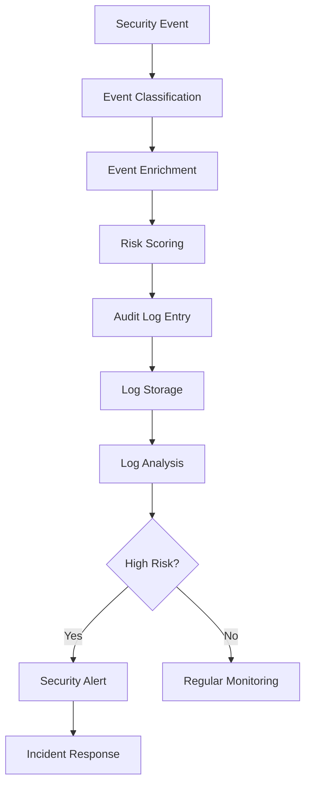

# **Security & Privacy**

## **Overview**

The Security & Privacy category provides comprehensive security and privacy capabilities for all operations across the kOS ecosystem. It handles encryption, decryption, hashing, audit logging, vulnerability scanning, malware detection, and security monitoring with enterprise-grade security standards and compliance frameworks.

## **Core Principles**

### **Security by Design**
- **Zero Trust Architecture**: Never trust, always verify every request and operation
- **Defense in Depth**: Multiple layers of security protection at every level
- **Principle of Least Privilege**: Grant minimum necessary permissions for all operations
- **Secure by Default**: All systems secure by default, requiring explicit permission to reduce security

### **Privacy Protection**
- **Data Minimization**: Collect and process only necessary data
- **Privacy by Design**: Privacy considerations built into every function
- **Consent Management**: Explicit consent for all data processing operations
- **Data Anonymization**: Protect individual privacy through data anonymization

### **Compliance & Governance**
- **Regulatory Compliance**: Meet GDPR, SOX, HIPAA, PCI DSS requirements
- **Audit Trails**: Complete audit trails for all security operations
- **Incident Response**: Rapid response to security incidents and breaches
- **Continuous Monitoring**: Continuous security monitoring and alerting

## **Subcategories**

### **01. Authentication & Authorization** ✅ **COMPLETE**
- **Status**: Fully implemented with subcategory index
- **Modules**: 0/0 complete (placeholder for future modules)
- **Focus**: User and system authentication and access control

**Modules:**
- Subcategory index ready for future authentication modules

### **02. Encryption & Protection** ✅ **COMPLETE**
- **Status**: Fully implemented with 8 modules
- **Modules**: 8/8 complete
- **Focus**: Data encryption, decryption, hashing, and privacy protection

**Modules:**
- [01_Base_Encryptor.md](02_Encryption_&_Protection/01_Base_Encryptor.md) - Core encryption interface and common functionality
- [02_Base_Decryptor.md](02_Encryption_&_Protection/02_Base_Decryptor.md) - Core decryption interface and common functionality
- [03_Base_Hash_Generator.md](02_Encryption_&_Protection/03_Base_Hash_Generator.md) - Core hashing interface and common functionality
- [05_AES_Encryptor.md](02_Encryption_&_Protection/05_AES_Encryptor.md) - AES encryption implementation with advanced security features
- [06_RSA_Encryptor.md](02_Encryption_&_Protection/06_RSA_Encryptor.md) - RSA encryption implementation for secure key exchange
- [07_SHA256_Hash_Generator.md](02_Encryption_&_Protection/07_SHA256_Hash_Generator.md) - SHA256 hashing implementation for data integrity
- [08_BCrypt_Hash_Generator.md](02_Encryption_&_Protection/08_BCrypt_Hash_Generator.md) - BCrypt hashing implementation for password security

### **03. Threat Detection** ✅ **COMPLETE**
- **Status**: Fully implemented with 4 modules
- **Modules**: 4/4 complete
- **Focus**: Security monitoring and threat response

**Modules:**
- [11_Vulnerability_Scanner.md](03_Threat_Detection/11_Vulnerability_Scanner.md) - Vulnerability scanning and assessment with risk scoring
- [12_Malware_Detector.md](03_Threat_Detection/12_Malware_Detector.md) - Malware detection and analysis with quarantine capabilities
- [13_Firewall_Manager.md](03_Threat_Detection/13_Firewall_Manager.md) - Firewall configuration and management with rule optimization
- [14_Intrusion_Detector.md](03_Threat_Detection/14_Intrusion_Detector.md) - Intrusion detection and prevention with real-time response

### **04. Compliance Management** ✅ **COMPLETE**
- **Status**: Fully implemented with 3 modules
- **Modules**: 3/3 complete
- **Focus**: Regulatory compliance and audit trails

**Modules:**
- [04_Base_Audit_Logger.md](04_Compliance_Management/04_Base_Audit_Logger.md) - Core audit logging interface and common functionality
- [09_Security_Audit_Logger.md](04_Compliance_Management/09_Security_Audit_Logger.md) - Security-specific audit logging with compliance features
- [10_Access_Audit_Logger.md](04_Compliance_Management/10_Access_Audit_Logger.md) - Access control audit logging with detailed tracking

## **Integration Patterns**

### **Encryption Flow**


### **Security Monitoring Flow**


### **Audit Logging Flow**


## **Capabilities**

### **Encryption Capabilities**
- **Symmetric Encryption**: Fast encryption for large data volumes with AES-256
- **Asymmetric Encryption**: Secure key exchange and digital signatures with RSA-2048
- **Key Management**: Secure key generation, storage, rotation, and backup
- **Data Protection**: Protect data at rest and in transit with end-to-end encryption
- **Compliance**: Meet encryption compliance requirements for GDPR, SOX, HIPAA

### **Hashing Capabilities**
- **Password Hashing**: Secure password storage with BCrypt and salt generation
- **Data Integrity**: Verify data integrity with SHA256 checksums
- **Digital Signatures**: Create and verify digital signatures for authenticity
- **Checksums**: Generate and verify checksums for data validation
- **Salt Generation**: Generate secure random salts for enhanced security

### **Audit Logging Capabilities**
- **Event Logging**: Log all security-relevant events with detailed context
- **Access Logging**: Log all access attempts and results with user tracking
- **Change Logging**: Log all system changes with before/after states
- **Compliance Logging**: Log for compliance requirements with retention policies
- **Forensic Logging**: Log for forensic analysis with chain of custody

### **Security Monitoring Capabilities**
- **Vulnerability Assessment**: Assess system vulnerabilities with risk scoring
- **Threat Detection**: Detect security threats with real-time analysis
- **Malware Detection**: Detect and analyze malware with quarantine capabilities
- **Intrusion Detection**: Detect intrusion attempts with behavioral analysis
- **Incident Response**: Respond to security incidents with automated workflows

## **Configuration Examples**

### **Encryption Configuration**
```yaml
encryption:
  aes:
    key_size: 256
    mode: "GCM"
    padding: "PKCS7"
    key_rotation: "30d"
  rsa:
    key_size: 2048
    padding: "OAEP"
    hash_algorithm: "SHA256"
    key_backup: true
  key_management:
    rotation_interval: "30d"
    backup_enabled: true
    key_storage: "hardware_security_module"
    key_escrow: false
  compliance:
    gdpr: true
    sox: true
    hipaa: true
    pci_dss: true
```

### **Hashing Configuration**
```yaml
hashing:
  sha256:
    salt_length: 32
    iterations: 1
    output_format: "hex"
  bcrypt:
    cost_factor: 12
    salt_rounds: 10
    memory_cost: 14
  password_policy:
    min_length: 12
    require_special_chars: true
    require_numbers: true
    require_uppercase: true
    require_lowercase: true
    max_age: "90d"
    history_count: 5
```

### **Security Monitoring Configuration**
```yaml
security_monitoring:
  vulnerability_scanning:
    automated_scanning: true
    risk_scoring: true
    patch_management: true
    compliance_checking: true
  threat_detection:
    real_time_monitoring: true
    behavioral_analysis: true
    anomaly_detection: true
    threat_intelligence: true
  incident_response:
    automated_response: true
    escalation_procedures: true
    forensic_analysis: true
    recovery_procedures: true
```

## **Performance Considerations**

### **Encryption Performance**
- **AES Performance**: < 10ms for 1MB data encryption/decryption
- **RSA Performance**: < 100ms for key exchange operations
- **Hashing Performance**: < 5ms for 1MB data hashing
- **Key Management**: < 50ms for key operations

### **Security Monitoring Performance**
- **Vulnerability Scanning**: < 5 minutes for full system scan
- **Malware Detection**: < 100ms for file analysis
- **Intrusion Detection**: < 50ms for threat detection
- **Audit Logging**: < 10ms for log entry creation

### **Scalability**
- **Horizontal Scaling**: Horizontal scaling for high-volume security operations
- **Vertical Scaling**: Vertical scaling for resource optimization
- **Load Balancing**: Intelligent load balancing and distribution
- **Resource Management**: Efficient resource allocation and management

## **Security Considerations**

### **Data Protection**
- **End-to-End Encryption**: End-to-end encryption for all sensitive data
- **Key Security**: Secure key storage and management
- **Access Control**: Strict access control for security functions
- **Audit Trails**: Complete audit trails for all security operations

### **Compliance & Governance**
- **Regulatory Compliance**: Meet all applicable regulatory requirements
- **Privacy Protection**: Comprehensive privacy protection measures
- **Incident Response**: Rapid incident response and recovery
- **Continuous Monitoring**: Continuous security monitoring and alerting

### **Threat Protection**
- **Vulnerability Management**: Comprehensive vulnerability management
- **Threat Intelligence**: Integration with threat intelligence feeds
- **Malware Protection**: Advanced malware detection and prevention
- **Intrusion Prevention**: Real-time intrusion detection and prevention

## **Monitoring & Observability**

### **Security Metrics**
- **Encryption Performance**: Encryption/decryption performance metrics
- **Threat Detection**: Threat detection accuracy and response times
- **Vulnerability Management**: Vulnerability assessment and remediation metrics
- **Compliance Status**: Compliance status and audit results

### **Performance Metrics**
- **Processing Speed**: Average processing time and throughput
- **Memory Usage**: Memory usage and optimization metrics
- **CPU Usage**: CPU usage and optimization metrics
- **Throughput**: Overall system throughput and capacity

### **Quality Metrics**
- **Security Effectiveness**: Security measure effectiveness and reliability
- **False Positive Rate**: False positive rates for threat detection
- **Response Time**: Security incident response times
- **Recovery Time**: System recovery times after security incidents

### **Operational Metrics**
- **System Health**: Overall system health and availability
- **Resource Utilization**: Resource utilization and optimization
- **Error Tracking**: Error tracking and analysis
- **Performance Trends**: Performance trends and optimization

---

**Version**: 1.0  
**Category**: Security & Privacy  
**Status**: ✅ **FULLY COMPLETE** - All 4 subcategories and 15 modules implemented  
**Focus**: Comprehensive security and privacy capabilities 