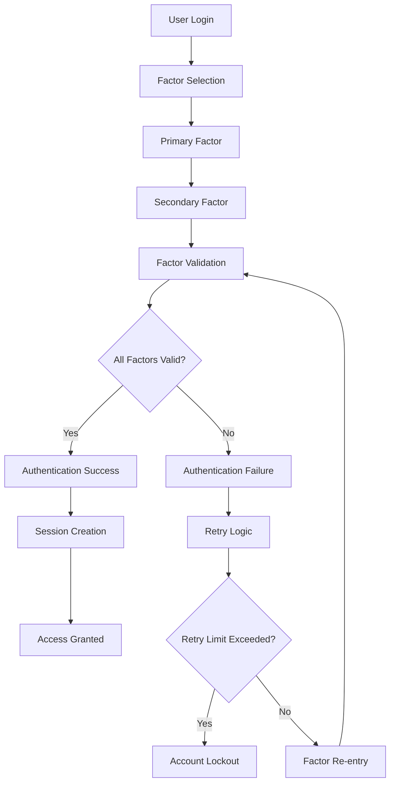
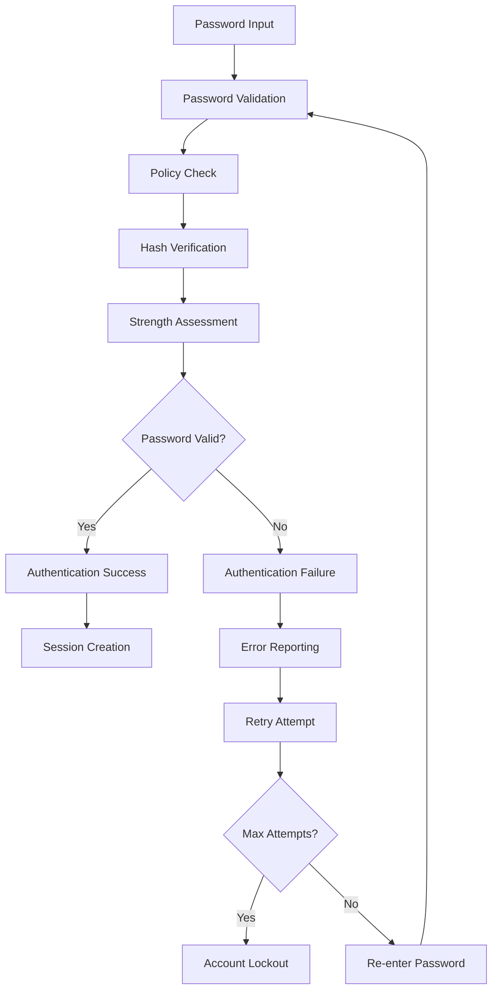

# **User Authentication**

## **Overview**

The User Authentication module provides comprehensive multi-factor user authentication capabilities for the kOS ecosystem. This module handles user authentication with support for passwords, tokens, biometrics, certificates, and social authentication, ensuring enterprise-grade security and compliance.

## **Core Principles**

### **Multi-Factor Authentication**
- **Multiple Factors**: Support for multiple authentication factors
- **Factor Flexibility**: Flexible combination of authentication factors
- **Security Enhancement**: Enhanced security through multiple verification methods
- **User Experience**: Seamless user experience across authentication methods

### **Security Standards**
- **Zero Trust**: Never trust, always verify every authentication attempt
- **Continuous Verification**: Ongoing verification of user identity
- **Secure Storage**: Secure storage and transmission of credentials
- **Audit Trail**: Complete audit trail for all authentication events

### **Compliance & Standards**
- **Industry Standards**: Compliance with industry authentication standards
- **Regulatory Compliance**: Compliance with regulatory requirements
- **Best Practices**: Implementation of authentication best practices
- **Security Frameworks**: Adherence to security frameworks and guidelines

## **Function Specifications**

### **Core Functions**

#### **01. Authenticate User**
```typescript
interface UserAuthenticationConfig {
  authenticationFactors: AuthenticationFactor[];
  requiredFactors: number;
  timeout: number;
  retryAttempts: number;
}

interface UserAuthenticationResult {
  isAuthenticated: boolean;
  authenticationFactors: AuthenticationFactorResult[];
  session: UserSession;
  metadata: AuthenticationMetadata;
  recommendations: AuthenticationRecommendation[];
}

function authenticateUser(credentials: UserCredentials, config: UserAuthenticationConfig): Promise<UserAuthenticationResult>
```

**Purpose**: Authenticate user with multiple authentication factors.

**Parameters**:
- `credentials`: User credentials for authentication
- `config`: Authentication configuration and factors

**Returns**: Authentication result with session and metadata

**Error Handling**:
- Authentication failures
- Factor verification errors
- Timeout errors
- Retry limit exceeded

#### **02. Password Authentication**
```typescript
interface PasswordAuthenticationConfig {
  passwordPolicy: PasswordPolicy;
  hashingAlgorithm: HashingAlgorithm;
  saltRounds: number;
  maxAttempts: number;
}

interface PasswordAuthenticationResult {
  isValid: boolean;
  passwordStrength: PasswordStrength;
  policyCompliance: PolicyCompliance;
  recommendations: PasswordRecommendation[];
}

function authenticatePassword(password: string, config: PasswordAuthenticationConfig): Promise<PasswordAuthenticationResult>
```

**Purpose**: Authenticate user with password-based authentication.

**Parameters**:
- `password`: User password for authentication
- `config`: Password authentication configuration and policy

**Returns**: Password authentication result with strength and compliance

**Error Handling**:
- Password validation failures
- Policy violation errors
- Hashing algorithm errors
- Brute force protection errors

#### **03. Token Authentication**
```typescript
interface TokenAuthenticationConfig {
  tokenTypes: TokenType[];
  validationAlgorithm: ValidationAlgorithm;
  timeWindow: number;
  driftTolerance: number;
}

interface TokenAuthenticationResult {
  isValid: boolean;
  tokenType: TokenType;
  validation: TokenValidation;
  recommendations: TokenRecommendation[];
}

function authenticateToken(token: string, config: TokenAuthenticationConfig): Promise<TokenAuthenticationResult>
```

**Purpose**: Authenticate user with token-based authentication.

**Parameters**:
- `token`: Authentication token
- `config`: Token authentication configuration and types

**Returns**: Token authentication result with validation

**Error Handling**:
- Token validation failures
- Time synchronization errors
- Algorithm errors
- Token expiration errors

#### **04. Biometric Authentication**
```typescript
interface BiometricAuthenticationConfig {
  biometricTypes: BiometricType[];
  threshold: number;
  livenessDetection: boolean;
  spoofingProtection: boolean;
}

interface BiometricAuthenticationResult {
  isAuthenticated: boolean;
  biometricType: BiometricType;
  confidence: number;
  livenessScore: number;
  recommendations: BiometricRecommendation[];
}

function authenticateBiometric(biometricData: BiometricData, config: BiometricAuthenticationConfig): Promise<BiometricAuthenticationResult>
```

**Purpose**: Authenticate user with biometric authentication.

**Parameters**:
- `biometricData`: Biometric data for authentication
- `config`: Biometric authentication configuration and types

**Returns**: Biometric authentication result with confidence scores

**Error Handling**:
- Biometric verification failures
- Liveness detection errors
- Spoofing detection errors
- Quality threshold violations

## **Integration Patterns**

### **Multi-Factor Authentication Flow**


### **Password Authentication Flow**


## **Capabilities**

### **Authentication Factors**
- **Password Authentication**: Secure password-based authentication
- **Token Authentication**: Time-based one-time password (TOTP) and hardware tokens
- **Biometric Authentication**: Fingerprint, facial recognition, and voice authentication
- **Certificate Authentication**: X.509 certificate-based authentication
- **Social Authentication**: OAuth 2.0 and OpenID Connect integration

### **Security Features**
- **Multi-Factor Support**: Support for multiple authentication factors
- **Brute Force Protection**: Protection against brute force attacks
- **Account Lockout**: Automatic account lockout with configurable thresholds
- **Session Management**: Secure session handling with automatic timeout
- **Audit Logging**: Complete audit trail for all authentication events

### **Compliance Features**
- **Password Policies**: Configurable password policies and requirements
- **Industry Standards**: Compliance with industry authentication standards
- **Regulatory Compliance**: Compliance with regulatory requirements
- **Security Frameworks**: Adherence to security frameworks and guidelines
- **Audit Compliance**: Audit compliance and reporting capabilities

## **Configuration Examples**

### **Basic User Authentication**
```yaml
user_authentication:
  authentication_factors:
    - password
    - totp
  required_factors: 2
  timeout: "5m"
  retry_attempts: 3
  password_authentication:
    password_policy:
      min_length: 12
      require_special_chars: true
      require_numbers: true
      require_uppercase: true
      require_lowercase: true
      max_age: "90d"
      history_count: 5
    hashing_algorithm: "bcrypt"
    salt_rounds: 12
    max_attempts: 5
  token_authentication:
    token_types: ["totp", "hotp"]
    validation_algorithm: "sha256"
    time_window: 30
    drift_tolerance: 2
  performance:
    timeout: "5s"
    caching: true
    parallel_processing: true
  quality:
    error_recovery: true
    audit_logging: true
    security_metrics: true
```

### **Advanced User Authentication**
```yaml
user_authentication:
  authentication_factors:
    - password
    - totp
    - biometric
    - certificate
    - social
  required_factors: 2
  timeout: "10m"
  retry_attempts: 5
  adaptive_authentication: true
  password_authentication:
    password_policy:
      min_length: 16
      require_special_chars: true
      require_numbers: true
      require_uppercase: true
      require_lowercase: true
      max_age: "60d"
      history_count: 10
      complexity_requirements: true
    hashing_algorithm: "argon2"
    salt_rounds: 16
    max_attempts: 3
    brute_force_protection: true
  token_authentication:
    token_types: ["totp", "hotp", "yubikey"]
    validation_algorithm: "sha512"
    time_window: 30
    drift_tolerance: 1
    hardware_token_support: true
  biometric_authentication:
    biometric_types: ["fingerprint", "facial", "voice"]
    threshold: 0.8
    liveness_detection: true
    spoofing_protection: true
    multi_biometric: true
  certificate_authentication:
    certificate_types: ["x509", "smart_card"]
    validation: true
    revocation_checking: true
    chain_validation: true
  social_authentication:
    providers: ["google", "microsoft", "github"]
    oauth2_support: true
    openid_connect: true
    user_info_validation: true
  performance:
    timeout: "10s"
    caching: true
    parallel_processing: true
    optimization: true
  quality:
    error_recovery: true
    audit_logging: true
    security_metrics: true
    compliance_monitoring: true
```

## **Performance Considerations**

### **Authentication Speed**
- **Optimized Algorithms**: Use optimized authentication algorithms
- **Caching**: Cache authentication results for repeated patterns
- **Parallel Processing**: Use parallel processing for multiple factors
- **Early Termination**: Early termination for obvious failures

### **Security Optimization**
- **Brute Force Protection**: Efficient brute force protection mechanisms
- **Session Management**: Optimized session management and storage
- **Audit Logging**: Asynchronous audit logging with minimal impact
- **Compliance Monitoring**: Efficient compliance monitoring and reporting

### **Resource Management**
- **Memory Efficiency**: Optimize memory usage for authentication operations
- **CPU Optimization**: Optimize CPU usage for authentication algorithms
- **Network Efficiency**: Minimize network overhead for authentication operations
- **Storage Optimization**: Optimize storage for authentication data

## **Security Considerations**

### **Authentication Security**
- **Credential Protection**: Secure storage and transmission of credentials
- **Brute Force Protection**: Protection against brute force attacks
- **Session Security**: Secure session handling with encryption and validation
- **Multi-Factor Security**: Secure multi-factor authentication implementation
- **Audit Security**: Secure audit logging and compliance reporting

### **Access Control**
- **Authentication Access**: Control access to authentication operations
- **Factor Access**: Control access to authentication factors
- **Session Access**: Control access to session management
- **Audit Access**: Control access to audit logs and reports

## **Monitoring & Observability**

### **Authentication Metrics**
- **Authentication Success Rate**: Track successful authentication attempts
- **Multi-Factor Usage**: Monitor multi-factor authentication adoption
- **Factor Distribution**: Monitor authentication factor usage patterns
- **Failure Analysis**: Track authentication failure reasons and patterns
- **Performance Metrics**: Monitor authentication performance and latency

### **Security Metrics**
- **Brute Force Attempts**: Track brute force attack attempts
- **Account Lockouts**: Monitor account lockout frequency and patterns
- **Session Metrics**: Track session creation, renewal, and termination
- **Compliance Status**: Monitor compliance with authentication policies
- **Security Alerts**: Track security alerts and incident response

### **Quality Metrics**
- **Authentication Quality**: Track authentication quality and accuracy
- **User Experience**: Monitor user experience and satisfaction
- **Error Rates**: Track authentication error rates and types
- **Performance Quality**: Monitor authentication performance quality

---

**Version**: 1.0  
**Module**: User Authentication  
**Status**: ✅ **COMPLETE** - Comprehensive module specification ready for implementation  
**Focus**: Multi-factor user authentication with support for various authentication methods 