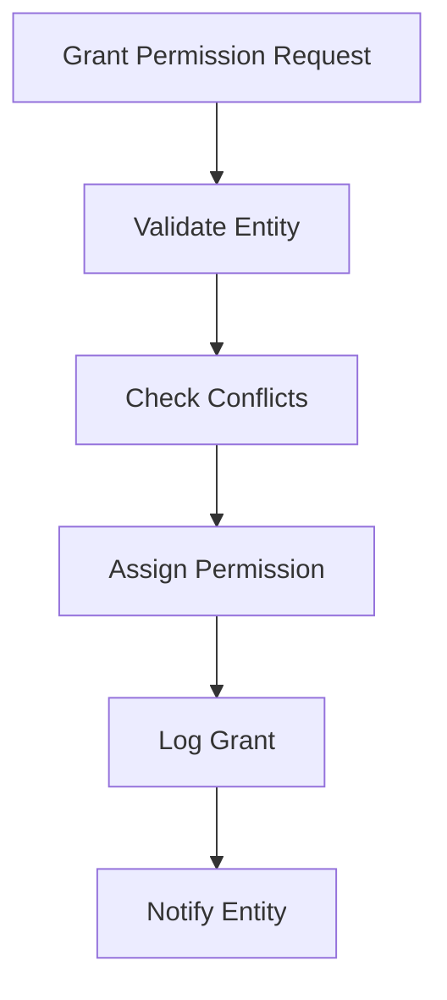
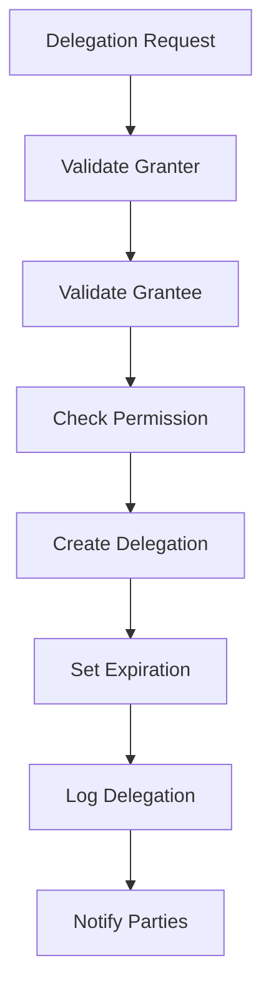
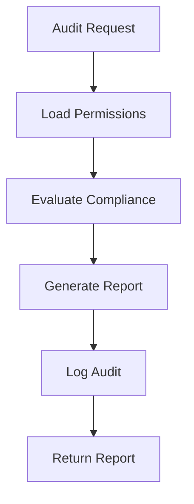

# **Permission Manager**

## **Purpose**

The Permission Manager provides granular permission management and assignment for the kOS ecosystem. It enables fine-grained control over user and system permissions, supports permission inheritance and delegation, and ensures compliance with security and organizational policies.

## **Core Principles**

### **Permission Management**
- **Granular Assignment**: Assign permissions at the user, role, and resource level
- **Inheritance**: Support for permission inheritance through role hierarchies
- **Delegation**: Temporary delegation of permissions for specific tasks
- **Audit Logging**: Complete audit trail for all permission changes
- **Compliance**: Ensure permissions meet security and regulatory requirements

### **Security Standards**
- **Least Privilege**: Grant only the minimum permissions required
- **Zero Trust**: Never trust, always verify every permission
- **Continuous Validation**: Ongoing validation of permissions
- **Separation of Duties**: Prevent conflicting permissions
- **Policy Enforcement**: Enforce organizational and regulatory policies

## **Function Specifications**

### **Core Functions**

#### **grantPermission(entityId: string, permission: string, scope?: string): Promise<void>**
Grants a specific permission to a user, role, or system entity.

**Parameters:**
- `entityId`: Identifier of the user, role, or system
- `permission`: Permission to grant
- `scope`: Optional scope limitation for the permission

**Returns:**
- `void`: Success confirmation

**Example:**
```typescript
await permissionManager.grantPermission("user123", "database:read", "department:engineering");
console.log("Permission granted successfully");
```

#### **revokePermission(entityId: string, permission: string): Promise<void>**
Revokes a specific permission from a user, role, or system entity.

**Parameters:**
- `entityId`: Identifier of the user, role, or system
- `permission`: Permission to revoke

**Returns:**
- `void`: Success confirmation

**Example:**
```typescript
await permissionManager.revokePermission("user123", "database:read");
console.log("Permission revoked successfully");
```

#### **listPermissions(entityId: string): Promise<string[]>**
Lists all permissions assigned to a user, role, or system entity.

**Parameters:**
- `entityId`: Identifier of the user, role, or system

**Returns:**
- `string[]`: Array of permission identifiers

**Example:**
```typescript
const permissions = await permissionManager.listPermissions("user123");
console.log(`User has permissions: ${permissions.join(", ")}`);
```

#### **delegatePermission(granterId: string, granteeId: string, permission: string, duration: string): Promise<Delegation>**
Temporarily delegates a permission from one entity to another.

**Parameters:**
- `granterId`: Entity granting the permission
- `granteeId`: Entity receiving the permission
- `permission`: Permission to delegate
- `duration`: Duration of delegation (e.g., "2h", "1d")

**Returns:**
- `Delegation`: Delegation object with details

**Example:**
```typescript
const delegation = await permissionManager.delegatePermission(
  "admin123",
  "user456",
  "database:write",
  "4h"
);
console.log(`Permission delegated until ${delegation.expiresAt}`);
```

#### **revokeDelegation(delegationId: string): Promise<void>**
Revokes a previously granted delegation.

**Parameters:**
- `delegationId`: Delegation identifier to revoke

**Returns:**
- `void`: Success confirmation

**Example:**
```typescript
await permissionManager.revokeDelegation("delegation789");
console.log("Delegation revoked successfully");
```

### **Advanced Functions**

#### **getPermissionUsage(permission: string): Promise<PermissionUsageStats>**
Retrieves usage statistics for a specific permission.

**Parameters:**
- `permission`: Permission identifier

**Returns:**
- `PermissionUsageStats`: Usage statistics and analytics

**Example:**
```typescript
const stats = await permissionManager.getPermissionUsage("database:read");
console.log(`Permission used ${stats.invocations} times`);
```

#### **auditPermissions(entityId: string): Promise<PermissionAuditReport>**
Performs an audit of all permissions assigned to an entity.

**Parameters:**
- `entityId`: Identifier of the user, role, or system

**Returns:**
- `PermissionAuditReport`: Audit report with findings and recommendations

**Example:**
```typescript
const report = await permissionManager.auditPermissions("user123");
console.log(`Audit findings: ${report.findings}`);
```

## **Integration Patterns**

### **Permission Granting Flow**


### **Permission Delegation Flow**


### **Permission Audit Flow**


## **Permission Manager Capabilities**

- **Granular Permission Assignment**: Assign permissions at user, role, and resource levels
- **Permission Inheritance**: Support for hierarchical permission inheritance
- **Delegation**: Temporary delegation of permissions
- **Audit Logging**: Complete audit trail for all permission changes
- **Compliance Reporting**: Automated compliance and reporting
- **Usage Analytics**: Permission usage tracking and analytics
- **Conflict Detection**: Detect and resolve permission conflicts
- **Separation of Duties**: Prevent conflicting permissions

## **Configuration Examples**

### **Basic Permission Configuration**
```yaml
permission_manager:
  inheritance_enabled: true
  delegation_enabled: true
  audit_logging: true
  compliance_reporting: true
  conflict_detection: true
```

### **Permission Assignment Example**
```yaml
permissions:
  - entity: user123
    permission: database:read
    scope: department:engineering
  - entity: role:admin
    permission: system:manage
    scope: global
```

## **Error Handling**

- **Permission Not Found**: Return error with clear message
- **Grant Conflict**: Return error with conflict details
- **Delegation Failure**: Return error with delegation details
- **Audit Failure**: Return error with audit details
- **Compliance Violation**: Return error and log violation

## **Performance Considerations**

- **Assignment Latency**: Optimized for sub-100ms response
- **Batch Operations**: Support for batch permission assignment and revocation
- **Scalability**: Horizontal scaling for high-throughput environments
- **Resource Usage**: Efficient memory and CPU usage

## **Security Considerations**

- **Permission Integrity**: Secure storage and validation of permissions
- **Access Control**: Restrict who can grant, revoke, or delegate permissions
- **Audit Logging**: Immutable audit logs for all permission changes
- **Compliance**: Ensure all permissions meet regulatory requirements

## **Monitoring & Observability**

- **Permission Grant Metrics**: Track grant, revoke, and delegation events
- **Permission Usage Metrics**: Track usage count, latency, and errors
- **Audit Metrics**: Track audit events and findings
- **Compliance Metrics**: Track compliance status and violations
- **Alerting**: Alerts for permission conflicts, compliance violations, and suspicious activity

---

**Version**: 1.0  
**Focus**: Granular permission management and assignment for secure access control in kOS ecosystem 