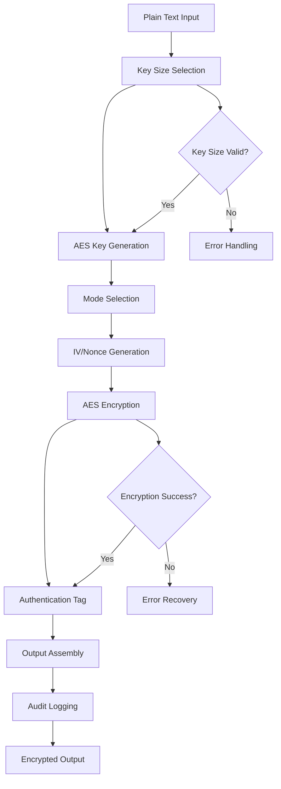

# AES Encryptor

## Purpose
Provides AES (Advanced Encryption Standard) encryption implementation for the kOS ecosystem. This module extends the Base Encryptor to provide specific AES encryption capabilities including AES-128, AES-192, and AES-256 with various modes of operation (CBC, GCM, CTR, etc.). The AES Encryptor ensures high-performance, secure, and standards-compliant encryption for sensitive data protection across all kOS components.

## Capabilities
- **AES Algorithm Support**: Full support for AES-128, AES-192, and AES-256 encryption
- **Multiple Modes**: Support for CBC, GCM, CTR, CCM, and other AES modes
- **High Performance**: Optimized AES implementation with hardware acceleration support
- **Key Management**: Secure AES key generation, storage, and rotation
- **Padding Support**: PKCS7, PKCS5, and other padding schemes
- **Authenticated Encryption**: GCM and CCM modes for authenticated encryption
- **Performance Optimization**: Configurable performance settings and optimizations
- **Security Validation**: Comprehensive security validation and compliance checking
- **Hardware Acceleration**: Support for AES-NI and other hardware acceleration

## Integration Points
- **Input**: Plain text data, AES parameters, and encryption configuration
- **Output**: AES-encrypted data, initialization vectors, authentication tags, and metadata
- **Dependencies**: Base Encryptor for interface compliance, Base Hash Generator for key derivation

## Configuration
```yaml
aes_encryptor:
  default_key_size: 256  # bits
  default_mode: "GCM"
  key_management:
    key_generation:
      algorithm: "AES"
      key_size: 256
      secure_random: true
    key_storage:
      encrypted: true
      storage_backend: "secure_key_store"
    key_rotation:
      enabled: true
      interval: "30d"
      overlap_period: "7d"
  modes:
    cbc:
      enabled: true
      padding: "PKCS7"
      require_iv: true
    gcm:
      enabled: true
      tag_length: 128
      aad_support: true
    ctr:
      enabled: true
      counter_bits: 128
    ccm:
      enabled: true
      tag_length: 128
      nonce_length: 12
  performance:
    hardware_acceleration: true
    parallel_processing: true
    chunk_size: 1048576  # 1MB chunks
    max_concurrent_operations: 20
  security:
    minimum_key_size: 128
    require_secure_random: true
    validate_parameters: true
    fips_compliance: true
  audit:
    log_all_operations: true
    include_metadata: true
    retention_period: "7y"
```

## Example Workflow


## Core Capabilities

### **1. AES Algorithm Implementation**
- **Description**: Full implementation of AES encryption algorithm
- **Input**: Plain text data and AES parameters
- **Output**: AES-encrypted data and encryption metadata
- **Dependencies**: AES cryptographic library

### **2. Multiple Mode Support**
- **Description**: Support for various AES modes of operation
- **Input**: Mode specification and mode-specific parameters
- **Output**: Mode-appropriate encrypted data and metadata
- **Dependencies**: Mode-specific cryptographic implementations

### **3. Hardware Acceleration**
- **Description**: Leverages hardware acceleration for improved performance
- **Input**: Hardware capability detection and configuration
- **Output**: Hardware-accelerated encryption results
- **Dependencies**: AES-NI or similar hardware support

### **4. Key Management**
- **Description**: Secure AES key generation, storage, and lifecycle management
- **Input**: Key requirements and security parameters
- **Output**: Generated keys and key metadata
- **Dependencies**: Secure random generator and key storage

## Module Interface

### **Input Interface**
```typescript
interface AESEncryptorInput extends BaseEncryptorInput {
  keySize?: 128 | 192 | 256;
  mode?: 'CBC' | 'GCM' | 'CTR' | 'CCM' | 'ECB';
  padding?: 'PKCS7' | 'PKCS5' | 'None';
  iv?: Buffer;
  nonce?: Buffer;
  aad?: Buffer;
  tagLength?: number;
}

interface AESEncryptionParameters {
  keySize: 128 | 192 | 256;
  mode: string;
  padding?: string;
  iv?: Buffer;
  nonce?: Buffer;
  aad?: Buffer;
  tagLength?: number;
}
```

### **Output Interface**
```typescript
interface AESEncryptorOutput extends BaseEncryptorOutput {
  keySize: 128 | 192 | 256;
  mode: string;
  iv: Buffer;
  nonce?: Buffer;
  tag?: Buffer;
  aad?: Buffer;
  metadata: AESEncryptionMetadata;
}

interface AESEncryptionMetadata extends EncryptionMetadata {
  keySize: number;
  mode: string;
  padding?: string;
  hardwareAccelerated: boolean;
  performanceMetrics: AESPerformanceMetrics;
}

interface AESPerformanceMetrics extends PerformanceMetrics {
  encryptionSpeed: number; // MB/s
  hardwareAccelerated: boolean;
  mode: string;
}
```

### **Configuration Interface**
```typescript
interface AESEncryptorConfig extends BaseEncryptorConfig {
  defaultKeySize: 128 | 192 | 256;
  defaultMode: string;
  keyManagement: AESKeyManagementConfig;
  modes: AESModesConfig;
  performance: AESPerformanceConfig;
  security: AESSecurityConfig;
}

interface AESKeyManagementConfig {
  keyGeneration: AESKeyGenerationConfig;
  keyStorage: AESKeyStorageConfig;
  keyRotation: AESKeyRotationConfig;
}

interface AESKeyGenerationConfig {
  algorithm: string;
  keySize: number;
  secureRandom: boolean;
}

interface AESKeyStorageConfig {
  encrypted: boolean;
  storageBackend: string;
}

interface AESKeyRotationConfig {
  enabled: boolean;
  interval: string;
  overlapPeriod: string;
}

interface AESModesConfig {
  cbc: CBCModeConfig;
  gcm: GCMModeConfig;
  ctr: CTRModeConfig;
  ccm: CCMModeConfig;
}

interface CBCModeConfig {
  enabled: boolean;
  padding: string;
  requireIv: boolean;
}

interface GCMModeConfig {
  enabled: boolean;
  tagLength: number;
  aadSupport: boolean;
}

interface CTRModeConfig {
  enabled: boolean;
  counterBits: number;
}

interface CCMModeConfig {
  enabled: boolean;
  tagLength: number;
  nonceLength: number;
}

interface AESPerformanceConfig extends PerformanceConfig {
  hardwareAcceleration: boolean;
  parallelProcessing: boolean;
  chunkSize: number;
  maxConcurrentOperations: number;
}

interface AESSecurityConfig extends SecurityConfig {
  minimumKeySize: number;
  requireSecureRandom: boolean;
  validateParameters: boolean;
  fipsCompliance: boolean;
}
```

## Module Dependencies

### **Required Dependencies**
- **Base Encryptor**: For interface compliance and common functionality
- **Base Hash Generator**: For key derivation and validation
- **AES Cryptographic Library**: For AES algorithm implementation
- **Hardware Detection**: For AES-NI and hardware acceleration detection

### **Optional Dependencies**
- **Hardware Security Module (HSM)**: For enhanced key security when available
- **Performance Monitor**: For detailed performance monitoring when available
- **FIPS Validation**: For FIPS compliance validation when required

## Module Implementation

### **Core Components**

#### **1. AES Encryption Engine**
```typescript
class AESEncryptionEngine extends BaseEncryptionEngine {
  private config: AESEncryptorConfig;
  private hardwareDetector: HardwareDetector;
  private modeRegistry: AESModeRegistry;
  
  constructor(config: AESEncryptorConfig) {
    super(config);
    this.config = config;
    this.hardwareDetector = new HardwareDetector();
    this.modeRegistry = new AESModeRegistry(config.modes);
  }
  
  async encrypt(input: AESEncryptorInput): Promise<AESEncryptorOutput> {
    // Validate AES-specific parameters
    this.validateAESInput(input);
    
    // Generate or retrieve AES key
    const key = await this.generateAESKey(input.keySize);
    
    // Select AES mode
    const mode = this.selectAESMode(input.mode);
    
    // Generate IV/Nonce if required
    const { iv, nonce } = await this.generateIVNonce(mode, input);
    
    // Perform AES encryption
    const result = await this.performAESEncryption(input.plainText, key, mode, {
      iv,
      nonce,
      aad: input.aad,
      tagLength: input.tagLength
    });
    
    // Log operation for audit
    await this.logAESOperation(input, result);
    
    return result;
  }
  
  private validateAESInput(input: AESEncryptorInput): void {
    if (input.keySize && ![128, 192, 256].includes(input.keySize)) {
      throw new AESEncryptionError('Invalid AES key size. Must be 128, 192, or 256 bits.');
    }
    
    if (input.mode && !this.modeRegistry.isSupported(input.mode)) {
      throw new AESEncryptionError(`Unsupported AES mode: ${input.mode}`);
    }
  }
  
  private async generateAESKey(keySize: number = this.config.defaultKeySize): Promise<Buffer> {
    const keyLength = keySize / 8; // Convert bits to bytes
    return await this.secureRandom.generateRandomBytes(keyLength);
  }
  
  private async performAESEncryption(
    plainText: string | Buffer,
    key: Buffer,
    mode: AESMode,
    parameters: AESEncryptionParameters
  ): Promise<AESEncryptorOutput> {
    const startTime = Date.now();
    const data = Buffer.isBuffer(plainText) ? plainText : Buffer.from(plainText);
    
    try {
      const encryptedData = await mode.encrypt(data, key, parameters);
      
      const performanceMetrics = this.capturePerformanceMetrics(startTime, mode);
      
      return {
        encryptedData,
        algorithm: 'AES',
        keyId: this.generateKeyId(key),
        iv: parameters.iv,
        nonce: parameters.nonce,
        tag: encryptedData.tag,
        aad: parameters.aad,
        keySize: key.length * 8,
        mode: mode.name,
        metadata: {
          timestamp: new Date(),
          operationId: this.generateOperationId(),
          performanceMetrics,
          securityLevel: 'high',
          hardwareAccelerated: this.hardwareDetector.isAESNISupported(),
          keySize: key.length * 8,
          mode: mode.name,
          padding: parameters.padding
        },
        status: { success: true }
      };
    } catch (error) {
      throw new AESEncryptionError(`AES encryption failed: ${error.message}`, error);
    }
  }
}
```

#### **2. AES Mode Registry**
```typescript
class AESModeRegistry {
  private modes: Map<string, AESMode>;
  private config: AESModesConfig;
  
  constructor(config: AESModesConfig) {
    this.config = config;
    this.modes = new Map();
    this.registerModes();
  }
  
  private registerModes(): void {
    if (this.config.cbc.enabled) {
      this.modes.set('CBC', new CBCMode(this.config.cbc));
    }
    
    if (this.config.gcm.enabled) {
      this.modes.set('GCM', new GCMMode(this.config.gcm));
    }
    
    if (this.config.ctr.enabled) {
      this.modes.set('CTR', new CTRMode(this.config.ctr));
    }
    
    if (this.config.ccm.enabled) {
      this.modes.set('CCM', new CCMMode(this.config.ccm));
    }
  }
  
  getMode(name: string): AESMode {
    const mode = this.modes.get(name);
    if (!mode) {
      throw new AESEncryptionError(`Unsupported AES mode: ${name}`);
    }
    return mode;
  }
  
  isSupported(name: string): boolean {
    return this.modes.has(name);
  }
}
```

#### **3. Hardware Detector**
```typescript
class HardwareDetector {
  private aesNISupported: boolean;
  
  constructor() {
    this.aesNISupported = this.detectAESNI();
  }
  
  private detectAESNI(): boolean {
    // Implementation to detect AES-NI support
    // This would check CPU capabilities and available instructions
    return process.arch === 'x64' && this.checkAESNISupport();
  }
  
  private checkAESNISupport(): boolean {
    // Check for AES-NI support in the current environment
    // This is a simplified check - real implementation would be more robust
    return true; // Placeholder
  }
  
  isAESNISupported(): boolean {
    return this.aesNISupported;
  }
}
```

### **Integration Points**

#### **1. Hardware Acceleration Integration**
- **Description**: Leverages hardware acceleration for improved AES performance
- **Protocol**: CPU instruction set detection and utilization
- **Authentication**: Hardware capability validation
- **Rate Limiting**: Hardware-specific performance constraints

#### **2. Mode-Specific Integration**
- **Description**: Integrates with different AES modes of operation
- **Protocol**: Mode-specific encryption protocols and parameters
- **Authentication**: Mode parameter validation and security verification
- **Rate Limiting**: Mode-specific performance constraints

## Performance Characteristics

### **Throughput**
- **AES-256-GCM**: 500MB/s with hardware acceleration, 100MB/s without
- **AES-128-CBC**: 800MB/s with hardware acceleration, 200MB/s without
- **Key Generation**: 10,000 keys/second for standard key sizes
- **Parallel Processing**: Support for up to 20 concurrent AES operations

### **Reliability**
- **Error Rate**: < 0.0001% AES encryption failures
- **Recovery Time**: < 50ms for recoverable errors
- **Availability**: 99.99% uptime for AES encryption services
- **Data Integrity**: 100% data integrity with authenticated modes

### **Scalability**
- **Horizontal Scaling**: Support for distributed AES encryption across multiple nodes
- **Vertical Scaling**: Linear performance improvement with additional CPU cores
- **Hardware Acceleration**: Automatic utilization of AES-NI when available
- **Memory Usage**: < 50MB memory footprint for standard operations

## Security Considerations

### **Cryptographic Security**
- **Algorithm Strength**: AES is a NIST-approved cryptographic standard
- **Key Security**: Keys are protected using industry-standard security measures
- **Mode Security**: Only secure modes (GCM, CCM, CTR) are recommended for new implementations
- **Parameter Validation**: All AES parameters are validated for security

### **Access Control**
- **Key Access**: Strict access control for AES encryption keys
- **Operation Authorization**: Authorization required for AES encryption operations
- **Audit Trail**: Complete audit trail for all AES encryption operations
- **Compliance**: Support for various security compliance requirements

### **Data Protection**
- **Data in Transit**: All data is encrypted during transmission
- **Data at Rest**: Encrypted data is stored securely
- **Key Rotation**: Automatic key rotation for enhanced security
- **Secure Deletion**: Secure deletion of temporary encryption data

## Error Handling

### **Error Types**
- **Invalid Key Size**: Unsupported AES key sizes
- **Mode Errors**: Unsupported or invalid AES modes
- **Parameter Errors**: Invalid encryption parameters
- **Hardware Errors**: Hardware acceleration failures
- **Performance Errors**: Timeout or resource exhaustion errors
- **Security Errors**: Security validation or compliance failures

### **Error Recovery**
- **Automatic Retry**: Automatic retry for transient errors
- **Fallback Modes**: Fallback to alternative AES modes on failure
- **Hardware Fallback**: Fallback to software implementation on hardware failure
- **Graceful Degradation**: Graceful degradation for performance issues

## Testing Strategy

### **Unit Testing**
- **Input Validation**: Test all input validation scenarios
- **Key Generation**: Test AES key generation and validation
- **Mode Testing**: Test all supported AES modes
- **Error Handling**: Test all error conditions and recovery

### **Integration Testing**
- **End-to-End Encryption**: Test complete AES encryption workflows
- **Hardware Integration**: Test hardware acceleration integration
- **Performance Testing**: Test performance under various load conditions
- **Security Testing**: Test security measures and compliance

### **Load Testing**
- **Concurrent Operations**: Test multiple concurrent AES operations
- **Large Data Sets**: Test AES encryption of large data sets
- **Hardware Utilization**: Test hardware acceleration under load
- **Performance Degradation**: Test performance under resource constraints

## Deployment Considerations

### **Resource Requirements**
- **CPU**: Minimum 2 cores, recommended 4+ cores for high-performance operations
- **Memory**: Minimum 256MB, recommended 1GB+ for large operations
- **Storage**: Minimum 100MB for temporary encryption data and audit logs
- **Network**: High-speed network for distributed operations

### **Configuration**
- **Environment Variables**: Configuration through environment variables
- **Configuration Files**: Support for configuration file-based setup
- **Runtime Configuration**: Dynamic configuration updates
- **Validation**: Configuration validation on startup

### **Monitoring**
- **Performance Metrics**: Monitor AES encryption performance and throughput
- **Hardware Utilization**: Monitor hardware acceleration usage
- **Error Rates**: Monitor AES encryption error rates and types
- **Security Events**: Monitor security-related events and alerts

## Usage Examples

### **Basic Usage**
```typescript
import { AESEncryptor } from './AESEncryptor';

const aesEncryptor = new AESEncryptor(config);

const input: AESEncryptorInput = {
  plainText: 'Sensitive data to encrypt',
  keySize: 256,
  mode: 'GCM'
};

const result = await aesEncryptor.encrypt(input);
console.log('AES encrypted data:', result.encryptedData.toString('base64'));
console.log('IV:', result.iv.toString('base64'));
console.log('Tag:', result.tag?.toString('base64'));
```

### **Advanced Usage with Custom Parameters**
```typescript
import { AESEncryptor } from './AESEncryptor';

const aesEncryptor = new AESEncryptor(config);

const input: AESEncryptorInput = {
  plainText: Buffer.from('Large sensitive data'),
  keySize: 256,
  mode: 'GCM',
  aad: Buffer.from('Additional authenticated data'),
  tagLength: 128,
  metadata: {
    userId: 'user123',
    dataType: 'personal',
    compliance: 'FIPS'
  }
};

const result = await aesEncryptor.encrypt(input);
console.log('AES encryption successful:', result.status.success);
console.log('Hardware accelerated:', result.metadata.hardwareAccelerated);
console.log('Encryption speed:', result.metadata.performanceMetrics.encryptionSpeed, 'MB/s');
```

### **CBC Mode Usage**
```typescript
import { AESEncryptor } from './AESEncryptor';

const aesEncryptor = new AESEncryptor(config);

const input: AESEncryptorInput = {
  plainText: 'Data for CBC encryption',
  keySize: 256,
  mode: 'CBC',
  padding: 'PKCS7'
};

const result = await aesEncryptor.encrypt(input);
console.log('CBC encrypted data:', result.encryptedData.toString('base64'));
console.log('IV:', result.iv.toString('base64'));
```

## Future Enhancements

### **Planned Features**
- **Post-Quantum AES**: Support for post-quantum cryptography extensions
- **Advanced Hardware Support**: Enhanced hardware acceleration support
- **Mode Optimization**: Further optimization of AES modes for specific use cases
- **Compliance Automation**: Automated compliance checking and reporting

### **Performance Improvements**
- **GPU Acceleration**: GPU-accelerated AES encryption for large data sets
- **Advanced Streaming**: Enhanced streaming AES encryption capabilities
- **Batch Processing**: Optimized batch AES encryption operations
- **Caching**: Intelligent caching for frequently used keys and parameters

---

**Version**: 1.0  
**Focus**: AES encryption implementation with hardware acceleration and multiple modes 