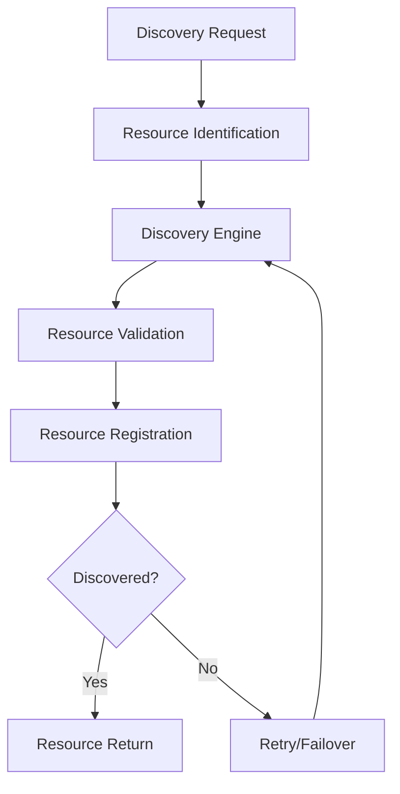
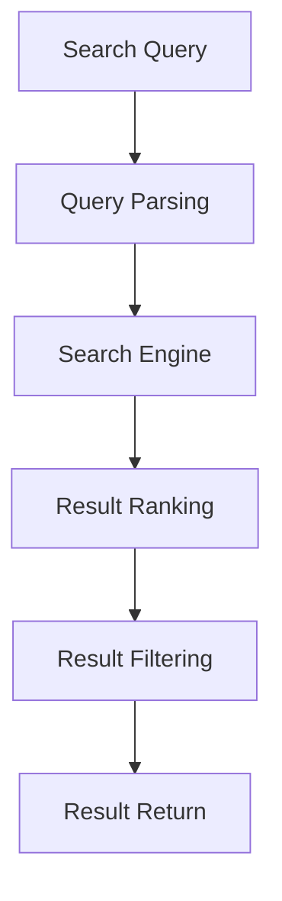
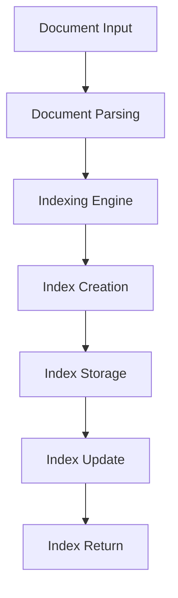

# Discovery & Search

## Overview
Handles all discovery and search functionalities including resource discovery, service discovery, content search, semantic search, and indexing across all platforms and contexts.

## Core Principles
- **Comprehensiveness**: Discover all relevant resources
- **Speed**: Provide fast search and discovery
- **Relevance**: Return relevant results
- **Scalability**: Scale with data and resource growth
- **Security**: Secure discovery and search operations
- **Extensibility**: Support new discovery and search types

## Function Specifications

### Base Functions (4 Functions)
1. [Base Discovery Engine](01_Base_Discovery_Engine.md) - Core discovery engine interface and common functionality
2. [Base Search Engine](02_Base_Search_Engine.md) - Core search engine interface and common functionality
3. [Base Indexer](03_Base_Indexer.md) - Core indexing interface and common functionality
4. [Base Semantic Search](04_Base_Semantic_Search.md) - Core semantic search interface and common functionality

### Resource Discovery (2 Functions)
5. [Service Discovery](05_Service_Discovery.md) - Service discovery
6. [Resource Discovery](06_Resource_Discovery.md) - Resource discovery

### Content Search (2 Functions)
7. [Keyword Search](07_Keyword_Search.md) - Keyword-based search
8. [Full-Text Search](08_Full_Text_Search.md) - Full-text search

### Semantic Search (2 Functions)
9. [Embedding Search](09_Embedding_Search.md) - Embedding-based semantic search
10. [Contextual Search](10_Contextual_Search.md) - Contextual semantic search

### Indexing (2 Functions)
11. [Document Indexer](11_Document_Indexer.md) - Document indexing
12. [Media Indexer](12_Media_Indexer.md) - Media indexing

## Integration Patterns

### Discovery Flow


### Search Flow


### Indexing Flow


## Discovery & Search Capabilities

### Discovery Capabilities
- **Service Discovery**: Discover available services
- **Resource Discovery**: Discover available resources
- **Dynamic Discovery**: Discover resources dynamically
- **Discovery Registration**: Register discovered resources
- **Discovery Validation**: Validate discovered resources

### Search Capabilities
- **Keyword Search**: Search by keywords
- **Full-Text Search**: Search full text
- **Semantic Search**: Search by meaning/context
- **Result Ranking**: Rank search results
- **Result Filtering**: Filter search results

### Indexing Capabilities
- **Document Indexing**: Index documents
- **Media Indexing**: Index media files
- **Index Updating**: Update indexes
- **Index Merging**: Merge multiple indexes
- **Index Optimization**: Optimize indexes

## Configuration Examples

### Discovery Configuration
```yaml
discovery:
  service:
    enabled: true
    refresh_interval: 30s
    registration: true
  resource:
    enabled: true
    types: ["file", "database", "api"]
    validation: true
  dynamic:
    enabled: true
    retry_attempts: 3
```

### Search Configuration
```yaml
search:
  keyword:
    enabled: true
    case_sensitive: false
    min_length: 3
  full_text:
    enabled: true
    language: "en"
    stemming: true
  semantic:
    enabled: true
    model: "bert-base"
    context_window: 512
```

### Indexing Configuration
```yaml
indexing:
  document:
    enabled: true
    storage: "elasticsearch"
    update_interval: 10m
  media:
    enabled: true
    storage: "s3"
    update_interval: 1h
  optimization:
    enabled: true
    schedule: "daily"
```

## Error Handling

### Discovery Errors
- **Identification Errors**: Handle resource identification errors
- **Validation Errors**: Handle resource validation errors
- **Registration Errors**: Handle registration errors
- **Discovery Failures**: Handle discovery failures
- **Retry Errors**: Handle retry/failover errors

### Search Errors
- **Parsing Errors**: Handle query parsing errors
- **Engine Errors**: Handle search engine errors
- **Ranking Errors**: Handle result ranking errors
- **Filtering Errors**: Handle result filtering errors
- **Return Errors**: Handle result return errors

### Indexing Errors
- **Parsing Errors**: Handle document parsing errors
- **Indexing Errors**: Handle indexing errors
- **Storage Errors**: Handle index storage errors
- **Update Errors**: Handle index update errors
- **Optimization Errors**: Handle index optimization errors

## Performance Considerations

### Discovery Performance
- **Efficient Identification**: Optimize resource identification
- **Batch Discovery**: Discover resources in batches
- **Caching**: Cache discovered resources
- **Parallel Discovery**: Discover resources in parallel
- **Retry Optimization**: Optimize retry logic

### Search Performance
- **Efficient Parsing**: Optimize query parsing
- **Index Optimization**: Optimize search indexes
- **Result Caching**: Cache search results
- **Parallel Search**: Search in parallel
- **Ranking Optimization**: Optimize result ranking

### Indexing Performance
- **Efficient Parsing**: Optimize document parsing
- **Batch Indexing**: Index documents in batches
- **Index Caching**: Cache indexes
- **Parallel Indexing**: Index in parallel
- **Optimization Scheduling**: Schedule index optimization

## Monitoring & Observability

### Discovery Metrics
- **Discovery Time**: Track discovery time
- **Resource Count**: Track discovered resources
- **Validation Rate**: Track validation rates
- **Registration Rate**: Track registration rates
- **Failure Rate**: Track discovery failures

### Search Metrics
- **Query Time**: Track query times
- **Result Count**: Track result counts
- **Ranking Time**: Track ranking times
- **Filtering Time**: Track filtering times
- **Error Rate**: Track search errors

### Indexing Metrics
- **Indexing Time**: Track indexing times
- **Index Size**: Track index sizes
- **Update Rate**: Track index updates
- **Optimization Time**: Track optimization times
- **Error Rate**: Track indexing errors

## Security Considerations

### Discovery Security
- **Access Control**: Control access to discovery operations
- **Validation**: Validate discovered resources
- **Audit Logging**: Log discovery activities
- **Encryption**: Encrypt discovery data
- **Compliance**: Meet compliance requirements

### Search Security
- **Access Control**: Control search access
- **Query Validation**: Validate search queries
- **Audit Logging**: Log search activities
- **Encryption**: Encrypt search data
- **Compliance**: Meet compliance requirements

### Indexing Security
- **Access Control**: Control index access
- **Index Validation**: Validate index data
- **Audit Logging**: Log indexing activities
- **Encryption**: Encrypt index data
- **Compliance**: Meet compliance requirements

## Integration Examples

### Discovery Integration
```typescript
const discoveryEngine = new ServiceDiscovery({
  refreshInterval: 30,
  registration: true
});

const services = await discoveryEngine.discover('user-service');
console.log('Discovered services:', services);
```

### Search Integration
```typescript
const searchEngine = new KeywordSearch({
  caseSensitive: false,
  minLength: 3
});

const results = await searchEngine.search('example query');
console.log('Search results:', results);
```

### Indexing Integration
```typescript
const indexer = new DocumentIndexer({
  storage: 'elasticsearch',
  updateInterval: 600
});

await indexer.index(document);
console.log('Document indexed');
```

## Future Enhancements

### Advanced Discovery
- **AI-Powered Discovery**: AI-driven resource discovery
- **Dynamic Topology**: Dynamic discovery of system topology
- **Federated Discovery**: Federated discovery across domains
- **Real-time Discovery**: Real-time resource discovery
- **Discovery Analytics**: Discovery usage analytics

### Enhanced Search
- **AI Search**: AI-powered search
- **Personalized Search**: Personalized search results
- **Voice Search**: Voice-based search
- **Visual Search**: Visual search capabilities
- **Search Analytics**: Search usage analytics

### Improved Indexing
- **AI Indexing**: AI-powered indexing
- **Distributed Indexing**: Distributed indexing
- **Real-time Indexing**: Real-time indexing
- **Index Analytics**: Index usage analytics
- **Index Testing**: Automated index testing

---

**Version**: 1.0  
**Category**: Discovery & Search  
**Total Functions**: 12 