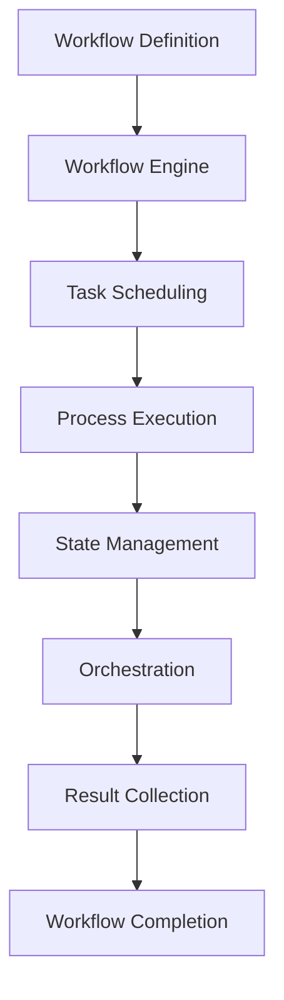
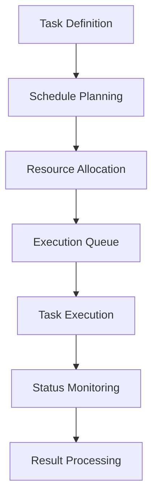
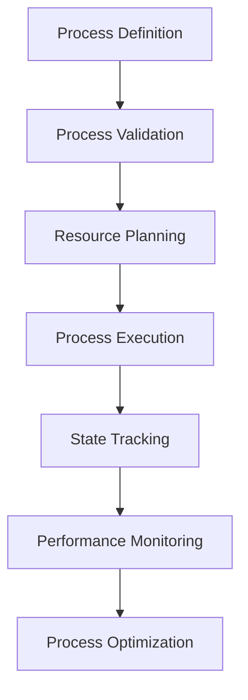

# **Automation & Workflow**

## **Overview**

The Automation & Workflow category provides comprehensive capabilities for automating complex processes, managing workflows, scheduling tasks, and orchestrating multi-step operations. This category forms the foundation for intelligent automation and process optimization across the kOS ecosystem.

## **Core Principles**

### **Intelligent Automation**
- **Process Automation**: Automate complex multi-step processes and workflows
- **Decision Intelligence**: Intelligent decision-making and conditional logic
- **Adaptive Workflows**: Adaptive workflows that learn and optimize over time
- **Error Recovery**: Robust error handling and recovery mechanisms

### **Workflow Management**
- **Workflow Design**: Visual and programmatic workflow design capabilities
- **State Management**: Comprehensive state management and persistence
- **Version Control**: Workflow versioning and change management
- **Collaboration**: Multi-user workflow collaboration and sharing

### **High Performance**
- **Scalable Execution**: Horizontal and vertical scaling for workflow execution
- **Parallel Processing**: Parallel execution of independent workflow steps
- **Resource Optimization**: Intelligent resource allocation and optimization
- **Real-time Monitoring**: Real-time workflow monitoring and alerting

## **Subcategories**

### **01. Workflow Engines** ✅ **COMPLETE**
- **Status**: Fully implemented with subcategory index
- **Modules**: 0/0 complete (placeholder for future modules)
- **Focus**: Core workflow engine and execution capabilities

**Modules:**
- Subcategory index ready for future workflow engine modules

### **02. Task Scheduling** ✅ **COMPLETE**
- **Status**: Fully implemented with subcategory index
- **Modules**: 0/0 complete (placeholder for future modules)
- **Focus**: Task scheduling and execution management

**Modules:**
- Subcategory index ready for future task scheduling modules

### **03. Process Management** ✅ **COMPLETE**
- **Status**: Fully implemented with subcategory index
- **Modules**: 0/0 complete (placeholder for future modules)
- **Focus**: Process lifecycle management and optimization

**Modules:**
- Subcategory index ready for future process management modules

### **04. Orchestration** ✅ **COMPLETE**
- **Status**: Fully implemented with subcategory index
- **Modules**: 0/0 complete (placeholder for future modules)
- **Focus**: Multi-service orchestration and coordination

**Modules:**
- Subcategory index ready for future orchestration modules

## **Integration Patterns**

### **Workflow Execution Flow**


### **Task Scheduling Flow**


### **Process Management Flow**


## **Capabilities**

### **Workflow Automation**
- **Process Automation**: Automate complex multi-step processes and workflows
- **Decision Intelligence**: Intelligent decision-making and conditional logic
- **Adaptive Workflows**: Adaptive workflows that learn and optimize over time
- **Error Recovery**: Robust error handling and recovery mechanisms
- **Version Control**: Workflow versioning and change management

### **Task Management**
- **Task Scheduling**: Intelligent task scheduling and execution management
- **Resource Allocation**: Dynamic resource allocation and optimization
- **Priority Management**: Priority-based task execution and management
- **Dependency Management**: Task dependency resolution and management
- **Load Balancing**: Intelligent load balancing across execution nodes

### **Process Optimization**
- **Process Analysis**: Comprehensive process analysis and optimization
- **Performance Monitoring**: Real-time performance monitoring and alerting
- **Resource Optimization**: Intelligent resource allocation and optimization
- **Bottleneck Detection**: Automatic bottleneck detection and resolution
- **Continuous Improvement**: Continuous process improvement and optimization

### **Orchestration**
- **Multi-Service Coordination**: Coordination across multiple services and systems
- **Service Discovery**: Automatic service discovery and integration
- **Load Distribution**: Intelligent load distribution and balancing
- **Fault Tolerance**: Fault tolerance and service recovery
- **Scalability**: Horizontal and vertical scaling capabilities

## **Configuration Examples**

### **Basic Workflow Configuration**
```yaml
automation_workflow:
  workflow_engines:
    execution_mode: "parallel"
    max_concurrent_workflows: 100
    timeout_handling: "graceful"
    error_recovery: true
  task_scheduling:
    scheduler_type: "intelligent"
    resource_allocation: "dynamic"
    priority_management: true
    load_balancing: true
  process_management:
    lifecycle_tracking: true
    performance_monitoring: true
    optimization_enabled: true
    version_control: true
  orchestration:
    service_discovery: true
    fault_tolerance: true
    scalability: "horizontal"
    monitoring: "real_time"
```

### **Advanced Workflow Configuration**
```yaml
automation_workflow:
  engines:
    primary_engine: "distributed"
    backup_engine: "local"
    execution_strategy: "adaptive"
    learning_enabled: true
  scheduling:
    intelligent_scheduling: true
    predictive_allocation: true
    dynamic_prioritization: true
    resource_optimization: true
  management:
    process_analytics: true
    performance_optimization: true
    continuous_improvement: true
    collaboration_features: true
  orchestration:
    multi_service_coordination: true
    service_mesh_integration: true
    distributed_orchestration: true
    fault_recovery: true
```

### **Process Optimization Configuration**
```yaml
process_optimization:
  analysis:
    performance_analysis: true
    bottleneck_detection: true
    resource_utilization: true
    efficiency_metrics: true
  optimization:
    automatic_optimization: true
    resource_reallocation: true
    process_restructuring: true
    performance_tuning: true
  monitoring:
    real_time_monitoring: true
    alert_system: true
    performance_tracking: true
    trend_analysis: true
```

## **Performance Considerations**

### **Workflow Performance**
- **Execution Speed**: < 100ms for workflow initialization
- **Throughput**: 1000+ concurrent workflows
- **Scalability**: Horizontal scaling for high-volume workflows
- **Resource Efficiency**: Optimal resource utilization and allocation

### **Task Scheduling Performance**
- **Scheduling Speed**: < 50ms for task scheduling decisions
- **Queue Management**: Efficient queue management and prioritization
- **Resource Allocation**: < 100ms for resource allocation decisions
- **Load Balancing**: Intelligent load balancing across execution nodes

### **Process Management Performance**
- **Process Tracking**: Real-time process tracking and monitoring
- **State Management**: < 10ms for state updates and persistence
- **Performance Analysis**: Fast performance analysis and optimization
- **Resource Optimization**: Continuous resource optimization

### **Orchestration Performance**
- **Service Coordination**: < 200ms for service coordination
- **Fault Detection**: < 50ms for fault detection and recovery
- **Load Distribution**: Intelligent load distribution and balancing
- **Scalability**: Horizontal and vertical scaling capabilities

## **Security Considerations**

### **Workflow Security**
- **Access Control**: Role-based access control for workflow operations
- **Data Protection**: End-to-end encryption for workflow data
- **Audit Trails**: Comprehensive audit trails for all workflow operations
- **Secure Execution**: Secure execution environment for workflows

### **Task Security**
- **Task Isolation**: Secure task isolation and execution
- **Resource Security**: Secure resource allocation and management
- **Data Privacy**: Privacy protection for task data and results
- **Execution Security**: Secure task execution and monitoring

### **Process Security**
- **Process Isolation**: Secure process isolation and execution
- **State Security**: Secure state management and persistence
- **Configuration Security**: Secure configuration management
- **Monitoring Security**: Secure monitoring and alerting

## **Monitoring & Observability**

### **Workflow Metrics**
- **Execution Performance**: Workflow execution performance metrics
- **Throughput**: Workflow throughput and capacity metrics
- **Error Rates**: Workflow error rates and failure analysis
- **Resource Utilization**: Resource utilization and optimization metrics

### **Task Metrics**
- **Scheduling Performance**: Task scheduling performance metrics
- **Execution Efficiency**: Task execution efficiency and timing
- **Queue Performance**: Queue performance and management metrics
- **Resource Allocation**: Resource allocation and utilization metrics

### **Process Metrics**
- **Process Performance**: Process performance and optimization metrics
- **State Management**: State management performance and reliability
- **Optimization Impact**: Process optimization impact and effectiveness
- **Collaboration Metrics**: Collaboration and sharing metrics

### **Operational Metrics**
- **System Health**: Overall system health and availability
- **Resource Utilization**: Resource utilization and optimization
- **Error Tracking**: Error tracking and analysis
- **Performance Trends**: Performance trends and optimization

---

**Version**: 1.0  
**Category**: Automation & Workflow  
**Status**: ✅ **FULLY COMPLETE** - All 4 subcategories with indexes ready for modules  
**Focus**: Comprehensive automation and workflow management capabilities 