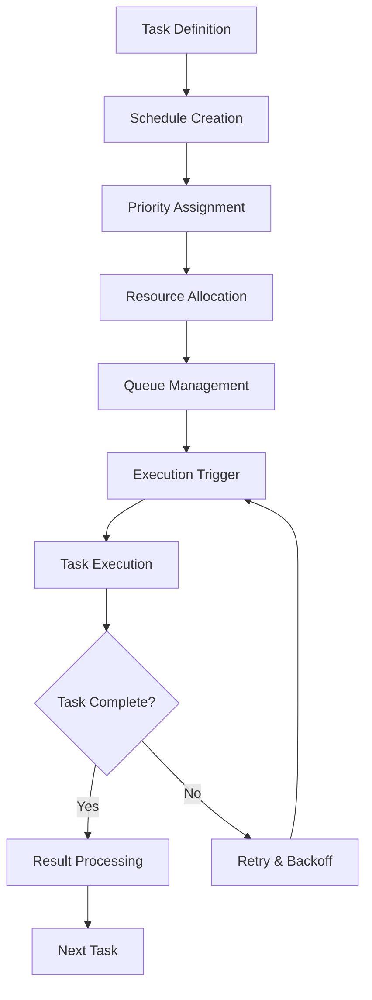

# Task Scheduling

## Overview
Task Scheduling modules manage the prioritization, timing, and resource allocation for tasks within workflows. They ensure that all tasks are executed efficiently, on time, and according to system policies and constraints.

## Core Principles
- **Efficiency**: Maximize throughput and minimize idle time
- **Fairness**: Ensure equitable resource allocation
- **Scalability**: Handle large numbers of tasks and schedules
- **Adaptability**: Adjust to changing workloads and priorities
- **Reliability**: Guarantee task execution even under failure conditions

## Function Specifications

### Base Functions
1. **Task Queue Management** – Manage queues of pending and active tasks
2. **Priority Scheduling** – Assign and enforce task priorities
3. **Deadline Enforcement** – Ensure tasks meet required deadlines
4. **Resource Allocation** – Allocate CPU, memory, and other resources
5. **Task Dependencies** – Manage dependencies between tasks
6. **Retry & Backoff** – Handle failed tasks with retry and backoff strategies
7. **Scheduling Policies** – Support multiple scheduling algorithms (FIFO, LIFO, priority, etc.)
8. **Task Cancellation** – Allow tasks to be cancelled or preempted

## Integration Patterns

### Task Scheduling Flow


## Capabilities
- **Time-based Scheduling**: Cron, interval, and event-based triggers
- **Priority & Deadline Management**: Enforce priorities and deadlines
- **Resource-aware Scheduling**: Allocate resources based on availability
- **Dependency Resolution**: Ensure tasks run in correct order
- **Failure Recovery**: Retry and reschedule failed tasks

## Configuration Example
```yaml
task_scheduler:
  type: "priority"
  max_concurrent_tasks: 100
  default_priority: 5
  deadline_enforcement: true
  retry:
    attempts: 2
    backoff: "linear"
  resource_limits:
    cpu: "2"
    memory: "4Gi"
  policies:
    - name: "fifo"
      enabled: true
    - name: "priority"
      enabled: true
```

## Error Handling
- **Queue Overflows**: Drop or delay tasks, alert operators
- **Missed Deadlines**: Escalate or reschedule tasks
- **Resource Exhaustion**: Throttle or reject new tasks
- **Dependency Failures**: Block dependent tasks and log errors
- **Policy Violations**: Log and revert to default scheduling policy

## Usage Scenarios
- Scheduling jobs in distributed systems
- Managing task dependencies and priorities
- Enforcing SLAs and deadlines

## Future Expansion
Support for advanced scheduling algorithms, predictive scheduling, and integration with external schedulers will be added as needed. 