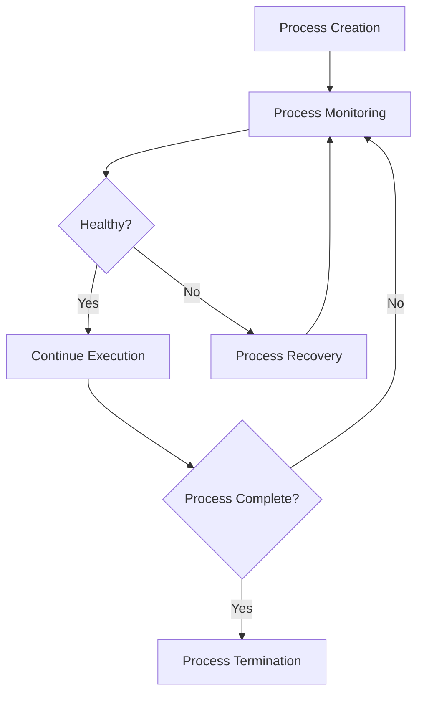

# Process Management

## Overview
Process Management modules handle the lifecycle, monitoring, and control of processes within workflows. They ensure robust execution, isolation, and recovery of workflow steps, supporting both short-lived and long-running processes.

## Core Principles
- **Robustness**: Ensure processes are resilient to failure
- **Isolation**: Prevent interference between processes
- **Scalability**: Support dynamic scaling of process pools
- **Transparency**: Provide clear monitoring and logging
- **Recoverability**: Enable automatic and manual recovery of failed processes

## Function Specifications

### Base Functions
1. **Process Creation** – Instantiate new processes for workflow steps
2. **Process Monitoring** – Track process health, status, and resource usage
3. **Process Control** – Pause, resume, or terminate processes as needed
4. **Process Termination** – Cleanly shut down processes and release resources
5. **Process Recovery** – Restart or recover failed processes
6. **Process Logging** – Log process events and errors
7. **Process Isolation** – Enforce boundaries between processes
8. **Process Scaling** – Dynamically adjust the number of active processes

## Integration Patterns

### Process Management Flow


## Capabilities
- **Health Monitoring**: Track and report process health
- **Dynamic Scaling**: Adjust process pools based on workload
- **Automatic Recovery**: Restart failed processes automatically
- **Comprehensive Logging**: Record all process events and errors
- **Resource Management**: Allocate and reclaim resources efficiently

## Configuration Example
```yaml
process_management:
  pool:
    min_size: 5
    max_size: 50
    idle_timeout: 300s
  monitoring:
    health_check_interval: 30s
    metrics_collection: true
    alerting: true
  recovery:
    auto_restart: true
    max_restarts: 3
    restart_delay: 10s
```

## Error Handling
- **Process Failures**: Detect and recover failed processes
- **Resource Leaks**: Monitor and reclaim unused resources
- **Scaling Errors**: Log and alert on scaling issues
- **Isolation Breaches**: Enforce boundaries and log violations
- **Logging Failures**: Fallback to alternate logging mechanisms

## Usage Scenarios
- Managing long-running or stateful processes
- Ensuring process isolation and recovery
- Scaling workflow execution dynamically

## Future Expansion
Future modules may include advanced process orchestration, AI-driven process management, and integration with external process managers. 