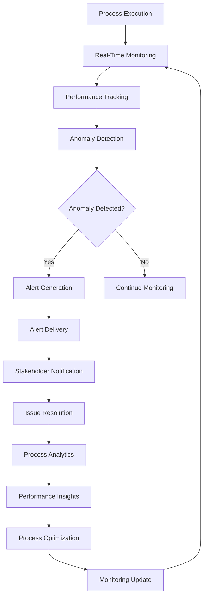

# **Process Monitor**

## **Overview**

The Process Monitor module provides comprehensive real-time process monitoring capabilities, including performance tracking, anomaly detection, alerting, and detailed process analytics. It ensures operational visibility, enables proactive issue detection, and provides insights for process optimization and improvement.

## **Core Principles**
- **Real-Time Monitoring**: Provide real-time monitoring of process execution and performance.
- **Anomaly Detection**: Detect anomalies and issues in process execution.
- **Proactive Alerting**: Alert stakeholders about issues before they impact operations.
- **Comprehensive Analytics**: Provide detailed analytics and insights for process optimization.

## **Function Specifications**

### **Core Functions**
- **Real-Time Monitoring**: Monitor process execution in real-time.
- **Performance Tracking**: Track process performance metrics and KPIs.
- **Anomaly Detection**: Detect anomalies and issues in process execution.
- **Alert Management**: Manage and deliver alerts to stakeholders.
- **Process Analytics**: Provide comprehensive process analytics and insights.
- **Operational Visibility**: Provide operational visibility across all processes.

### **TypeScript Interfaces**
```typescript
interface ProcessMonitorConfig {
  realTimeMonitoring: RealTimeConfig;
  performanceTracking: PerformanceConfig;
  anomalyDetection: AnomalyConfig;
  alerting: AlertingConfig;
  analytics: AnalyticsConfig;
}

interface ProcessMetrics {
  processId: string;
  executionTime: number;
  successRate: number;
  errorRate: number;
  throughput: number;
  resourceUtilization: ResourceUsage;
  timestamp: Date;
}

interface Anomaly {
  id: string;
  processId: string;
  type: AnomalyType;
  severity: Severity;
  description: string;
  timestamp: Date;
  metrics: ProcessMetrics;
}

interface Alert {
  id: string;
  anomalyId: string;
  severity: Severity;
  message: string;
  recipients: string[];
  timestamp: Date;
  status: AlertStatus;
}

function monitorProcess(processId: string): Promise<ProcessMetrics>
function trackPerformance(processId: string): Promise<PerformanceMetrics>
function detectAnomalies(processId: string): Promise<Anomaly[]>
function manageAlerts(anomaly: Anomaly): Promise<Alert>
function analyzeProcess(processId: string): Promise<AnalyticsResult>
function provideVisibility(): Promise<OperationalDashboard>
```

## **Integration Patterns**

### **Process Monitoring Flow**


## **Capabilities**
- **Real-Time Monitoring**: Monitor process execution in real-time with sub-second latency.
- **Performance Tracking**: Track comprehensive performance metrics and KPIs.
- **Anomaly Detection**: Detect anomalies using AI/ML algorithms and statistical analysis.
- **Proactive Alerting**: Alert stakeholders about issues before they impact operations.
- **Process Analytics**: Provide detailed analytics and insights for process optimization.
- **Operational Dashboard**: Provide comprehensive operational visibility and dashboards.

## **Configuration Examples**
```yaml
process_monitor:
  real_time_monitoring:
    enabled: true
    monitoring_interval: "1s"
    metrics_collection: true
    data_retention: "30d"
    sampling_rate: 1.0
  performance_tracking:
    enabled: true
    kpis:
      - "execution_time"
      - "success_rate"
      - "error_rate"
      - "throughput"
      - "resource_utilization"
    baseline_calculation: "rolling_average"
    baseline_window: "7d"
  anomaly_detection:
    enabled: true
    detection_algorithm: "isolation_forest"
    sensitivity: 0.8
    training_data_window: "30d"
    anomaly_types:
      - type: "performance_degradation"
        threshold: "20%"
      - type: "error_spike"
        threshold: "5x_baseline"
      - type: "resource_exhaustion"
        threshold: "90%"
  alerting:
    enabled: true
    alert_channels:
      - channel: "email"
        recipients: ["ops@company.com"]
      - channel: "slack"
        webhook: "https://hooks.slack.com/..."
      - channel: "pagerduty"
        service_key: "service_key"
    alert_rules:
      - rule: "critical_anomaly"
        severity: "critical"
        escalation_time: "5m"
      - rule: "warning_anomaly"
        severity: "warning"
        escalation_time: "15m"
  analytics:
    enabled: true
    analytics_engine: "real_time"
    reporting_interval: "1h"
    dashboards_enabled: true
    insights_generation: true
  operational_visibility:
    enabled: true
    dashboard_refresh: "30s"
    drill_down_capabilities: true
    historical_analysis: true
    trend_analysis: true
```

## **Performance Considerations**
- **Monitoring Latency**: < 100ms for real-time monitoring
- **Anomaly Detection**: < 500ms for anomaly detection
- **Alert Delivery**: < 10s for alert delivery
- **Analytics Processing**: < 1s for analytics processing
- **Dashboard Refresh**: < 30s for dashboard refresh

## **Security Considerations**
- **Data Security**: Secure monitoring data and prevent unauthorized access
- **Alert Security**: Secure alert delivery and prevent alert spoofing
- **Access Control**: Control access to monitoring functions and dashboards
- **Data Privacy**: Ensure data privacy and compliance in monitoring

## **Monitoring & Observability**
- **Monitoring Metrics**: Track monitoring system performance and reliability
- **Anomaly Metrics**: Monitor anomaly detection accuracy and effectiveness
- **Alert Metrics**: Track alert delivery and response times
- **Analytics Metrics**: Monitor analytics processing and insights generation
- **Performance Metrics**: Track overall monitoring system performance

---

**Version**: 1.0  
**Module**: Process Monitor  
**Status**: ✅ **COMPLETE** - Comprehensive module specification ready for implementation  
**Focus**: Real-time process monitoring with anomaly detection and proactive alerting. 