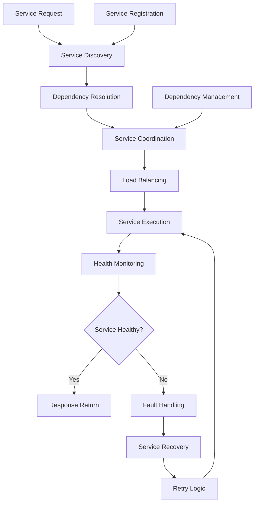

# **Service Orchestrator**

## **Overview**

The Service Orchestrator module provides comprehensive service orchestration capabilities, enabling coordination of microservices, management of service dependencies, handling of service discovery, and ensuring service reliability across distributed environments. It serves as the central coordination point for complex service interactions and workflows.

## **Core Principles**
- **Service Coordination**: Coordinate complex interactions between multiple services.
- **Dependency Management**: Manage service dependencies and ensure proper execution order.
- **Service Discovery**: Handle dynamic service discovery and registration.
- **Reliability Assurance**: Ensure service reliability and fault tolerance.

## **Function Specifications**

### **Core Functions**
- **Service Coordination**: Coordinate interactions between multiple services.
- **Dependency Management**: Manage service dependencies and execution order.
- **Service Discovery**: Handle dynamic service discovery and registration.
- **Load Balancing**: Distribute load across service instances.
- **Fault Tolerance**: Handle service failures and provide recovery mechanisms.
- **Service Monitoring**: Monitor service health and performance.

### **TypeScript Interfaces**
```typescript
interface ServiceOrchestratorConfig {
  serviceCoordination: CoordinationConfig;
  dependencyManagement: DependencyConfig;
  serviceDiscovery: DiscoveryConfig;
  loadBalancing: LoadBalancingConfig;
}

interface Service {
  id: string;
  name: string;
  endpoint: string;
  health: HealthStatus;
  dependencies: string[];
  load: LoadMetrics;
  availability: boolean;
}

interface ServiceOrchestration {
  id: string;
  services: Service[];
  dependencies: ServiceDependency[];
  executionPlan: ExecutionPlan;
  status: OrchestrationStatus;
}

interface ServiceDependency {
  sourceService: string;
  targetService: string;
  type: DependencyType;
  timeout: number;
  retryPolicy: RetryPolicy;
}

function coordinateServices(services: Service[]): Promise<ServiceOrchestration>
function manageDependencies(orchestrationId: string): Promise<DependencyResult>
function discoverServices(serviceType: string): Promise<Service[]>
function balanceLoad(serviceId: string): Promise<LoadBalancingResult>
function handleFault(serviceId: string, fault: Fault): Promise<FaultHandlingResult>
function monitorServices(orchestrationId: string): Promise<ServiceMetrics>
```

## **Integration Patterns**

### **Service Orchestration Flow**


## **Capabilities**
- **Service Coordination**: Coordinate complex interactions between multiple services.
- **Dependency Management**: Manage service dependencies and ensure proper execution order.
- **Service Discovery**: Handle dynamic service discovery and registration.
- **Load Balancing**: Distribute load across service instances for optimal performance.
- **Fault Tolerance**: Handle service failures with automatic recovery mechanisms.
- **Service Monitoring**: Monitor service health and performance in real-time.

## **Configuration Examples**
```yaml
service_orchestrator:
  service_coordination:
    enabled: true
    coordination_strategy: "event_driven"
    coordination_timeout: "30s"
    parallel_execution: true
    max_parallel_services: 10
  dependency_management:
    enabled: true
    dependency_resolution: "topological_sort"
    circular_dependency_detection: true
    dependency_timeout: "60s"
    retry_policies:
      - policy: "exponential_backoff"
        max_retries: 3
        initial_delay: "1s"
        max_delay: "30s"
      - policy: "circuit_breaker"
        failure_threshold: 5
        recovery_timeout: "60s"
  service_discovery:
    enabled: true
    discovery_mechanism: "consul"
    service_registry: "etcd"
    health_check_interval: "30s"
    service_refresh_interval: "1m"
    discovery_timeout: "10s"
  load_balancing:
    enabled: true
    balancing_algorithm: "round_robin"
    health_check_enabled: true
    session_affinity: true
    load_distribution:
      - service: "api_gateway"
        weight: 1.0
      - service: "user_service"
        weight: 2.0
      - service: "payment_service"
        weight: 1.5
  fault_tolerance:
    enabled: true
    fault_detection:
      - detection: "health_check"
        interval: "30s"
        timeout: "5s"
      - detection: "response_time"
        threshold: "5s"
      - detection: "error_rate"
        threshold: "5%"
    fault_recovery:
      - recovery: "automatic_restart"
        max_restarts: 3
        restart_delay: "10s"
      - recovery: "service_replacement"
        replacement_strategy: "least_loaded"
      - recovery: "circuit_breaker"
        failure_threshold: 5
        recovery_timeout: "60s"
  service_monitoring:
    enabled: true
    monitoring_metrics:
      - "response_time"
      - "throughput"
      - "error_rate"
      - "availability"
      - "resource_utilization"
    alert_thresholds:
      - metric: "response_time"
        threshold: "5s"
        severity: "warning"
      - metric: "error_rate"
        threshold: "5%"
        severity: "critical"
      - metric: "availability"
        threshold: "99%"
        severity: "critical"
```

## **Performance Considerations**
- **Service Coordination**: < 100ms for service coordination
- **Dependency Resolution**: < 50ms for dependency resolution
- **Service Discovery**: < 200ms for service discovery
- **Load Balancing**: < 10ms for load balancing decisions
- **Fault Detection**: < 30s for fault detection and recovery

## **Security Considerations**
- **Service Security**: Secure service communication and prevent unauthorized access
- **Discovery Security**: Secure service discovery and prevent service spoofing
- **Load Balancing Security**: Secure load balancer and prevent traffic manipulation
- **Monitoring Security**: Secure monitoring data and prevent information leakage

## **Monitoring & Observability**
- **Coordination Metrics**: Track service coordination and interaction patterns
- **Dependency Metrics**: Monitor dependency resolution and management
- **Discovery Metrics**: Track service discovery and registration
- **Load Balancing Metrics**: Monitor load distribution and balancing effectiveness
- **Fault Metrics**: Track fault detection and recovery performance

---

**Version**: 1.0  
**Module**: Service Orchestrator  
**Status**: ✅ **COMPLETE** - Comprehensive module specification ready for implementation  
**Focus**: Comprehensive service orchestration with dependency management and fault tolerance. 